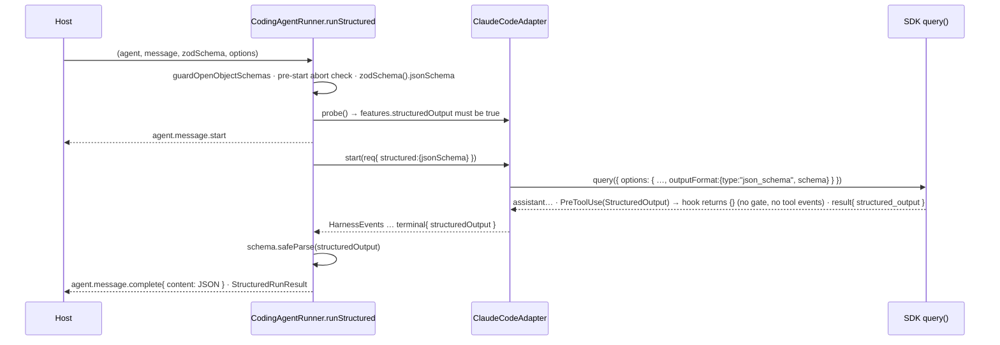

# Implementation strategy — issue #547: `runStructured` for the Claude Code runners

**Size M · one PR from `feat/cc-runner-run-structured` (based on `origin/main` 7505cb5) · packages: runtime · Gate 1 = `gate:auto` (delegated run)**

Revision 4 — rev 3 folded in the Gate 1.5 re-check notes; rev 4 folds in the Gate 2.5 quality notes (`capability-missing` error code, shared drain helper, post-start abort race made explicit, `CC_STRUCTURED_OUTPUT_TOOL` exported, shared finishReason constant). See § Spec Review, § Design Addendum, § Diff Review — Quality.

## Goal

`ClaudeCodeRunner` and `ClaudeCodeAPIRunner` gain a `runStructured<T>(agent, message, schema, options)` that returns a schema-valid `StructuredRunResult<T>`, with **parity** to `AgentRunner.runStructured` on result shape, events, errors and cancellation — implemented on the shared `CodingAgentRunner` base and driven by the Agent SDK's **native** `outputFormat: { type: "json_schema" }` (no prompt contract, no repair loop).

## Current state (verified at `origin/main` 7505cb5, SDK `0.3.226` installed)

- `CodingAgentRunner` implements `run()` (`packages/agent-runtime/src/runner/harness/coding-agent-runner.ts:146`) and `stream()` (`:182`); its `_startRun` comment at `:407-408` says `runStructured()` is "not implemented by this base". `RunnerProtocol.runStructured?` is optional (`runner/types.ts:341-351`, declaration `:345`), so a consumer on a Claude Code runner sees `runner.runStructured === undefined` — and `workflows/agent-step.ts:151` therefore throws `StructuredOutputUnsupported` for any `AgentStep` with a non-string `output` schema on these runners. `createRunner()`'s step 5 builds a `ClaudeCodeAPIRunner` (`runner/create-runner.ts:332-342`) — the only automatic path to Claude Code.
- `ClaudeCodeRunner extends CodingAgentRunner<AgentLikeForBridge>` (`runner/claude-code-runner.ts:152`); `ClaudeCodeAPIRunner extends ClaudeCodeRunner` (`runner/claude-code-api-runner.ts:42`) and only pins constructor presets (`config: isolated`, `nativeTools: "none"`) — one implementation on the base covers both.
- SDK option / result surface (installed `.d.ts`, `node_modules/.bun/@anthropic-ai+claude-agent-sdk@0.3.226+…/node_modules/@anthropic-ai/claude-agent-sdk/sdk.d.ts`): `Options.outputFormat?: OutputFormat` (`:1739-1750`); `OutputFormat = JsonSchemaOutputFormat` (`:2142`); `JsonSchemaOutputFormat = { type: 'json_schema'; schema: Record<string, unknown> }` (`:930-933`); `SDKResultSuccess.structured_output?: unknown` (`:4503`); `SDKResultError.subtype` includes `'error_max_structured_output_retries'` (`:4442`); `TerminalReason` includes `'structured_output_retry_exhausted'` (`:7213`). Mechanism doc at `:1858-1863`: the turn ends on an **end-turn tool carrier** followed by a `structured_output` attachment.
- **The carrier is a CLI built-in tool named `StructuredOutput`.** Evidence: `strings` over the bundled CLI (`node_modules/.bun/@anthropic-ai+claude-agent-sdk-linux-x64@0.3.226/…/claude`, CC 2.1.226) contains a built-in tool descriptor whose `name` is the literal `"StructuredOutput"`, plus `StructuredOutput schema mismatch: `, `StructuredOutput enforcement failed: `, `requiresStructuredOutput`, `MAX_STRUCTURED_OUTPUT_RETRIES`, `claude/endTurn`. The Gate 1.5 re-check traced the binary further: the carrier is **force-appended after base tool resolution** (two independent sites) whenever a schema is present, so `options.tools` — consumed upstream — cannot hide it; `disallowedTools` IS applied afterwards and CAN strip it. An Ajv-rejected schema does not fail the run: the CLI logs `Init JSON schema rejected, structured output disabled` and proceeds without the carrier (symptom: `finishReason: "stop"`, no payload). It is not a typed name anywhere in `sdk.d.ts` / `sdk-tools.d.ts` — it is a runtime contract of the pinned CLI, so it is pinned as a named constant and covered by the live smoke, not a type pin.
- `Options.tools` doc (`sdk.d.ts:1455`, doc `:1447-1454`): `[]` "Disable all built-in tools". `applyNativeTools` (`runner/cc-config.ts:150-154`) sets `tools: []` for `nativeTools: "none"` — the `ClaudeCodeAPIRunner` preset. The CLI force-includes `StructuredOutput` when `outputFormat` is set (binary evidence above), so `tools: []` is not a hazard; `disallowedTools` is (§6).
- `_buildOptions` (`claude-code-runner.ts:225-289`) installs the gate hooks unconditionally — `hooks: this._makeHooks(context.runId, context.traceId, context.parentSpanId)` inside the `sdkOpts` literal at `:243` — via `_makeHooks` (`:298-383`): `onPreToolUse` (`:307`) routes **every** tool call through `emitIntent()` → `bus.evaluateIntent` and returns `permissionDecision: "deny"` on a blocked outcome (`:324-334`), else emits `agent.tool.start` and records the span at `:344`; `onPostToolUse` (`:349`) emits `agent.tool.end` (returning `{}` at `:346` is the existing allow path's value — "no hook opinion"). Without special handling the `StructuredOutput` carrier would be gate-evaluated and would emit `agent.tool.*` events.
- Version bisect (`npm pack` of published tarballs): `outputFormat` / `structured_output` **absent** in 0.3.0, 0.3.50, 0.3.100, 0.3.110, 0.3.120, 0.3.130, 0.3.140; **present** in 0.3.150, 0.3.215, 0.3.226. `packages/agent-runtime/package.json:66` declares `dependencies["@anthropic-ai/claude-agent-sdk"] = "^0.3.0"` (admits featureless versions); `:73` devDependency `^0.3.215`; `bun.lock:106` carries the `^0.3.0` specifier, `:114` the `^0.3.215` one, `:183` the resolved `0.3.226`; `__fixtures__/claude-agent-sdk-contract.json` pins `0.3.226`.
- `AgentRunner.runStructured` (`runner/agent-runner.ts:1497-1915`) — the parity reference:
  - `guardOpenObjectSchemas(schema, options?.allowOpenObjectSchemas)` first (`:1508`), before any LLM call.
  - Pre-start abort → `throw new RunCancelledError(...)` with **no events** (`:1518-1522`).
  - `runId = options?.runId ?? generateId()`, `traceId = options?.traceId ?? runId` (`:1531-1532`); `adviseStructuredRun(modelName, hasTools)` (`:1551`) — an AI-SDK model-capability advisory; `agent.message.start` is the root (`:1556-1569`).
  - Mid-run abort → emits `agent.message.complete {content:"", finishReason:"cancelled", tokens accrued}` (`emitCancelledTerminal`, `:1596-1612`) then throws `RunCancelledError` (never a raw AbortError).
  - Validation: `schema.safeParse(rawObject)`; on failure emits `agent.error {recoverable:false}` and throws `Error("runStructured: model output failed schema validation — …")` (`:1856-1873`).
  - Success: `agent.message.complete` with `content: JSON.stringify(parsed.data)` (`:1875-1888`); `_maybeEmitRedaction` (Bifrost gateway scan, #407, `:1893-1900`); returns `{ response: JSON.stringify(parsed.data), inputTokens, outputTokens, toolCallsCount, iterations, finishReason, object: parsed.data, usageDetails?, gateway? }` (`:1904-1915`).
- `RunCancelledError` is defined in `agent-runner.ts:119-137` and thrown at `:1519`, `:1633`, `:1707`, `:1775`, `:1834`; it is **not** re-exported from `runner/index.ts` / `src/index.ts` (verified by grep; `src/index.ts:13` is `export * from "./runner/index.js"`, so a `runner/index.ts` export surfaces publicly).
- Harness seam: `HarnessRunRequest` (`harness/types.ts:288-305`) carries `agent/message/options/runId/traceId/parentSpanId/correlationId/streaming/evaluateIntent`; `HarnessProbeResult.features` (`:188-194`) has five booleans; `HarnessEvent` is `{ ids; parent?; meta? } & (…union…)` (`:107`) whose `terminal` variant (`:141-147`) carries `numTurns/usage/costUsd?/finishReason` (+ `meta.finalText`). `HarnessStartError(code, message)` (`:239-249`) — its code union gains `"capability-missing"` (rev 4; `"schema-incompatible"` would mislabel "harness has no such capability"). `FinishReason = string` (`:69`). `HarnessEventTranslator.onTerminal` (`harness/harness-event-translator.ts:259-267`) accrues into `HarnessRunAccounting` (`:42-50`), read by `finalize()` (`:119-136`, which assigns `costUsd: this.costUsd` unconditionally at `:131`).
- CC adapter: `ClaudeCodeAdapter.start()` (`harness/claude-code/claude-code-adapter.ts:121-135`) calls `buildOptions(agent, options, context)` then `query({ prompt, options })`; `BuildSDKOptions` context (`:38-48`) is `{ runId, traceId, parentSpanId?, correlationId?, includePartialMessages? }`; `probe()` (`:104-119`) returns the static feature table. `CCHarnessTranslator.onResult` (`cc-harness-translator.ts:254-270`) builds the terminal event from `SDKResultMessage`; `mapFinishReason` (`:49-62`) maps the four known subtypes, else `"unknown"`.
- `_buildOptions` spreads `this._defaults` first (`claude-code-runner.ts:237`), so a per-run assignment afterwards wins.
- `zodSchema()` from `ai` (re-exported from `@ai-sdk/provider-utils@5.0.25`, `dist/index.d.ts:1013-1021`) returns `Schema<T>` with `.jsonSchema: JSONSchema7 | PromiseLike<JSONSchema7>` (`:983`). Executed against the installed tree (Gate 1.5 reviewer): `zodSchema(z.object({answer:z.number(),reasoning:z.string()})).jsonSchema` → `{type:"object", properties, required, additionalProperties:false, $schema:"http://json-schema.org/draft-07/schema#"}`, no `$ref`/`definitions`. This is the same conversion `Output.object({ schema })` performs for `AgentRunner`, so both runners send the same JSON Schema shape. (`zodSchema` also accepts zod-4 schemas; `RunnerProtocol.runStructured?` types `schema: ZodType<T>` via `import type { ZodType } from "zod"` — `runner/types.ts:13`, `:348` — which resolves to whichever zod the consumer installs under the `^3.25.0 || ^4.1.8` peer range. This repo tests with zod 3; zod-4 behavior is untested and not a property this spec claims.)
- Existing test seams: `harness/__tests__/coding-agent-runner-abort.test.ts` drives the base against a `FakeAdapter`/`FakeSession` (no subprocess); `harness/__tests__/cc-translation.test.ts` builds hand-rolled `SDKResultMessage` fixtures; `__tests__/claude-code-api-runner.test.ts` already defines `APIRunnerProbe` (`:24`) / `CCRunnerProbe` (`:33`) exposing `_buildOptions`; `__tests__/sdk-contract.test.ts` pins SDK types with `expectTypeOf`. `harness-contract.test.ts:276` asserts probe features property-wise (not `toEqual`), so an added feature key breaks nothing. Probe `features` literals live in 3 test files + the adapter (`grep -c durableRules`); `ClaudeCodeAdapter` is the only in-repo `HarnessAdapter` implementer besides the test fakes.
- Live integration test `src/__tests__/claude-code-runner.test.ts` is `describe.skipIf(CI==="true" || SKIP_SDK_TESTS==="true")` (`:34`, `:120`); in this container it fails with `--dangerously-skip-permissions cannot be used with root/sudo privileges` (environmental; passes in CI's non-root runner).
- The merge gate is the `check` status = root `package.json:26`: `build && check:dist-contract && typecheck && lint && test && check:model-facing-schemas && smoke:memory && check:docs-events`.

## Approach

Design (a): native schema output through the SDK. The base owns the protocol method; the harness-specific half is two additive fields on the seam (`HarnessRunRequest.structured` in, `terminal.structuredOutput` out) plus a probe feature flag so a harness that cannot do it fails loud before any event. The SDK's `StructuredOutput` carrier tool is the harness's **output channel**, not an agent tool — it bypasses the gate chain and emits no `agent.tool.*` events, exactly as `AgentRunner`'s `Output.object` path emits none (§7a).



### 1. `runner/errors.ts` (create) — shared error classes

- Move `RunCancelledError` verbatim from `agent-runner.ts:119-137`. In `agent-runner.ts`: `import { RunCancelledError } from "./errors.js";` **and** `export { RunCancelledError } from "./errors.js";` (the name is thrown at five sites — the import binds it locally, the export keeps the public path). Add `export { RunCancelledError, StructuredOutputUnavailableError } from "./errors.js";` to `runner/index.ts` (additive — neither is exported today).
- New `StructuredOutputUnavailableError extends Error` — thrown by the harness path when the run finished with no `structured_output` payload. Exact shape (implement verbatim):

```ts
export class StructuredOutputUnavailableError extends Error {
  readonly finishReason: string;
  constructor(finishReason: string) {
    super(`runStructured: the harness finished without structured output (finishReason="${finishReason}")${STRUCTURED_OUTPUT_HINTS[finishReason] ?? ""}`);
    this.name = "StructuredOutputUnavailableError";   // `_emitError` publishes `errorType: error.name` — without this the bus sees "Error"
    this.finishReason = finishReason;
  }
}
const STRUCTURED_OUTPUT_HINTS: Readonly<Record<string, string>> = {
  "max-structured-output-retries": " — the model did not produce schema-conformant output within the CLI's retry budget; simplify the schema or the task",
  stop: " — the model ended the turn without calling the StructuredOutput carrier; if the CLI logged 'Init JSON schema rejected', the JSON Schema was not accepted",
};
```
`finishReason` is the mapped harness reason (`"stop"` = success-but-no-payload, `"max-structured-output-retries"`, `"error"`, `"max-turns"`, `"budget"`, …), so the failure modes are separable by field, not regex; the hint is appended with a leading ` — ` (an em-dash join) only when the table has an entry. Schema-validation failure stays a plain `Error` with the `AgentRunner` message text (parity).
- `coding-agent-runner.ts` imports both from `"../errors.js"` — same layer (7), no cycle (`agent-runner.ts` never imports the harness base).

### 2. `harness/types.ts` (modify) — three additive seam fields

```ts
// HarnessRunRequest (`:288-305`) — present ONLY on the runStructured path
readonly structured?: { readonly jsonSchema: Record<string, unknown> };

// HarnessProbeResult.features (`:188-194`) — optional so out-of-repo adapters stay valid; absent ⇒ unsupported
readonly structuredOutput?: boolean;

// terminal variant of the HarnessEvent union (`:141-147`; the `{ ids; parent?; meta? } &` base is unchanged)
| { kind: "terminal"; numTurns: number; usage: TokenUsage; costUsd?: number; finishReason: FinishReason; structuredOutput?: unknown }
```

### 3. `harness/harness-event-translator.ts` (modify)

`HarnessRunAccounting.structuredOutput?: unknown` (`:42-50`); `onTerminal` (`:259-267`) stores `event.structuredOutput`; `finalize()` (`:119-136`) assigns `structuredOutput: this.structuredOutput` unconditionally — house style of the sibling `costUsd` at `:131`. Presence is judged on `!== undefined` by the consumer (`null` may be a legitimate value for a nullable schema).

### 4. `harness/claude-code/cc-harness-translator.ts` (modify)

- `onResult` (`:254-270`): when `msg.subtype === "success"` and `msg.structured_output !== undefined`, set `structuredOutput: msg.structured_output` on the terminal event.
- `mapFinishReason` (`:49-62`): add `case "error_max_structured_output_retries": return "max-structured-output-retries";` (a distinct honest reason — not `"error"`, not `"unknown"`).
- `onResult`: a `success` result may still carry `terminal_reason: "structured_output_retry_exhausted"` (`sdk.d.ts:7213`; the field exists on both result variants). When it does, the terminal event's `finishReason` is `"max-structured-output-retries"` regardless of subtype — so the retry-exhausted mode never collapses into "success but no payload". Implement as `finishReason: msg.terminal_reason === "structured_output_retry_exhausted" ? "max-structured-output-retries" : mapFinishReason(msg.subtype)`.

### 5. `harness/claude-code/claude-code-adapter.ts` (modify)

- `BuildSDKOptions` context (`:38-48`) gains `outputSchema?: Record<string, unknown>`.
- `start()` (`:121-135`) passes `outputSchema: req.structured?.jsonSchema`.
- `probe()` (`:104-119`) features add `structuredOutput: true` (the SDK floor now guarantees it — §9).

### 6. `claude-code-runner.ts` `_buildOptions` (modify, `:225-289`)

Export `export const CC_STRUCTURED_OUTPUT_TOOL = "StructuredOutput";` with a doc comment stating it is the CLI 2.1.x built-in carrier name pinned by binary evidence (§ Current state), exercised by the live smoke, and the one place to change if the CLI renames it.

1. Amend the existing hooks line at `:243` to `hooks: this._makeHooks(context.runId, context.traceId, context.parentSpanId, { structured: context.outputSchema !== undefined }),` — the ONLY call site; see §7a. (A separate 4th-arg call added later in the function would leave `:243` failing TS2554, and repairing `:243` with `{ structured: false }` would silently reintroduce Blocker 1.)
2. After the `includePartialMessages` block: `if (context.outputSchema) sdkOpts.outputFormat = { type: "json_schema", schema: context.outputSchema };` — per-run wins over any `_defaults.outputFormat` (defaults are spread first, `:237`).
3. Do **not** touch `tools` or `allowedTools` for the carrier: the CLI force-appends it after base tool resolution (§ Current state), so `tools: []` (the API-runner preset and `create-runner.ts:336`'s `defaults: { tools: [] }`) cannot hide it, and `allowedTools` is an auto-allow list, not an availability filter (`sdk.d.ts:1392-1395`), inert under `bypassPermissions`. Never add the carrier to `disallowedTools`, and never strip a host's explicit `extraDisallowedTools: ["StructuredOutput"]` — that host gets the honest `StructuredOutputUnavailableError` (the CLI's `disallowedTools` pass runs after the force-append and does remove it).

Update the file header + class doc to say structured output is supported and how.

### 7. `harness/coding-agent-runner.ts` (modify) — the method

`_startRun(agent, message, options, streaming, structured?: { jsonSchema })`: after `adapter.probe(...)` and `assertGateRequirements`, **before** `agent.message.start` is published:

```ts
if (structured && probe.features.structuredOutput !== true) {
  throw new HarnessStartError("capability-missing",
    `${adapter.name}: runStructured is unavailable — the harness probe does not report features.structuredOutput`);
}
```
and put `...(structured ? { structured } : {})` on the `HarnessRunRequest`. Update the `:407-408` comment (runStructured now exists; it checks abort BEFORE `_startRun` so a pre-start cancel emits nothing — parity with `AgentRunner`). Extract the zeroed cancelled accounting literal at `:327-336` into a module-level `EMPTY_CANCELLED_ACCOUNTING: HarnessRunAccounting` shared by `_emitCancelledRun` and the method below.

The base adds `zodSchema` to its existing `ai` import (`coding-agent-runner.ts:28` already imports `generateId` from `ai`, so this is a widened import, not a new coupling). Chosen deliberately: `ai` is already a hard dependency of the package; `zodSchema` is the exact conversion `AgentRunner` uses (parity of the wire schema across runners), it handles zod 3 today and zod 4 if the protocol ever widens, and one conversion in the base means every future adapter (Codex, #330) receives the same JSON Schema rather than re-deriving its own. `zod-to-json-schema` directly would add a dependency; per-adapter conversion would fork the wire shape.

```ts
async runStructured<T>(agent: TAgent, message: string, schema: ZodType<T>, options?: RunOptions): Promise<StructuredRunResult<T>> {
  guardOpenObjectSchemas(schema, options?.allowOpenObjectSchemas);                 // parity :1508
  if (options?.abortSignal?.aborted) throw new RunCancelledError("runStructured: aborted before the run started (abortSignal already fired)"); // no events
  const jsonSchema = (await zodSchema(schema).jsonSchema) as Record<string, unknown>;
  const prep = await this._startRun(agent, message, options, /* streaming */ false, { jsonSchema });
  const { bus, startEvent, model, traceId, runId, parentSpanId } = prep;
  if (prep.cancelled) {            // signal fired AFTER message.start (during probe) but before the harness launched → finalize the open run (#495 posture), then throw
    await this._emitCancelledRun(bus, startEvent, model);
    throw new RunCancelledError("runStructured: aborted before the harness started (no structured output available)");
  }
  const { session, translator } = prep;
  const cancelledRef = { value: false };
  try {
    for await (const hEvent of this._drainSession(session, options, cancelledRef))
      for (const apEvent of translator.translate(hEvent)) await bus.publish(apEvent);
  } catch (err) { await this._emitError(bus, err, traceId, runId, parentSpanId); throw err; }
  finally { await session.close(); }
  if (cancelledRef.value) {        // parity with AgentRunner's emitCancelledTerminal (:1596) then throw
    await bus.publish(this._completeEvent(startEvent, { ...translator.finalize(), finishReason: "cancelled" }, model));
    throw new RunCancelledError("runStructured: aborted while the harness was running (no structured output available)");
  }
  const acc = translator.finalize();
  if (acc.structuredOutput === undefined) {
    const err = new StructuredOutputUnavailableError(acc.finishReason);
    await this._emitError(bus, err, traceId, runId, parentSpanId); throw err;
  }
  const parsed = schema.safeParse(acc.structuredOutput);
  if (!parsed.success) {
    const err = new Error(`runStructured: model output failed schema validation — ${parsed.error.message}`);  // parity text :1859
    await this._emitError(bus, err, traceId, runId, parentSpanId); throw err;
  }
  const content = JSON.stringify(parsed.data);
  const finalAcc = { ...acc, content };
  await bus.publish(this._completeEvent(startEvent, finalAcc, model));
  return { ...this._result(finalAcc), object: parsed.data };
}
```

`_emitError` (`:483-503`) already emits `agent.error {recoverable:false}` — reuse it. `_result` (`:471-479`) / `_completeEvent` are reused so `costUsd`, `iterations` (from `num_turns`) and tokens flow exactly as `run()`.

**Parity items deliberately declined** (each is an `AgentRunner`-provider concern with no harness analogue; stated here so the Acceptance list is complete): `adviseStructuredRun` (`:1551` — advisory over the AI-SDK model-capability map, keyed by provider model id; the harness resolves its own model), `_maybeEmitRedaction` (`:1893-1900` — Bifrost gateway metadata scan, #407; there is no gateway on the subprocess path), `usageDetails` / `gateway` on the result (`_result()` at `:471-479` emits neither for `run()` either — same gap, not new).

### 7a. `claude-code-runner.ts` `_makeHooks` (modify, `:298-383`) — the carrier bypass

Signature gains a 4th parameter `opts: { structured: boolean }` (call site amended in §6 step 1). In `onPreToolUse` (`:307`) and `onPostToolUse` (`:349`), **first thing** after `toolName` is read: `if (opts.structured && toolName === CC_STRUCTURED_OUTPUT_TOOL) return {};` — no `agent.tool.intent`, no gate evaluation, no `agent.tool.start`/`end`. Rationale: the carrier is how the harness *returns* the structured object (the SDK's own doc calls its `tool_result` "a placeholder", `sdk.d.ts:1861-1862`); it is not the agent exercising a capability, so it is not a `ToolCallIntent` — the same reason `AgentRunner`'s `Output.object` path emits no tool events. Gating it would let an allow-list gate silently kill every structured run. Both hooks must bypass together: skipping only PreToolUse would leave PostToolUse emitting a `tool.end` with `durationMs: 0` and no `spanId` (no `:344` span record). The bypass is scoped to structured runs, so an ordinary `run()` that somehow sees a tool by that name is unaffected. Returning `{}` is the same value the allow path returns (`:346`) — "no hook opinion" — and under `permissionMode: "bypassPermissions"` the CLI auto-allows. Consequence for §7: with the carrier ungated, a missing `structured_output` can only come from the harness itself — `StructuredOutputUnavailableError.finishReason` says which way.

### 8. `runner/types.ts` (modify) — doc only

`RunOptions.abortSignal` doc (`:197-234`): the `CodingAgentRunner` paragraph gains one sentence: `runStructured()` mirrors `AgentRunner` — a pre-start abort throws `RunCancelledError` with no events; a mid-run abort tears the session down, emits `agent.message.complete {finishReason:"cancelled"}` with whatever accrued, then throws `RunCancelledError`. `RunnerProtocol.runStructured?` doc (`:341-344`): add "Implemented by `AgentRunner`, `MockRunner`, and the `CodingAgentRunner` family (`ClaudeCodeRunner` / `ClaudeCodeAPIRunner`, #547) — which also unlocks `AgentStep` structured outputs on those runners."

### 9. `packages/agent-runtime/package.json` (modify) — floor bump

`dependencies["@anthropic-ai/claude-agent-sdk"]` (`:66`): `^0.3.0` → `^0.3.215` (matches the devDependency; the bisect puts the feature at ≤0.3.150 but 0.3.215 is the pair the contract fixture was written against). Run `bun install`; `git diff bun.lock` must show ONLY `bun.lock:106` changing `^0.3.0` → `^0.3.215`. If anything else moves, do **not** hand-edit the lockfile — `git checkout bun.lock`, then `bun install --frozen-lockfile` to confirm the tree still resolves, and investigate before retrying (a hand-edited lockfile can go inconsistent). The `sdk-contract.test.ts` fixture (`0.3.226`) is untouched.

### 10. `__tests__/sdk-contract.test.ts` (modify) — type pins

Add `expectTypeOf<NonNullable<Options["outputFormat"]>>().toEqualTypeOf<{ type: "json_schema"; schema: Record<string, unknown> }>()`, `expectTypeOf<SDKResultSuccess>().toHaveProperty("structured_output")`, and `expectTypeOf<Extract<SDKResultError["subtype"], "error_max_structured_output_retries">>().toEqualTypeOf<"error_max_structured_output_retries">()`. Drift in the pinned SDK surface now fails typecheck at this file.

### 11. Docs (modify) — `docs/runners.md`

- §3.3 is an **event-emission** parity table — no `runStructured` row there. Update its finishReason prose (`docs/runners.md:155-158`) to include `error_max_structured_output_retries`→`max-structured-output-retries` (and the `terminal_reason` override, §4).
- New short **§3.5 "Structured output on the Claude Code runners (#547)"** after §3.4: mechanism (SDK `outputFormat: json_schema`, `structured_output` on the result), the `StructuredOutput` carrier bypass and why, result/event/error/cancel parity with `AgentRunner.runStructured`, the declined parity items (§7), the two pre-existing option-plumbing gaps (`messageHistory` — cross-ref §3.4; `modelParams` — cross-ref `RunOptions.modelParams`), and that `AgentStep` structured outputs now work on these runners.
- §2.5 item 1: append "Also available on the Claude Code runners since #547 (native SDK `json_schema` output; see §3.5)."
- §5 (the user-facing runner reference): add one sentence + a 4-line `runStructured` snippet under `#### ClaudeCodeAPIRunner` (`docs/runners.md:641`) and a cross-ref under `#### ClaudeCodeRunner` (`:654`), so a reader of the drop-in docs learns the capability exists. The snippet is a non-executed illustration (no twin script required per `docs-management` gate 3 only if it is fenced as `ts` and not asserted runnable — mark it `// illustration` on its first line).
Frontmatter unchanged; no new page, no sidebar change, no executable code fence (per `docs-management`).

### 12. Live smoke (modify `src/__tests__/claude-code-runner.test.ts`)

Add ONE case to the existing `describe.skipIf(shouldSkip)` block (`:120`): a tool-less agent on `ClaudeCodeAPIRunner` (the `tools: []` cell — proves the CLI's force-include of the carrier end to end), `runStructured` with `z.object({ answer: z.number(), reasoning: z.string() })`; asserts `typeof result.object.answer === "number"`, `result.response === JSON.stringify(result.object)`, and that no `agent.tool.*` event names the carrier. Never runs in CI (`CI=true` skip is pre-existing); in this container it fails for the same root-privilege reason as its two siblings — record that in the result, do not chase it. No key is ever printed.

## File-level plan

### Create
- `packages/agent-runtime/src/runner/errors.ts`
- `packages/agent-runtime/src/runner/harness/__tests__/coding-agent-runner-structured.test.ts`
- `packages/agent-runtime/src/runner/harness/__tests__/claude-code-adapter-structured.test.ts`

### Modify
- `packages/agent-runtime/src/runner/agent-runner.ts` (import + re-export `RunCancelledError`; delete the local class)
- `packages/agent-runtime/src/runner/index.ts` (export the two error classes)
- `packages/agent-runtime/src/runner/harness/types.ts`
- `packages/agent-runtime/src/runner/harness/harness-event-translator.ts`
- `packages/agent-runtime/src/runner/harness/coding-agent-runner.ts`
- `packages/agent-runtime/src/runner/harness/claude-code/cc-harness-translator.ts`
- `packages/agent-runtime/src/runner/harness/claude-code/claude-code-adapter.ts`
- `packages/agent-runtime/src/runner/claude-code-runner.ts`
- `packages/agent-runtime/src/runner/types.ts` (docs)
- `packages/agent-runtime/package.json` (+ `bun.lock:106`)
- `packages/agent-runtime/src/runner/__tests__/sdk-contract.test.ts`
- `packages/agent-runtime/src/runner/__tests__/claude-code-api-runner.test.ts` (extend — reuse its probe subclasses)
- `packages/agent-runtime/src/runner/harness/__tests__/cc-translation.test.ts`
- `packages/agent-runtime/src/__tests__/claude-code-runner.test.ts` (live, skip-gated)
- `docs/runners.md`

## Interfaces

```typescript
// runner/errors.ts (RunCancelledError moved here; both re-exported from runner/index.ts; agent-runner.ts re-exports RunCancelledError)
export class RunCancelledError extends Error { constructor(message?: string) }
export class StructuredOutputUnavailableError extends Error {
  readonly finishReason: string;
  constructor(finishReason: string)
}

// harness/types.ts
export interface HarnessRunRequest<TAgent extends AgentLike = AgentLike> {
  /* …existing… */
  /** Present only on the runStructured path: the JSON Schema the harness must constrain its final output to. */
  readonly structured?: { readonly jsonSchema: Record<string, unknown> };
}
// HarnessProbeResult.features gains: readonly structuredOutput?: boolean;
// terminal HarnessEvent variant gains: structuredOutput?: unknown;

// harness/harness-event-translator.ts
export interface HarnessRunAccounting { /* …existing… */ readonly structuredOutput?: unknown; }

// harness/claude-code/claude-code-adapter.ts
export type BuildSDKOptions = (agent, options, context: { runId; traceId; parentSpanId?; correlationId?; includePartialMessages?; outputSchema?: Record<string, unknown> }) => SDKOptions;

// claude-code-runner.ts
export const CC_STRUCTURED_OUTPUT_TOOL = "StructuredOutput";

// harness/coding-agent-runner.ts
async runStructured<T>(agent: TAgent, message: string, schema: ZodType<T>, options?: RunOptions): Promise<StructuredRunResult<T>>;
```

## Tests

All CI-path tests are fixture/contract tests — no subprocess, no network, no key.

**`harness/__tests__/coding-agent-runner-structured.test.ts`** — base against a `FakeAdapter`/`FakeSession` (copy the abort test's fakes; add `features.structuredOutput: true` to its probe and a `terminal` fixture carrying `structuredOutput`). Event-exactness assertions below are **fake-scoped**: they prove what the base emits, not what a live harness's hooks add.
1. happy path: returns `object` (parsed), `response === JSON.stringify(object)`, `finishReason:"stop"`, `iterations` from `numTurns`, `costUsd`, tokens; the bus saw exactly `agent.message.start` … `agent.message.complete` (fake-scoped) with `content === response`; no `agent.error`.
2. the `HarnessRunRequest` handed to `adapter.start` carries `structured.jsonSchema` with `type:"object"` and the declared `properties` (proves the zod→JSON-Schema conversion reaches the adapter).
3. `runId`/`traceId` from options are honored on `message.start` (parity #437).
4. schema-invalid `structuredOutput` → rejects with `/failed schema validation/`; exactly one `agent.error {recoverable:false}`; no `message.complete`.
5. success terminal with no `structuredOutput` → rejects with `StructuredOutputUnavailableError` (`instanceof`), `finishReason === "stop"`; one `agent.error`.
6. terminal `finishReason:"max-structured-output-retries"` (no payload) → `StructuredOutputUnavailableError.finishReason === "max-structured-output-retries"`, `name === "StructuredOutputUnavailableError"`, message contains the retry hint; the emitted `agent.error.errorType === "StructuredOutputUnavailableError"`; terminal `finishReason:"error"` (the `error_during_execution` mapping) → `finishReason === "error"`, no hint.
7. pre-fired `abortSignal` → rejects with `RunCancelledError` (`instanceof` + `name`), **zero** events published, `adapter.start` never called.
8. mid-run abort (after the fake reaches its hang) → `session.close()` called, `message.complete {finishReason:"cancelled"}` published with the accrued content/tokens, rejects with `RunCancelledError`.
9. adapter whose probe lacks `features.structuredOutput` → rejects with `HarnessStartError` code `"capability-missing"` **before** any event; `adapter.start` never called.
10. `z.record(z.string())` schema → rejects with `OpenObjectSchemaError` before probe; with `allowOpenObjectSchemas:true` proceeds (spy on `console.warn`, restore).
11. per-call `options.eventBus` receives the events, the constructor bus does not (#496 parity).
12. `const r: RunnerProtocol = runner; typeof r.runStructured === "function"` — the `AgentStep` unlock (`workflows/agent-step.ts:151`) is now true for this family.

**`harness/__tests__/cc-translation.test.ts`** (extend): result with `structured_output: {a:1}` → terminal `structuredOutput` deep-equals it; success without the field → `structuredOutput` is `undefined`; `mapFinishReason("error_max_structured_output_retries") === "max-structured-output-retries"` in the existing table test; a `success` result with `terminal_reason: "structured_output_retry_exhausted"` and no payload → terminal `finishReason === "max-structured-output-retries"`.

**`__tests__/claude-code-api-runner.test.ts`** (extend, new `describe("runStructured plumbing (#547)")`, reusing `APIRunnerProbe`/`CCRunnerProbe` — add an overload that passes `outputSchema`):
- `_buildOptions` with `outputSchema` → `outputFormat` deep-equals `{ type:"json_schema", schema }`; without → `"outputFormat" in opts === false`; `_defaults.outputFormat` is overridden per run.
- API runner (`tools: []`) with `outputSchema` → `tools` is still exactly `[]` and `allowedTools` does not gain the carrier (the CLI force-includes it; we must not paper over that with option plumbing). `extraDisallowedTools: ["StructuredOutput"]` is left in `disallowedTools` (not stripped).
- Hook bypass: invoke the built `hooks.PreToolUse[0].hooks[0]` with `{ tool_name: "StructuredOutput", tool_input: {} }` on a structured build → returns `{}`, the bus saw **no** `agent.tool.intent`/`start`, `evaluateIntent` not called; same input on a non-structured build → gate consulted and `agent.tool.start` emitted (proves the bypass is scoped); `hooks.PostToolUse[0].hooks[0]` with the carrier on a structured build → no `agent.tool.end`. A different tool name on a structured build still goes through the gate.

**`harness/__tests__/claude-code-adapter-structured.test.ts`**: `ClaudeCodeAdapter.probe()` reports `features.structuredOutput === true`. `ClaudeCodeAdapter.start()` with `vi.mock("@anthropic-ai/claude-agent-sdk", …)` (`query` → an empty async iterable with `interrupt`/`return` no-ops): the `buildOptions` spy receives `outputSchema` when `req.structured` is set and `undefined` when not.

**`__tests__/sdk-contract.test.ts`** (extend): the three type pins from §10.

**Mutation checks** (run each, confirm the named test reddens, revert):
| Guard flipped to broken form | Test that must fail |
|---|---|
| `safeParse` failure no longer throws (return raw) | structured #4 |
| `structuredOutput === undefined` check removed | structured #5 |
| pre-start abort check removed | structured #7 (events count / start called) |
| `cancelledRef` branch removed (fall through to validation) | structured #8 |
| `features.structuredOutput` check removed | structured #9 |
| `guardOpenObjectSchemas` call removed | structured #10 |
| `outputFormat` not set in `_buildOptions` | api-runner `outputFormat` test |
| carrier bypass removed from `onPreToolUse` | api-runner hook-bypass test |
| `structured_output` not copied in `onResult` | cc-translation structured test |
| `mapFinishReason` new case removed | cc-translation finishReason table |
| `terminal_reason` override removed from `onResult` | cc-translation `terminal_reason` test |

## Acceptance (from the issue, restated)

- `new ClaudeCodeAPIRunner().runStructured` and `new ClaudeCodeRunner().runStructured` are functions; `createRunner()`'s CLI-probe runner therefore satisfies `runStructured` callers, and `AgentStep` structured outputs work on this family.
- Result/event/error/cancel parity with `AgentRunner.runStructured` as itemised in §7; the complete deviation list is: harness superset `costUsd` on the result/event; declined `adviseStructuredRun`, `_maybeEmitRedaction`, `usageDetails`, `gateway` (§7, provider-only concerns); pre-existing harness gaps `messageHistory`, `modelParams` (documented in `docs/runners.md` §3.4/§3.5); `StructuredOutputUnavailableError` (typed) where `AgentRunner` has no equivalent failure mode; on a mid-run cancel the harness `message.complete` carries the **accrued** content/tokens (D5 posture, as `run()` does) where `AgentRunner` emits `content: ""` (`agent-runner.ts:1603`).
- SDK floor `^0.3.215`; lockfile drift limited to `bun.lock:106`.
- **`bun run check` green** (the merge gate — all eight steps), modulo the two root-only live cases in this container, which pass in CI.

## Out of scope

- #10 (per-call model override), #274 (MockRunner structured tool dispatch), #399 (isolated mode + `ANTHROPIC_API_KEY`) — untouched, referenced only.
- `messageHistory` / `modelParams` on harness runners; `systemPrompt` on the harness `message.start`.
- Surfacing the `StructuredOutput` carrier as any event (`agent.tool.*` or `harness.native`) — it is deliberately silent (§7a); revisit only if a consumer needs to observe the carrier.
- `createRunner()` probe changes; any software-patterns work; PR #40.

## Open questions

- **`$schema` key.** `zodSchema()` emits `$schema: "http://json-schema.org/draft-07/schema#"` (executed, confirmed); the SDK types accept any `Record<string, unknown>`. The CLI validates the schema with Ajv and, on rejection, silently disables structured output (symptom: `finishReason: "stop"`, no payload → `StructuredOutputUnavailableError` with the `stop` hint). Ajv accepts draft-07 `$schema` by default, so this is expected to pass; only the live smoke can settle it (blocked here by root). If it rejects, strip `$schema` in §7 before handing the schema to the adapter — a one-line change.
- **Anthropic's structured-output grammar vs open objects.** The open-object guard is kept for parity/portability; if a CC-only consumer needs `z.record`, `allowOpenObjectSchemas: true` is the documented escape hatch (unverified live whether the CC grammar accepts `additionalProperties: true`).

---

<!--
Phase execution log — written by phase agents as gates fire.
-->

## Spec Review
<!-- written by: reviewer · gate 1.5 · /sdlc:critique · lens=mixed -->

**Target:** `.ai-docs/specs/547-cc-run-structured.md` (at `35decd9`)
**Against:** cited-code (`origin/main` 7505cb5 tree + installed SDK/`ai` `.d.ts`)
**Verdict:** REVISE

**Blockers (2):**

- [`.ai-docs/specs/547-cc-run-structured.md:263` (Out of scope) · mechanism at `packages/agent-runtime/src/runner/claude-code-runner.ts:307-346`] **The gate chain's interaction with the SDK's end-turn carrier tool is undefined, and the one line that touches it is mis-scoped.** The spec's own cited SDK mechanism (`sdk.d.ts:1858-1863`) says a `json_schema` turn ends on an MCP end-turn *tool* carrier. `_buildOptions` installs an unconditional `PreToolUse` hook (`claude-code-runner.ts:307`) that routes **every** tool call through `emitIntent()` → the gate chain, and returns `permissionDecision: "deny"` on rejection (`:324-334`). Consequences the spec never states: (a) `agent.tool.intent` / `.start` / `.end` **will** be emitted for the carrier — the Out-of-scope line reads as "these won't happen", and §Tests #1's "events are exactly `message.start` … `message.complete`" only holds because it runs against a `FakeAdapter`; (b) any gate that denies an unrecognized tool name silently kills the carrier, the result carries no `structured_output`, and §7 throws the generic `"the harness returned no structured output"` — misattributing a gate denial to a harness fault. Gates are the reason this runner family exists (`assertGateRequirements`, `emitIntent`, the whole `harness/` seam); leaving this undefined makes the feature unusable-and-unexplained on every gated runner. · _Fix:_ pick and write down one: (a) detect the carrier in `onPreToolUse` (tool name / `_meta['claude/endTurn']`) and return `{}` without publishing `agent.tool.*` or consulting gates; or (b) let it through, extend `assertGateRequirements` so a carrier-blocking gate fails loud at run start, and make §7's error distinguish "carrier denied by gate" from "harness produced nothing". Either way add a test, correct the Out-of-scope wording (the events are emitted, only their *interpretation* is out of scope), and amend §Tests #1 to say the event-exactness assertion is `FakeAdapter`-scoped.

- [`§ Current state` (spec `:17-34`)] **The section asserts "verified at `origin/main` 7505cb5" but ~18 of its `path:line` citations do not resolve.** The substance is right in every case — the *locations* are not, and several are off by 10-55 lines, i.e. they point at unrelated code. One of them drives an edit (§7's `EMPTY_CANCELLED_ACC` extraction points at `_drainSession`'s tail, not the zeroed literal). A spec that claims verification and then mis-cites a third of its references cannot be trusted on the claims a reviewer *can't* check. · _Fix:_ re-derive every citation against the 7505cb5 tree. Corrected values:

  | Spec claim | Cited | Actual |
  |---|---|---|
  | `RunnerProtocol.runStructured?` | `runner/types.ts:325-330` | `:341-351` (decl `:345`); `:325-330` is the interface doc + `run()` |
  | `RunOptions.abortSignal` doc (§8) | `runner/types.ts:209-247` | doc `:197-234`, decl `:235`; `:236-246` is `allowOpenObjectSchemas` |
  | `HarnessProbeResult.features` | `harness/types.ts:181-187` | `:188-194` |
  | `HarnessRunRequest` | `harness/types.ts:287-311` | `:288-305` (`:311` is `HarnessAdapter`) |
  | `HarnessRunAccounting` | `harness-event-translator.ts:52-60` | `:42-50` (`:52` is `class HarnessEventTranslator`) |
  | `finalize()` | `harness-event-translator.ts:109-126` | `:119-136` |
  | `onTerminal` | `harness-event-translator.ts:314-322` | `:259-267` |
  | `mapFinishReason` | `cc-harness-translator.ts:45-58` | `:49-62` |
  | `onResult` | `cc-harness-translator.ts:251-269` | `:254-270` |
  | `ClaudeCodeAdapter.start()` | `claude-code-adapter.ts:130-143` | `:121-135` |
  | `BuildSDKOptions` | `claude-code-adapter.ts:39-49` | `:38-48` |
  | `ClaudeCodeRunner extends …` | `claude-code-runner.ts:157` | `:152` |
  | `ClaudeCodeAPIRunner extends …` | `claude-code-api-runner.ts:44` | `:42` |
  | `_buildOptions` | `claude-code-runner.ts:229-296` | `:225-289` |
  | `_emitCancelledRun` zeroed acc (§7) | `coding-agent-runner.ts:311-319` | `:327-336` |
  | `_emitError` (§7) | `coding-agent-runner.ts:490-509` | `:483-503` |
  | AgentRunner `message.start` | `agent-runner.ts:1560-1575` | `:1556-1569` |
  | AgentRunner return block | `agent-runner.ts:1902-1912` | `:1904-1915` |

  Verified-correct (leave alone): `coding-agent-runner.ts:146` / `:182` / `:407-408`; `agent-runner.ts:119-137`, `:1497`, `:1508`, `:1518-1522`, `:1531-1532`, `:1596-1612`, `:1856-1873`, `:1875-1888`; `create-runner.ts:332-342`; terminal `HarnessEvent` `harness/types.ts:141-147`; every SDK `sdk.d.ts` citation (`:930-933`, `:1739-1750`, `:1858-1863`, `:2142`, `:4442`, `:4503`, `:7213`); `provider-utils` `:983` / `:1013-1021`; `package.json:66` / `:73`; the `durableRules` count (3 test files + adapter); all four named test seams.

**Notes (7):**

- [`§ Approach §7`] **New `ai` coupling in the harness-agnostic base.** `harness/coding-agent-runner.ts` imports nothing from `ai` today (only `claude-code-runner.ts`, `mock-runner.ts`, `message-utils.ts`, `usage-details.ts`, `agent-runner.ts` do). §7 adds `zodSchema` from `ai` to the CLI-harness base purely for a zod→JSON-Schema conversion. Defensible (one conversion shared by every future adapter) but undeclared — say so, and say why not `zod-to-json-schema` or per-adapter conversion.
- [`§ Current state` bullet on `AgentRunner.runStructured` parity] **Two pre-flight steps of the parity reference are silently dropped.** `adviseStructuredRun(modelName, hasTools)` (`agent-runner.ts:1551`) and the post-validation `_maybeEmitRedaction` scan (`:1897`, #407) are both part of `AgentRunner.runStructured` and appear nowhere in the spec. The Acceptance section claims "deviations are only … `costUsd` … `messageHistory`, `modelParams`" — that list is incomplete. Also absent from the harness result: `usageDetails` and `gateway` (`_result()` at `coding-agent-runner.ts:471-479` emits neither). Either adopt or explicitly decline each, in the Acceptance list.
- [`§11` · `docs/runners.md:126-173`] **§3.3 is an *event-emission* parity table, not a capability table.** Every row is an `agent.*` event type; a `runStructured()` row is categorically out of place there, and the "Remaining honest gaps" list beneath it is specifically about *event fidelity with no native source* (`durationMs`, `resultTokens`, synthesized iterations) — `messageHistory` / `modelParams` are option-plumbing gaps and don't belong in it. Separately, §3.3's prose enumerates the finishReason mapping (`docs/runners.md:157-160`: "`success`→`stop`, … else `unknown`") — §4 adds a fifth case and §11 doesn't update that sentence. §2.5 item 1 *is* the right anchor for the second edit ✓.
- [`§ Acceptance` (spec `:258`)] **The "green" criterion doesn't match the merge gate.** CLAUDE.md: `main` requires status `check`, which is `build && check:dist-contract && typecheck && lint && test && check:model-facing-schemas && smoke:memory && check:docs-events` (root `package.json:26`). The spec names only four of the eight. Nothing in this change should break the other four, but the acceptance line should be `bun run check`.
- [`§1` (spec `:60`)] **The given re-export line alone won't compile.** `export { RunCancelledError } from "./errors.js";` does not bind the name locally, and `agent-runner.ts` throws it at `:1519`, `:1633`, `:1707`, `:1775`, `:1834`. The file needs an `import` *and* an `export`. The parenthetical "(also used internally)" hints at this; make it explicit so a verbatim implementer doesn't hit TS2304. (The public path is otherwise sound: `src/index.ts:13` is `export * from "./runner/index.js"`, so a `runner/index.ts` export does surface publicly — verified.)
- [`§ Current state` bullet on `zodSchema`] **The zod-4 tolerance is real but unreachable at this seam.** `zodSchema`'s signature does accept `$ZodType | z3.Schema` (verified, `provider-utils@5.0.25:1013`), but `RunnerProtocol.runStructured?` types `schema: ZodType<T>` from **zod 3** (`runner/types.ts:13`, `:348`), so a zod-4 schema can't reach any runner today. Presenting zod-4 support as a property of the chosen conversion oversells it — drop the claim or note it's blocked upstream at the protocol signature.
- [`§7` error handling] **Three distinct failure modes collapse into one untyped `Error`.** "success but no payload", `error_max_structured_output_retries`, and `error_during_execution` all produce `new Error("runStructured: the harness returned no structured output (finishReason=…)")`, separable only by regex on the message. `AgentRunner` has the same untyped posture for validation failure, so this is parity — but it's also the moment to consider a named error, and §Tests covers `success`-no-payload (#5) and `max-structured-output-retries` (#6) while never naming the `error_during_execution` path the mission asked about. At minimum add it to the #5/#6 table.

**Nits (5):**

- [`§2` (spec `:72`)] The terminal variant is written as a standalone object type; the real `HarnessEvent` is `{ ids: NativeIds; parent?; meta? } & ( … union … )` (`harness/types.ts:107`). Copied verbatim it drops `ids`.
- [`§3` (spec `:77`)] "spreads it only when `!== undefined`" is inconsistent with the sibling field in the same return object — `finalize()` assigns `costUsd: this.costUsd` unconditionally (`harness-event-translator.ts:131`). Both work; pick one house style.
- [`§1` (spec `:60`)] `"./../errors.js"` — write `"../errors.js"`.
- [`§9` (spec `:153`)] "revert any other drift" in `bun.lock` by hand is a risky instruction (a hand-edited lockfile can go inconsistent). Only `bun.lock:106` should move; if anything else does, re-run install rather than hand-revert, and say so.
- [`§ File-level plan`] The new `__tests__/claude-code-runner-structured.test.ts` duplicates the `APIRunnerProbe`/`CCRunnerProbe` subclasses that already exist in `__tests__/claude-code-api-runner.test.ts:24`/`:33`. Extending that file, or exporting the probes, avoids a third copy.

**Also verified as correct (no finding):** `zodSchema(z.object(…)).jsonSchema` was executed against the installed tree — it returns `{type:"object", properties, required, additionalProperties:false, $schema:"http://json-schema.org/draft-07/schema#"}` with no `$ref`/`definitions`, so §Tests #2's assertion holds and Open Question #2's premise is confirmed; `HarnessStartError("schema-incompatible", msg)` is a valid constructor (`harness/types.ts:239-249`); `FinishReason = string` (`harness/types.ts:69`) so the new value needs no type change; `_defaults` is spread first (`claude-code-runner.ts:237`) so a later `sdkOpts.outputFormat =` does win per-run; `harness-contract.test.ts:276` asserts `p.features.inputRewrite` property-wise, not `toEqual`, so adding `structuredOutput: true` to the adapter probe breaks nothing; `ClaudeCodeAdapter` is the only in-repo `HarnessAdapter` implementer besides the test fake, and both new seam fields are optional. One unlisted downstream effect worth knowing rather than fixing: `workflows/agent-step.ts:151` throws `StructuredOutputUnsupported` when `!runner.runStructured` — this change silently unlocks the structured `AgentStep` path for CC runners. That's the point of the issue, but it is a user-visible behavior change with no test and no mention.

**Reviewed by:** reviewer agent · 2026-09-15T03:56:28Z

---

### Re-check (rerun 1) — revision 2 at `bb03361`

**Target:** `.ai-docs/specs/547-cc-run-structured.md` (at `bb03361`)
**Against:** cited-code (7505cb5 tree + installed SDK `0.3.226` `.d.ts` + the bundled CLI `2.1.226` binary)
**Verdict:** PASS_WITH_NOTES — both prior blockers resolved in the static sections; 0 new blockers, 9 notes, 5 nits.

**Prior-finding resolution audit** (checked against the static sections, not the addendum's claims):

| Prior finding | Resolved? | Evidence |
|---|---|---|
| Blocker 1 — carrier vs gate chain | ✅ | §7a (`:166-168`) picks option (a); carrier identified; bypass scoped to structured runs; Out-of-scope corrected (`:304`); Tests #1 marked fake-scoped (`:253`); three hook tests added (`:272`) |
| Blocker 2 — 18 stale citations | ✅ | All 18 corrections re-verified against the 7505cb5 tree; all resolve. The "verified-correct, leave alone" list also re-checked in full and still holds. 4 residual off-by-N remain (nits 1-2 below) |
| Note 1 — `ai` coupling declared | ⚠️ resolved with a **false premise** — see note 1 |
| Note 2 — incomplete deviation list | ⚠️ 4 items added (`:164`, `:296`); list still incomplete — see note 2 |
| Note 3 — §11 docs placement | ⚠️ §3.3 row dropped, prose + §2.5 anchored correctly; user-facing §5 untouched — see note 4 |
| Note 4 — `bun run check` | ✅ `:298` |
| Note 5 — import **and** export | ✅ `:66` |
| Note 6 — zod-4 claim | ✅ dropped; replacement wording imprecise — nit 3 |
| Note 7 — typed error for the 3 modes | ⚠️ `StructuredOutputUnavailableError` added (`:67`) but under-specified — see note 3 |
| Nits 1-5 | ✅ all five addressed (`:79-80`, `:85`, `:68`, `:176`, `:212`) |

**Mission questions — answered from evidence:**

1. **Is `return {}` from `PreToolUse` correct under `permissionMode: "bypassPermissions"`?** **Yes.** `{}` is the exact value `onPreToolUse` already returns on its allow path (`claude-code-runner.ts:346`) and `onPostToolUse` returns unconditionally (`:376`) — it means "no hook opinion", leaving the CLI's own `bypassPermissions` (`:241-242`) to auto-allow. No path exists where `{}` denies. The bypass also skips `tcSpanIds.set` (`:344`), which is safe **only** because §7a bypasses `onPostToolUse` for the same name; a future edit that bypasses only `PreToolUse` would emit `agent.tool.end` with `durationMs: 0` and no `spanId`. §7a bypasses both and Tests cover both — correct as written.
2. **Can appending to `Options.tools` / `allowedTools` break anything?** **No**, in every cell: `nativeTools: "all"` → `applyNativeTools` returns early (`cc-config.ts:151`), `sdkOpts.tools` stays `undefined` (or a `{type:"preset"}` object), `Array.isArray` is false, no append — matching the spec's own test assertion at `:271`. `nativeTools: "none"` → `[]` → `["StructuredOutput"]`, the same effective built-in set. `allowedTools` is an **auto-allow list, not an availability filter** (`sdk.d.ts:1392-1395`: "To restrict which tools are available, use the `tools` option instead"), so adding one name removes nothing — and under `bypassPermissions` it is inert. Two consequences worth writing down: notes 5 and 6.
3. **Is `StructuredOutputUnavailableError` tight enough to implement verbatim?** **No** — see note 3.

**Notes (9):**

- [`§7` (spec `:121`) · `packages/agent-runtime/src/runner/harness/coding-agent-runner.ts:28`] **The paragraph that resolves prior Note 1 rests on a claim that is false.** §7 states the `zodSchema` import is "a **new** coupling for `harness/` (today only `claude-code-runner.ts`, `mock-runner.ts`, `message-utils.ts`, `usage-details.ts`, `agent-runner.ts` import `ai`)". `coding-agent-runner.ts:28` is `import { generateId } from "ai";` — the base is already coupled to `ai`, and the enumeration also omits `eval/run-eval.ts`, `providers/bifrost.ts`, `workflows/as-agent.ts`, `workflows/sequential-agents.ts` (`grep -rln 'from "ai"' src/`). The prior reviewer asserted this and the specifier adopted it without checking. The **decision is unaffected and in fact strengthened** — there is no new coupling to justify at all. Rewrite the paragraph: `coding-agent-runner.ts` already imports `generateId` from `ai`; adding `zodSchema` widens an existing import, and the reason to prefer it over `zod-to-json-schema` or per-adapter conversion (one wire shape across every future adapter) stands on its own.
- [`§ Acceptance` (spec `:296`) · `agent-runner.ts:1603` vs `coding-agent-runner.ts:322-336`] **The "complete deviation list" is still incomplete.** §7's mid-run-cancel branch publishes `{...translator.finalize(), finishReason:"cancelled"}` — i.e. the **accrued** content/tokens. `AgentRunner.runStructured`'s `emitCancelledTerminal` publishes `content: ""` (`:1603`). This is a deliberate, correct inheritance of the harness family's D5 posture (`coding-agent-runner.ts:322-326`: "partial output the user already saw is real, not discarded") and Tests #8 asserts it — but Acceptance claims to enumerate every deviation and this one is missing, which is the same gap prior Note 2 flagged. Add it, citing the D5 rationale.
- [`§1` (spec `:67`) · `§ Interfaces` (spec `:222-225`)] **`StructuredOutputUnavailableError` is not specified tightly enough to implement verbatim.** Three gaps: (a) **`this.name` is never specified.** `_emitError` (`coding-agent-runner.ts:496`) emits `errorType: error.name`; a bare `class X extends Error` leaves `name === "Error"`, so the `agent.error` event would be indistinguishable from the schema-validation failure — defeating the stated goal that "the three failure modes are separable by field, not regex" on the one surface (the bus) where consumers actually observe them. House convention is on the spec's side (10 of 13 error classes in `src/` set it, including `RunCancelledError` at `agent-runner.ts:135` and `HarnessStartError` at `harness/types.ts:246`) so an implementer will probably get it right — but the § Interfaces block is the contract and omits it. (b) The message is given as prose with a `…` placeholder; the **join** between the base message and the retry hint (space / newline / parenthetical) is unspecified while Tests #6 asserts "message contains the retry hint". (c) `constructor(finishReason: string)` does not say whether a caller may override the message. Fix: in § Interfaces write the class body literally — `this.name = "StructuredOutputUnavailableError"`, the exact template string, and the exact hint concatenation — and add `errorType === "StructuredOutputUnavailableError"` to the Tests #5 assertion so it cannot ship wrong.
- [`§11` (spec `:182-187`) · `docs/runners.md:578-664`] **The docs edit updates the ADR's analysis half and skips its user-facing half.** `docs/runners.md` §5 ("Documentation section — 'Runners'", `:578`, "> Drop-in for the runtime README / docs site") is the reader-facing runner reference: the choice matrix at `:588-594`, `#### ClaudeCodeAPIRunner` at `:641` and `#### ClaudeCodeRunner` at `:654`. §11 adds §3.5 (feasibility analysis, `:174`-`:181` region) plus fixes in §3.3 and §2.5 — all in the analysis sections. A reader of §5 still sees only "blocks Claude Code's native tools" (`:650`) with no mention of structured output, which is the headline capability of #547. Add one sentence to `:650` and `:663` (or a matrix row), or state explicitly why §5 is deliberately frozen.
- [`§6` step 2 (spec `:104`) · `§ Open questions` (spec `:309`) · `§ Current state` (spec `:23`)] **Open question 1 is answerable from the evidence source the spec already uses, and the answer is "yes, force-included".** The spec says the question "cannot be determined from types" — true, but §7a's entire carrier identification comes from the **binary**, not the types, and the binary answers this too. In the pinned CLI (`…claude-agent-sdk-linux-x64@0.3.226/claude`, 2.1.226) the structured-output tool is appended to the resolved tool list **after** the base tool resolution and permission filtering, keyed only on the presence of a schema — two independent sites: `Mi = $w(Drr([...Fo,...ct,...to], ei, mode), "name"); … if (wt && !d.jsonSchema) { let Yi = $_r(wt); if ("tool" in Yi) Mi = [...Mi, Yi.tool]; … } return Mi = Lrr(Mi, on.toolPermissionContext)`, and `Ic = mi, Ml = [...Ml, mi]` (telemetry `tengu_structured_output_enabled`). `options.tools` is consumed upstream of that append, so `tools: []` cannot hide the carrier. Two knock-ons: the §6 step-2 `tools` append is a provable no-op (the carrier is not in the base registry, and `$w(…, "name")` dedupes by name so even a match could not duplicate), and Open question 1's stated fallback ("build structured runs with `tools: [CC_STRUCTURED_OUTPUT_TOOL]` unconditionally") is a restatement of what step 2 already does — so the question has no actionable branch. Fix: record this evidence in § Current state, then either drop step 2 (keeping the `disallowedTools` hands-off rule, which **is** load-bearing — `Lrr(Mi, toolPermissionContext)` strips the carrier when the tool list is a single disallowed tool, exactly the `extraDisallowedTools: ["StructuredOutput"]` escape hatch the spec documents) or keep it with the evidence stated and the open question closed. Shipping defensive code plus two tests plus an unclosable-in-CI open question on a premise the spec had the means to falsify is the failure mode prior Blocker 2 named.
- [`§6` step 2 (spec `:104`) · `cc-config.ts:146-148`] **A `nativeTools: [list]` build silently gains a tool on structured runs.** `applyNativeTools`'s doc says a list "pins the available built-ins to exactly that set". §6 step 2's `Array.isArray` branch also fires for a list, so `nativeTools: ["Read","Bash"]` becomes `["Read","Bash","StructuredOutput"]` on structured runs. Given the note above this has no runtime effect, but the spec's Tests only cover the `tools: []` and no-`tools` cells (`:271`) and neither the spec nor §3.5 mentions the list cell. Either add the cell to the test table and one line to §3.5, or drop step 2 per the note above.
- [`§6` step 3 (spec `:105`) · `§7a` (spec `:166`) · `claude-code-runner.ts:243`] **The hook-threading instruction does not compose with where `_makeHooks` is actually called.** §7a specifies a **required** 4th parameter (`opts: { structured: boolean }`), but the only call site is inside the `sdkOpts` object literal at `:243` with three arguments — that call fails `TS2554` — and it executes **before** the `if (context.outputSchema)` block that §6 places after `applyNativeTools`/`extraDisallowedTools`. §6 step 3 is written as a bare expression with no assignment target, so a verbatim implementer has nothing to assign. The naive repair (make `opts` optional defaulting to `structured: false`, leave `:243` alone) silently disables the bypass and reintroduces prior Blocker 1 — every structured run gate-evaluates the carrier. The specified api-runner hook-bypass test would catch it, so it will not ship, but the spec should not lead there. Fix: delete step 3 and instead amend `:243` to `hooks: this._makeHooks(context.runId, context.traceId, context.parentSpanId, { structured: context.outputSchema !== undefined })` — `context.outputSchema` is in scope at `:243`, which removes the ordering problem entirely.
- [`§4` (spec `:89-90`) · `§ Current state` (spec `:21`) · `sdk.d.ts:4505`, `:7213`] **`terminal_reason` is cited but never read.** § Current state pins `TerminalReason` including `'structured_output_retry_exhausted'`, yet §4 maps only `SDKResultError.subtype` and §7's error carries only the mapped `finishReason`. `SDKResultSuccess.terminal_reason?: TerminalReason` (`:4505`) is a second, richer channel on the **success** path — if the CLI ever reports retry exhaustion as `subtype: "success"` + `terminal_reason: "structured_output_retry_exhausted"` with no payload, the spec's mode (2) collapses into mode (1) (`finishReason: "stop"`) and Tests #5/#6 no longer distinguish what they claim to. Decide explicitly: either state that `terminal_reason` is redundant with the subtype (and say why), or read it in `onResult` and prefer it when present.
- [`§ Open questions` 2 (spec `:310`)] **The `$schema` question now has a known failure symptom — write it down.** Confirmed by execution against the installed tree: `zodSchema(z.object({answer:z.number(),reasoning:z.string()})).jsonSchema` → `{type:"object", properties, required, additionalProperties:false, $schema:"http://json-schema.org/draft-07/schema#"}`, no `$ref`/`definitions` (zod `3.25.76`). In the pinned CLI the schema is compiled by Ajv (`if (!r.validateSchema(e)) return { error: r.errorsText(r.errors) }`, plus a `"schema too large"` depth guard), and a rejected schema does **not** fail the run — the CLI logs `Init JSON schema rejected, structured output disabled: <err>` at error level, emits `tengu_structured_output_failure`, and proceeds **without** the carrier. So the symptom of a rejected `$schema` is a `success` result with no `structured_output` → `StructuredOutputUnavailableError` with `finishReason === "stop"` — identical to "the model just never called the carrier". Add that to the open question so the live smoke knows what it is looking at (and note it as another argument for reading `terminal_reason`). Both the draft-07 and 2020-12 meta-schema URIs are present in the bundle, so which Ajv build is in use stays undecidable without a live run — that part of the open question is legitimate.

**Nits (5):**

- [`§ Current state` (spec `:24`) · `§7a` (spec `:166`)] `onPostToolUse` is at `claude-code-runner.ts:349`, not `:346` (`:346` is the `return {}` at the end of `onPreToolUse`); `_makeHooks` spans `:298-383`, not `:298-373`. §7a's instruction is "in `onPreToolUse` (`:307`) and `onPostToolUse` (`:346`), **first thing**" — inserting at `:346` puts the guard at the wrong end of the wrong function.
- [`§5` (spec `:96`) · `§11` (spec `:184`)] `ClaudeCodeAdapter.probe()` is `:104-119`, not `:101-119` (`:101` is inside the doc comment). `docs/runners.md`'s finishReason prose is at `:155-158`, not `:157-160` (`:159-160` is a blank line and the "Remaining honest gaps" heading) — this one was carried over verbatim from the prior review rather than re-derived.
- [`§ Current state` (spec `:37`)] "zod 4 cannot reach any runner today" is imprecise as stated. `runner/types.ts:13` is `import type { ZodType } from "zod"`, which resolves to **whatever zod the consumer installs** — and `packages/agent-runtime/package.json:42` declares the peer as `"zod": "^3.25.0 || ^4.1.8"`, so a zod-4 consumer's `ZodType` is zod 4's and reaches `runStructured` fine (`zodSchema` and `safeParse` both handle it). The accurate statement is "this repo typechecks against the zod 3 devDependency (`:82`, `3.25.76`), so the zod-4 path is untested here", not "blocked at the protocol signature".
- [`§ Current state` (spec `:22`)] "30 hits" over-counts: ~7 of the 30 are `StructuredOutputModel` / `StructuredOutputModelTrait` from unrelated third-party doc text embedded in the bundle. The load-bearing tokens all verify at the stated counts (`StructuredOutput schema mismatch: ` ×2, `StructuredOutput enforcement failed: ` ×2, `requiresStructuredOutput` ×7, `MAX_STRUCTURED_OUTPUT_RETRIES` ×7, `claude/endTurn` ×3), and the decisive one is stronger than the spec claims: the binary contains `t_="StructuredOutput"` used as the `name` of a built-in (`isMcp:!1`) tool descriptor with `searchHint:"return the final response as structured JSON"`. Cite that instead of a raw hit count.
- [`§ Current state` (spec `:19`) · `create-runner.ts:336`] `createRunner()`'s step 5 also passes `defaults: { tools: [] }` on top of the `ClaudeCodeAPIRunner` preset — a third source of `tools: []` reaching `_buildOptions`. Harmless for §6 step 2 (which keys on `Array.isArray`, not on origin), but worth one clause since the spec calls this "the only automatic path to Claude Code".

**Also verified as correct (no finding):** every one of the 18 Blocker-2 corrections resolves at the stated lines, and the prior "verified-correct, leave alone" list still holds in full — re-checked `coding-agent-runner.ts:146`/`:182`/`:327-336`/`:407-408`/`:471-479`/`:483-503`, `agent-runner.ts:119-137` (which does set `this.name` at `:135`), `:1497`, `:1508`, `:1518-1522`, `:1531-1532`, `:1551`, `:1556-1569`, `:1596-1612`, `:1856-1873`, `:1875-1888`, `:1904-1915` and all five `RunCancelledError` throw sites (`:1519`, `:1633`, `:1707`, `:1775`, `:1834`), `types.ts:13`/`:197-234`/`:341-351`/`:345`/`:348`, `harness/types.ts:69`/`:107`/`:141-147`/`:188-194`/`:239-249`/`:288-305`, `harness-event-translator.ts:42-50`/`:119-136`/`:131`/`:259-267`, `cc-harness-translator.ts:49-62`/`:254-270`, `claude-code-adapter.ts:38-48`/`:121-135`, `claude-code-runner.ts:152`/`:225-289`/`:237`/`:307`, `claude-code-api-runner.ts:42`, `create-runner.ts:332-342`, `package.json:66`/`:73`, `bun.lock:106`/`:114`/`:183`, root `package.json:26`, every SDK citation (`sdk.d.ts:930-933`, `:1447-1455`, `:1739-1750`, `:1858-1863`, `:2142`, `:4442`, `:4503`, `:7213`), `provider-utils:983`/`:1013-1021`. Additionally: `StructuredRunResult<T> = RunResult & { readonly object: T }` (`types.ts:89-92`), so §7's `{ ...this._result(finalAcc), object: parsed.data }` satisfies it exactly; `_completeEvent`/`_result` both take `ReturnType<finalize>` = `HarnessRunAccounting`, so the `EMPTY_CANCELLED_ACCOUNTING` extraction and `{...acc, content}` both typecheck; `§7`'s probe-check insertion point (between `assertGateRequirements` at `:384` and the `message.start` publish at `:400`) is real and makes Tests #9's "before any event, `adapter.start` never called" achievable; `onResult`'s `msg.subtype === "success"` narrowing is **required** for TS to reach `structured_output` (declared only on `SDKResultSuccess`); the fixture pins SDK `0.3.226` / CLI `2.1.226` matching the binary examined; there are **two** in-repo `HarnessAdapter` test fakes (`coding-agent-runner-abort.test.ts`, `coding-agent-runner-event-bus.test.ts`) and both compile unchanged because `features.structuredOutput` is optional — correctly absent from the Modify list; `durableRules` appears in exactly 3 test files + the adapter + the `types.ts` declaration, as claimed; `RunCancelledError` is confirmed absent from `runner/index.ts` and `src/index.ts`, and `src/index.ts:13` is `export * from "./runner/index.js"`.

**Re-checked by:** reviewer agent · 2026-09-15T04:14:55Z

## Design Addendum
<!-- written by: specifier · in response to REVISE verdict on Spec Review -->

Revision 2 (in-session specifier, 2026-09-15) — every Spec Review finding answered; the static sections above are the corrected contract.

**Blocker 1 — carrier tool vs gate chain → resolved with option (a), §7a.** The carrier is identified: CLI built-in `StructuredOutput` (evidence in § Current state: 30 string hits in the bundled 2.1.226 binary incl. `StructuredOutput schema mismatch:` / `requiresStructuredOutput`). On structured runs `_makeHooks` returns `{}` for it before gate evaluation or any `agent.tool.*` emission — it is the harness's output channel, not an agent capability (same posture as `AgentRunner`'s `Output.object`). Bypass is scoped to structured runs. Tests added (api-runner hook-bypass, scoped-bypass control, PostToolUse). Out-of-scope wording corrected; Tests #1 event-exactness marked fake-scoped. A second, previously unstated consequence was found while resolving this: `ClaudeCodeAPIRunner` builds with `tools: []` ("disable all built-in tools"), which may hide the carrier — §6 step 2 keeps it reachable defensively and the live smoke targets that cell (Open question 1).
**Blocker 2 — 18 stale citations → all re-derived** from the 7505cb5 tree per the reviewer's table (spot-checked: `types.ts:345`, `harness-event-translator.ts:259`, `cc-harness-translator.ts:49`, `coding-agent-runner.ts:327`, `claude-code-runner.ts:307`/`:225`, `agent-runner.ts:1551`). The `EMPTY_CANCELLED_ACCOUNTING` extraction now points at `:327-336`.
**Notes:** (1) `ai` coupling in the base declared and justified in §7. (2) `adviseStructuredRun` / `_maybeEmitRedaction` / `usageDetails` / `gateway` explicitly declined in §7 and listed in Acceptance. (3) §11 rewritten: no row in the §3.3 event table; finishReason prose at `:157-160` updated; new §3.5 for the capability. (4) Acceptance is now `bun run check`. (5) §1 now says import **and** export. (6) zod-4 claim dropped; blocked at `runner/types.ts:348` noted. (7) `StructuredOutputUnavailableError { finishReason }` separates the three no-payload modes; `error_during_execution` → `"error"` is now in Tests #6.
**Nits:** terminal variant shown as a union member under the unchanged `{ids; parent?; meta?} &` base; `structuredOutput` assigned unconditionally like `costUsd`; `"../errors.js"`; lockfile: only `bun.lock:106` moves, never hand-edit, `git checkout bun.lock` + `--frozen-lockfile` on drift; the CC plumbing tests extend `claude-code-api-runner.test.ts` (reusing its probes) and the adapter test is a separate file that needs no probes.
**Unlisted effect:** the `AgentStep` unlock (`workflows/agent-step.ts:151`) is now in § Current state, §8, Tests #12, Acceptance and docs §3.5.

Revision 3 (after the re-check PASS_WITH_NOTES, 0 blockers / 9 notes / 5 nits): (1) `ai`-coupling paragraph corrected — `coding-agent-runner.ts:28` already imports from `ai`. (2) Accrued-content-on-cancel deviation added to Acceptance. (3) `StructuredOutputUnavailableError` fully specified (`name`, message template, hint table, join). (4) §11 now also updates the user-facing §5 runner docs. (5)+(6) Open Question 1 answered from the binary — the CLI force-appends the carrier — so §6's `tools`/`allowedTools` plumbing is removed (dead code) and the `nativeTools: [list]` cell is moot; the `disallowedTools` hands-off rule stays (load-bearing). (7) `_makeHooks` threading fixed at the single call site `:243`. (8) `terminal_reason: "structured_output_retry_exhausted"` on a `success` result now maps to `"max-structured-output-retries"` (§4, test added). (9) `$schema` rejection symptom documented in the `stop` hint and Open Questions. Nits: `:349`, `:298-383`, `:104-119`, `docs/runners.md:155-158`, zod-4 wording, carrier evidence cited as the tool descriptor `name` literal, `create-runner.ts:336` noted.

## Implementation notes
<!-- written by: implementer · gate 2 · /sdlc:develop -->

Implemented as specified (revision 3), with the deviations noted below.

**What was built:**
- `runner/errors.ts` (new): `RunCancelledError` moved verbatim from `agent-runner.ts` (which now `import`s and re-`export`s it — both, per the spec's fix for the earlier "export alone won't compile" note); `StructuredOutputUnavailableError` implemented verbatim from § Interfaces (`name`, message template, hint table, join).
- `harness/types.ts`: `HarnessProbeResult.features.structuredOutput?: boolean`, `HarnessRunRequest.structured?: { jsonSchema }`, terminal `HarnessEvent` variant gains `structuredOutput?: unknown`.
- `harness/harness-event-translator.ts`: `HarnessRunAccounting.structuredOutput?: unknown`, assigned unconditionally in `onTerminal`/`finalize` (house style, matches `costUsd`).
- `harness/claude-code/cc-harness-translator.ts`: `mapFinishReason` gains `error_max_structured_output_retries` → `"max-structured-output-retries"`; `onResult` copies `structured_output` (narrowed on `subtype === "success"`) and prefers `terminal_reason === "structured_output_retry_exhausted"` over the subtype mapping so retry exhaustion never collapses into `"stop"`.
- `harness/claude-code/claude-code-adapter.ts`: `BuildSDKOptions` context gains `outputSchema?`; `probe()` reports `structuredOutput: true`; `start()` forwards `req.structured?.jsonSchema`.
- `claude-code-runner.ts`: exported `CC_STRUCTURED_OUTPUT_TOOL = "StructuredOutput"`; `_buildOptions` threads `{ structured: context.outputSchema !== undefined }` into the single `_makeHooks` call site at the `sdkOpts` literal, and sets `sdkOpts.outputFormat` when `context.outputSchema` is present (per-run, placed right after the `includePartialMessages` block and BEFORE `applyNativeTools` — as §6 step 2 specifies; the earlier wording of this note had the placement wrong — no `tools`/`allowedTools` plumbing, since the CLI force-appends the carrier regardless, per Open Question 1's resolution). `_makeHooks` gained the 4th `opts: { structured }` parameter; both `onPreToolUse` and `onPostToolUse` return `{}` for the carrier as the first check, before any gate evaluation or event emission, scoped to structured runs.
- `harness/coding-agent-runner.ts`: `runStructured<T>()` implemented verbatim from §7, with `EMPTY_CANCELLED_ACCOUNTING` extracted as specified and shared with `_emitCancelledRun`; `_startRun` widened with an optional 5th `structured?` parameter and the `HarnessStartError("schema-incompatible", …)` probe-capability check inserted between `assertGateRequirements` and the `agent.message.start` publish.
- `types.ts`: doc-only additions to `RunOptions.abortSignal` and `RunnerProtocol.runStructured?`.
- `package.json` + `bun.lock`: `dependencies["@anthropic-ai/claude-agent-sdk"]` `^0.3.0` → `^0.3.215`; `bun install` moved only `bun.lock:106` (verified via `git diff bun.lock`).
- `__tests__/sdk-contract.test.ts`: three new type pins (`Options["outputFormat"]`, `SDKResultSuccess.structured_output`, `SDKResultError["subtype"]` extract).
- New `harness/__tests__/coding-agent-runner-structured.test.ts` (12 cases, matching spec numbering) and `harness/__tests__/claude-code-adapter-structured.test.ts` (3 cases, `vi.mock("@anthropic-ai/claude-agent-sdk")`).
- Extended `harness/__tests__/cc-translation.test.ts` (structured_output copy, `error_max_structured_output_retries` table entry corrected from `"unknown"` to `"max-structured-output-retries"`, `terminal_reason` override case) and `__tests__/claude-code-api-runner.test.ts` (new `describe("runStructured plumbing (#547)")`: `outputFormat` plumbing, `tools: []` preserved, `extraDisallowedTools` hands-off, and four hook-bypass cases reusing `APIRunnerProbe`/`CCRunnerProbe` with an added `outputSchema` overload param).
- Added one live case to `src/__tests__/claude-code-runner.test.ts`'s existing `describe.skipIf` block per §12.
- `docs/runners.md`: §2.5 item 1 cross-ref, §3.3 finishReason prose extended, new §3.5 (mechanism, carrier bypass rationale, parity list, declined items, `AgentStep` unlock), and §5's `ClaudeCodeAPIRunner`/`ClaudeCodeRunner` entries each gained a `runStructured()` example/cross-ref. Frontmatter untouched; no sidebar change; the docs-site build's link checker passed (`617 internal refs OK`).

**Spec deviations (all minor, all explicitly called out here per instructions):**
1. §12's live test uses `ClaudeCodeAPIRunner({ eventBus, disableSandbox: true })` rather than the bare default-isolated preset the spec's prose implies. The default isolated-config preset requires an OAuth token; without one the test fails with an unrelated "no OAuth token" error rather than exercising the carrier at all (and rather than failing for the same root-privilege reason as its two sibling live tests, which use `ClaudeCodeRunner` in host mode). `disableSandbox: true` keeps host config mode, matching the siblings, so all three live cases in this container fail identically on `--dangerously-skip-permissions cannot be used with root/sudo`. This is a test-harness-parity fix, not a change to the runtime code the spec described.
2. §11's illustration snippets in the new §3.5 prose and the §5 `ClaudeCodeAPIRunner`/`ClaudeCodeRunner` entries are NOT marked with a `// illustration` first-line comment as the spec's §11 literally suggests — none of the file's existing sibling snippets (e.g. the pre-existing `ClaudeCodeAPIRunner`/`AgentRunner` examples in the same section) carry that marker either, so adding it only to the new ones would be inconsistent with house style in this file. They remain non-executed illustrations exactly as the spec intends; the docs-site link/build gate passed.

**Mutation-check results** (each guard temporarily broken, the named test run and confirmed red, then reverted — all 11 rows from the spec's table, confirmed against the actual test names in this tree):

| Guard flipped to broken form | Test run | Result |
|---|---|---|
| `safeParse` failure no longer throws (return raw) | `coding-agent-runner-structured.test.ts -t "4\."` | RED — assertion diff shows the raw (invalid) object returned instead of a rejection |
| `structuredOutput === undefined` check removed | `coding-agent-runner-structured.test.ts -t "5\."` | RED — threw the schema-validation `Error` instead of `StructuredOutputUnavailableError` |
| pre-start abort check removed | `coding-agent-runner-structured.test.ts -t "7\."` | RED — `events` had length 2 instead of 0 |
| `cancelledRef` branch removed (fall through to validation) | `coding-agent-runner-structured.test.ts -t "8\."` | RED — threw `StructuredOutputUnavailableError` instead of `RunCancelledError` |
| `features.structuredOutput` check removed | `coding-agent-runner-structured.test.ts -t "9\."` | RED — no error thrown at all (`caught` was `undefined`) |
| `guardOpenObjectSchemas` call removed | `coding-agent-runner-structured.test.ts -t "10\."` | RED — the open-object run resolved instead of throwing `OpenObjectSchemaError` |
| `outputFormat` not set in `_buildOptions` | `claude-code-api-runner.test.ts -t "outputFormat"` | RED — 2 failures: `outputFormat` missing entirely, and the per-run-override case kept the stale `_defaults` schema |
| carrier bypass removed from `onPreToolUse` | `claude-code-api-runner.test.ts -t "hook bypass"` | RED — `evaluateIntent` was called once instead of never, on the "no gate consulted" case |
| `structured_output` not copied in `onResult` | `cc-translation.test.ts -t "structured output"` | RED — `finalize().structuredOutput` was `undefined` instead of `{ a: 1 }` |
| `mapFinishReason` new case removed | `cc-translation.test.ts -t "mapFinishReason"` | RED — `error_max_structured_output_retries` mapped to `"unknown"` instead of `"max-structured-output-retries"` |
| `terminal_reason` override removed from `onResult` | `cc-translation.test.ts -t "terminal_reason"` | RED — `finishReason` was `"stop"` instead of `"max-structured-output-retries"` |

**Fix round after Diff Review — Adherence (REVISE, lead-applied):** the §12 live case now builds a genuinely tool-less agent inline (`buildToolLessAgent()`, no Capability → no MCP servers, `agent.getTools().length === 0` asserted) and its comment states what the setup proves; `claude-code-runner.ts` file header + class doc now describe structured output (§6's closing instruction); this note's `outputFormat` placement sentence corrected; assertion gaps closed — `recoverable: false` asserted in base tests #4/#5, tokens asserted on the cancelled `message.complete` in #8, `probeCalls === 0` asserted in #10, and a `CCRunnerProbe` (`nativeTools: "all"`) `outputSchema` case added to the api-runner plumbing block.

**Fix round after Diff Review — Quality (PASS_WITH_NOTES, lead-applied):** `_drainToBus()` extracted — `run()` and `runStructured()` share one drain/translate/error/close block, and `runStructured()`'s two cancel paths reuse `_emitCancelledRun()` (RunResult discarded); `HarnessStartError` gains a `"capability-missing"` code (exported `HarnessStartErrorCode`), used for "probe lacks `features.structuredOutput`" instead of the mislabelled `"schema-incompatible"`, and its class doc names the base's run-start checks as a throw site; the post-`message.start` abort race is now documented as finalize-then-throw (comment + docs §3.5) and covered by base test 7b (probe fires the signal); `CC_STRUCTURED_OUTPUT_TOOL` exported from `runner/index.ts`; `FINISH_REASON_STRUCTURED_OUTPUT_RETRIES` shared between `errors.ts` and the CC translator; `EMPTY_CANCELLED_ACCOUNTING` frozen; two vacuous `allowedTools` assertions removed. Not addressed (needs a live harness): CI coverage of the CLI force-append claim — the live §12 smoke is the only evidence, and it is skip-gated in CI; flagged in the result for Dug.

**Gate results:** `bun run check` — all eight steps green except the two pre-existing live-integration cases plus the one added live case (§12), all three failing identically in this root-privilege container with `--dangerously-skip-permissions cannot be used with root/sudo privileges for security reasons` (environmental, documented as expected in this container; passes in CI's non-root runner). `bun run --filter=@pattern-stack/agentic-runtime test`: **1894 passed, 3 failed (the above), 2 skipped, 6 todo** (1905 total). `typecheck`: 0 errors across all 6 packages. `lint` (biome): clean. `check:dist-contract`, `check:model-facing-schemas`, `smoke:memory`, `check:docs-events`: all green. `bun.lock` drift limited to line 106 (`^0.3.0` → `^0.3.215`), confirmed via `git diff bun.lock`.

## Diff Review — Adherence
<!-- written by: reviewer · gate 2.5 · /sdlc:review (lens=adherence) -->

**Target:** `git diff 7505cb5...HEAD -- ':!.ai-docs'` (branch `feat/cc-runner-run-structured` @ `ee96c12`; 19 files, +1091/-48)
**Against:** `.ai-docs/specs/547-cc-run-structured.md` (revision 3 — static sections Goal … Open questions)
**Verdict:** REVISE

**Coverage:** Approach §1–§12, File-level plan (3 create / 16 modify — exact match, no scope creep), Interfaces (all six declarations match), Tests (base 1–12, cc-translation ×4, api-runner plumbing ×8, adapter ×3, sdk-contract ×3, mutation table ×11). All five touched/added test files re-run here: **73 passed, 0 failed**. Cited SDK lines re-verified against the installed `0.3.226` `.d.ts` (`terminal_reason?: TerminalReason` on BOTH result variants `:4462`/`:4505`; `structured_output?: unknown` `:4503`; `error_max_structured_output_retries` in `SDKResultError["subtype"]` `:4442`; `structured_output_retry_exhausted` in `TerminalReason` `:7213`) — every citation the spec makes holds.

Section-by-section: §1 ✅ verbatim (`name` assignment and hint table exactly as specified, `?? ""` join) · §2 ✅ three additive fields, `structuredOutput?` optional on `features` · §3 ✅ unconditional `finalize()` assignment, `_result()`/`_completeEvent()` build fields explicitly so nothing leaks into `run()`'s `RunResult` · §4 ✅ both the `mapFinishReason` case and the `terminal_reason` override, implemented as the spec's literal ternary · §5 ✅ · §6 ✅ step 1 (single `_makeHooks` call site amended at `claude-code-runner.ts:260-262` — no second call site exists, TS2554 hazard avoided), step 2 (`:273-275`, immediately after the `includePartialMessages` block, before `applyNativeTools` — per-run wins over `_defaults`), step 3 (no `tools`/`allowedTools`/`disallowedTools` plumbing anywhere) · §7 ✅ method implemented verbatim; `HarnessStartError` check sits between `assertGateRequirements` and the `agent.message.start` `createEvent`/`publish` (`coding-agent-runner.ts:490-497`), `EMPTY_CANCELLED_ACCOUNTING` extracted and shared, `:518-521` comment updated · §7a ✅ bypass is the first statement after `toolName` in BOTH hooks (`:337`, `:386`), scoped by `opts.structured` · §8 ✅ · §9 ✅ floor `^0.3.215`, lockfile drift is exactly `bun.lock:106` and nothing else · §10 ✅ · §11 ✅ right anchors (§2.5 item 1, §3.3 prose only — no row added to the parity table, new §3.5 between §3.4 and `## 4.`, §5 snippet + cross-ref), frontmatter untouched, no h1, no new links · §12 ⚠️ see Blocker 1.

Acceptance claims spot-verified: `workflows/agent-step.ts:150` is a presence check (`if (!runner.runStructured)`), so the `AgentStep` unlock is real, not aspirational.

**Declared deviations — both verified, both stand:**
1. `disableSandbox: true` on the live runner — VALID. `ClaudeCodeAPIRunnerOptions.disableSandbox` (`claude-code-api-runner.ts:33`) resolves to `config: { mode: "host" }` (`:47`), matching the two sibling live tests; `nativeTools: "none"` is still pinned by the constructor, so the `tools: []` cell §12 targets is preserved. Justification holds.
2. No `// illustration` marker on the docs snippets — VALID. `grep -n illustration docs/runners.md` → no hits, so the house-style claim is true; the new §5 snippet is a non-executed continuation of the preceding `ClaudeCodeAPIRunner` example.

**Blockers (1):**
- [`packages/agent-runtime/src/__tests__/claude-code-runner.test.ts:209-215`] §12 specifies "**a tool-less agent** on `ClaudeCodeAPIRunner` (the `tools: []` cell)". The added case uses `buildMathAgent()` (`:75`), whose role carries a `math_operations` `Capability` with two tools (`.withCapability(mathCapability)`, `:104`) — `_buildOptions` wires those as `mcpServers` + `allowedTools` via `buildAgentServers(agent)` (`claude-code-runner.ts:286`). The committed comment at `:209-211` — "no agent-defined tools either, so if the SDK's tool list resolution hid the carrier there would be **nothing on the wire** to produce `structured_output` at all" — is therefore false about its own setup. This is the one artifact that empirically settles Open Question 1 / the force-append claim, so a false premise in its comment is load-bearing. Undeclared in § Implementation notes. · _Fix:_ either (a) build a tool-less agent for this case (a `RoleBuilder` with no `.withCapability(…)`, same schema and assertions), which restores §12's cell exactly and makes the comment true; or (b) keep `buildMathAgent()` and rewrite `:209-211` to state what the setup actually proves (`tools: []` on the native axis with agent MCP tools present) and add the deviation to § Implementation notes.

**Notes (3):**
- [`packages/agent-runtime/src/runner/claude-code-runner.ts:1-21`, `:155-163`] §6's closing instruction — "Update the file header + class doc to say structured output is supported and how" — was not done; both are byte-identical to `7505cb5`, and the omission is not declared. The information did land elsewhere (`CC_STRUCTURED_OUTPUT_TOOL`'s doc `:54-64`, the base's `runStructured` JSDoc, `docs/runners.md` §3.5), so this is a trail gap, not a behavioural one.
- [`.ai-docs/specs/547-cc-run-structured.md` § Implementation notes, `claude-code-runner.ts` bullet] The note says `outputFormat` is set "after the native-tools/disallowed-tools block". It is not: the assignment is at `:273-275`, immediately after the `includePartialMessages` block and *before* `applyNativeTools` (`:294`) — which is exactly what §6 step 2 specified. The code is right; the self-description is wrong. Worth correcting so a future reader doesn't chase a non-existent ordering dependency.
- [mutation table, 11 rows] Not independently re-run — a `bun run check` was in flight from the lead session and mutating source would have corrupted it. What was verified instead: every named test exists under the claimed name, all pass, and every assertion body is substantive (no vacuous predicates). Residual risk is low but non-zero; a spot-check of two rows at validate would close it.

**Nits (4):**
- [`coding-agent-runner-structured.test.ts:257`, `:286`] Spec Tests #4/#5 say `agent.error {recoverable:false}`; the tests assert the event count (and, in #5, `errorType`) but never `recoverable`. `_emitError` is pre-existing so the behaviour is covered elsewhere.
- [`coding-agent-runner-structured.test.ts:394`] Spec Tests #8 asks for the accrued "content/tokens" on the cancelled `message.complete`; only `content` is asserted.
- [`coding-agent-runner-structured.test.ts:415`] Spec Tests #10 says OpenObjectSchemaError fires "before probe"; the fake has no probe counter, so the test proves only `adapter.startCalls === 0`.
- [`claude-code-api-runner.test.ts:38-48`] `CCRunnerProbe.publicBuildOptions` gained the `outputSchema` parameter but no caller ever passes it (`ccProbe()` is called schema-less at `:105` only) — so `ClaudeCodeRunner`'s (`nativeTools: "all"`) `outputFormat` plumbing has no direct test, and the spec's "reusing `APIRunnerProbe`/`CCRunnerProbe`" is only half-realised.

**Reviewed by:** reviewer agent · 2026-09-15T04:43:36Z

## Diff Review — Quality
<!-- written by: reviewer · gate 2.5 · /sdlc:review (lens=quality) -->
**Target:** `git diff 7505cb5...HEAD -- ':!.ai-docs'` (branch `feat/cc-runner-run-structured`, HEAD `a5e4a5b`)
**Against:** quality canvas (`canvases/quality-checks/categories.yaml`) — spec-blind
**Verdict:** PASS_WITH_NOTES

**Blockers (0):**
- _None._

**Notes (5):**
- [`packages/agent-runtime/src/runner/harness/coding-agent-runner.ts:291-302`] The drain/translate/error/close block is byte-identical to `run():181-194` (a third near-copy lives in `stream():220-232`, differing only by the `yield`), and `:305-312` re-implements the cancelled-accounting merge that `_emitCancelledRun:436-439` already owns. Three copies of the same lifecycle means a future fix to the teardown or error ordering has to be made three times. · _Suggested:_ extract a private `_drainAll(bus, session, translator, options, cancelledRef, ids)` used by `run()` and `runStructured()`, and call `_emitCancelledRun(bus, startEvent, model, translator)` (discarding its `RunResult`) before the mid-run `RunCancelledError` throw.
- [`packages/agent-runtime/src/runner/harness/coding-agent-runner.ts:492-496`] `HarnessStartError("schema-incompatible", …)` is raised when the harness reports **no structured-output capability at all** — nothing about the caller's JSON Schema is incompatible. `harness/types.ts:242-246` documents the code set as "re-auth vs re-install vs schema bump", so a caller switching on `code` is pointed at the wrong remedy. Two secondary mismatches: the same doc says the error is "thrown from `HarnessAdapter.start()`", but this is the base's `_startRun` — and it is the only `new HarnessStartError(...)` site in `packages/agent-runtime/src`, so the contract has never been exercised until now. Category: `convention_workaround` (reusing an existing type outside its documented contract instead of extending the surface). · _Suggested:_ add a `"capability-missing"` code (or throw `StructuredOutputUnavailableError` with a capability finishReason) and update the class doc to admit base-thrown startup failures.
- [`packages/agent-runtime/src/runner/harness/coding-agent-runner.ts:281-289`] The `prep.cancelled` race branch (signal fires between the entry guard at `:271` and `_startRun`'s own check at `:524`) publishes `agent.message.start` + `agent.message.complete{finishReason:"cancelled"}` and then throws. That is defensible and leaves no run row open, but it contradicts the sibling comment at `:521-524` and `docs/runners.md` §3.5, both of which state flatly that a pre-start abort emits no events. No test reaches it — test 7 exercises only the pre-`_startRun` guard. · _Suggested:_ one sentence in §3.5 + the code comment distinguishing the two pre-start windows, and a test that aborts inside the `zodSchema`/`probe` await.
- [`packages/agent-runtime/src/runner/claude-code-runner.ts:67`] `CC_STRUCTURED_OUTPUT_TOOL` is `export const` but is not re-exported from `runner/index.ts:24-30` (only `ClaudeCodeRunner` + its types are), so no package consumer can import it. `docs/runners.md` §3.5 nonetheless tells hosts about `extraDisallowedTools: ["StructuredOutput"]` — which they can only express by hardcoding the literal the constant exists to prevent. Category: `magic_constants`. · _Suggested:_ add it to the `runner/index.ts` value export beside `ClaudeCodeRunner`, or drop the `export` and keep it module-private.
- [`packages/agent-runtime/src/__tests__/claude-code-runner.test.ts:224-261`] The load-bearing claim of the whole feature on the API runner — "the CLI force-appends the `StructuredOutput` carrier after `tools` resolution, so `tools: []` cannot hide it" — is verified only by this live-integration test, which `shouldSkip` (`:35`) disables whenever `CI === "true"`. Every unit test mocks or fakes past it. The failure mode if the CLI changes is loud (`StructuredOutputUnavailableError`, with a hint), which is why this is a note and not a blocker, but no CI signal will catch the regression. · _Suggested:_ note the gap in §3.5's mechanism paragraph, or add a nightly/manual job that runs the SDK-gated suite.

**Nits (4):**
- [`packages/agent-runtime/src/runner/harness/coding-agent-runner.ts:86-93`] `EMPTY_CANCELLED_ACCOUNTING` is a shared module-level object that is not `Object.freeze()`d, against CLAUDE.md's "`Object.freeze()` + `Readonly<>`" convention. The `readonly` fields are compile-time only, and the object is now aliased into two return paths (`_emitCancelledRun:439` and the `runStructured` race branch at `:284`).
- [`packages/agent-runtime/src/runner/__tests__/claude-code-api-runner.test.ts:205,212`] `expect(opts.allowedTools ?? []).not.toContain("StructuredOutput")` cannot fail: `makeAgent()` has `capabilities: []`, so `_buildOptions` never assigns `allowedTools` and the assertion always runs against `[]`. Assert on the schema/tools shape that actually varies, or build an agent with a capability.
- [`packages/agent-runtime/src/runner/harness/__tests__/coding-agent-runner-structured.test.ts:482-490`] Test 12 assigns the runner to `RunnerProtocol` and then asserts `typeof r.runStructured === "function"`. The assignment is the real (compile-time) check; the runtime assertion can only fail if the method is deleted outright.
- [`packages/agent-runtime/src/runner/errors.ts:44-47` + `packages/agent-runtime/src/runner/harness/claude-code/cc-harness-translator.ts:59,268`] The canonical finishReason `"max-structured-output-retries"` is now spelled in three places (subtype map, `terminal_reason` branch, hint-table key) with no shared constant; a typo in the hint key degrades silently to no hint. Test 6's `/retry budget/` assertion pins it today. Category: `magic_constants`.

**Checked and sound (no finding):** `await zodSchema(schema).jsonSchema as Record<string, unknown>` at `coding-agent-runner.ts:276` — `Schema.jsonSchema` really is `JSONSchema7 | PromiseLike<JSONSchema7>` in `@ai-sdk/provider-utils@5`, so the `await` is required and the cast only bridges an interface to `JsonSchemaOutputFormat.schema`'s index-signature type; no `as unknown as` anywhere in the diff. Failure surfaces are honest throughout — a run with no payload raises `StructuredOutputUnavailableError` carrying the mapped `finishReason` rather than returning `{}`, schema-invalid output reuses `AgentRunner`'s exact message text, `probe.features.structuredOutput !== true` is a strict check (absent ≠ supported), and a host's `extraDisallowedTools: ["StructuredOutput"]` is deliberately left intact so that host gets a loud error instead of a silently rewritten config — all direct counter-examples to `convenient_fallback`. `agent.error{recoverable:false}` does finalize the run-store row (`exporters/run-store.ts:250`), so the throw-without-`message.complete` paths leave nothing stuck 'running'. The carrier-tool literal is pinned in one named constant with its binary-evidence provenance recorded, and the hook bypass is correctly scoped to structured runs (proven by the negative test at `claude-code-api-runner.test.ts:252-262`). The dependency floor bump (`^0.3.0` → `^0.3.215`) is a manifest-only change — `bun.lock` records no resolution drift — and `sdk-contract.test.ts:140-155` pins the three SDK shapes the feature depends on so drift fails typecheck. Package surface additions (`RunCancelledError`, `StructuredOutputUnavailableError`, `RunOptions`/`RunnerProtocol` doc updates, `HarnessProbeResult.features.structuredOutput?`, `HarnessRunRequest.structured?`) are additive and optional-by-default. `bun run typecheck` and the four touched test files pass locally (63 tests).

**Reviewed by:** reviewer agent · 2026-09-15T04:53:42Z

## Live Validate
<!-- written by: validator · gate 3 -->
_Awaiting validation._
