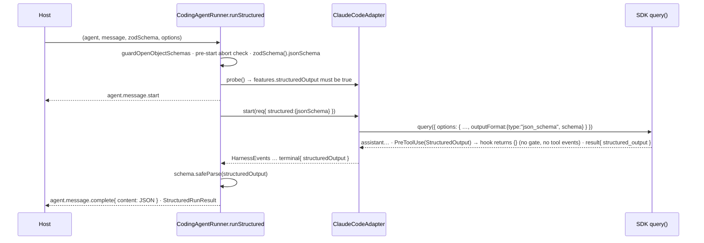

# Implementation strategy — issue #547: `runStructured` for the Claude Code runners

**Size M · one PR from `feat/cc-runner-run-structured` (based on `origin/main` 7505cb5) · packages: runtime · Gate 1 = `gate:auto` (delegated run)**

Revision 2 — re-cited against the 7505cb5 tree after the Gate 1.5 REVISE (see § Spec Review and § Design Addendum below).

## Goal

`ClaudeCodeRunner` and `ClaudeCodeAPIRunner` gain a `runStructured<T>(agent, message, schema, options)` that returns a schema-valid `StructuredRunResult<T>`, with **parity** to `AgentRunner.runStructured` on result shape, events, errors and cancellation — implemented on the shared `CodingAgentRunner` base and driven by the Agent SDK's **native** `outputFormat: { type: "json_schema" }` (no prompt contract, no repair loop).

## Current state (verified at `origin/main` 7505cb5, SDK `0.3.226` installed)

- `CodingAgentRunner` implements `run()` (`packages/agent-runtime/src/runner/harness/coding-agent-runner.ts:146`) and `stream()` (`:182`); its `_startRun` comment at `:407-408` says `runStructured()` is "not implemented by this base". `RunnerProtocol.runStructured?` is optional (`runner/types.ts:341-351`, declaration `:345`), so a consumer on a Claude Code runner sees `runner.runStructured === undefined` — and `workflows/agent-step.ts:151` therefore throws `StructuredOutputUnsupported` for any `AgentStep` with a non-string `output` schema on these runners. `createRunner()`'s step 5 builds a `ClaudeCodeAPIRunner` (`runner/create-runner.ts:332-342`) — the only automatic path to Claude Code.
- `ClaudeCodeRunner extends CodingAgentRunner<AgentLikeForBridge>` (`runner/claude-code-runner.ts:152`); `ClaudeCodeAPIRunner extends ClaudeCodeRunner` (`runner/claude-code-api-runner.ts:42`) and only pins constructor presets (`config: isolated`, `nativeTools: "none"`) — one implementation on the base covers both.
- SDK option / result surface (installed `.d.ts`, `node_modules/.bun/@anthropic-ai+claude-agent-sdk@0.3.226+…/node_modules/@anthropic-ai/claude-agent-sdk/sdk.d.ts`): `Options.outputFormat?: OutputFormat` (`:1739-1750`); `OutputFormat = JsonSchemaOutputFormat` (`:2142`); `JsonSchemaOutputFormat = { type: 'json_schema'; schema: Record<string, unknown> }` (`:930-933`); `SDKResultSuccess.structured_output?: unknown` (`:4503`); `SDKResultError.subtype` includes `'error_max_structured_output_retries'` (`:4442`); `TerminalReason` includes `'structured_output_retry_exhausted'` (`:7213`). Mechanism doc at `:1858-1863`: the turn ends on an **end-turn tool carrier** followed by a `structured_output` attachment.
- **The carrier is a CLI built-in tool named `StructuredOutput`.** Evidence: `strings` over the bundled CLI (`node_modules/.bun/@anthropic-ai+claude-agent-sdk-linux-x64@0.3.226/…/claude`, CC 2.1.226) contains `StructuredOutput`, `StructuredOutput schema mismatch: `, `StructuredOutput enforcement failed: `, `requiresStructuredOutput`, `MAX_STRUCTURED_OUTPUT_RETRIES`, `claude/endTurn` (30 hits). It is not a typed name anywhere in `sdk.d.ts` / `sdk-tools.d.ts` — it is a runtime contract of the pinned CLI, so it is pinned as a named constant and covered by the live smoke, not a type pin.
- `Options.tools` doc (`sdk.d.ts:1455`, doc `:1447-1454`): `[]` "Disable all built-in tools". `applyNativeTools` (`runner/cc-config.ts:150-154`) sets `tools: []` for `nativeTools: "none"` — the `ClaudeCodeAPIRunner` preset. Whether the CLI force-includes `StructuredOutput` when `outputFormat` is set cannot be determined from types; the spec treats it defensively (§6).
- `_buildOptions` (`claude-code-runner.ts:225-289`) installs the gate hooks unconditionally via `_makeHooks` (`:298-373`): `onPreToolUse` (`:307`) routes **every** tool call through `emitIntent()` → `bus.evaluateIntent` and returns `permissionDecision: "deny"` on a blocked outcome (`:324-334`), else emits `agent.tool.start`; `onPostToolUse` (`:346`) emits `agent.tool.end`. Without special handling the `StructuredOutput` carrier would be gate-evaluated and would emit `agent.tool.*` events.
- Version bisect (`npm pack` of published tarballs): `outputFormat` / `structured_output` **absent** in 0.3.0, 0.3.50, 0.3.100, 0.3.110, 0.3.120, 0.3.130, 0.3.140; **present** in 0.3.150, 0.3.215, 0.3.226. `packages/agent-runtime/package.json:66` declares `dependencies["@anthropic-ai/claude-agent-sdk"] = "^0.3.0"` (admits featureless versions); `:73` devDependency `^0.3.215`; `bun.lock:106` carries the `^0.3.0` specifier, `:114` the `^0.3.215` one, `:183` the resolved `0.3.226`; `__fixtures__/claude-agent-sdk-contract.json` pins `0.3.226`.
- `AgentRunner.runStructured` (`runner/agent-runner.ts:1497-1915`) — the parity reference:
  - `guardOpenObjectSchemas(schema, options?.allowOpenObjectSchemas)` first (`:1508`), before any LLM call.
  - Pre-start abort → `throw new RunCancelledError(...)` with **no events** (`:1518-1522`).
  - `runId = options?.runId ?? generateId()`, `traceId = options?.traceId ?? runId` (`:1531-1532`); `adviseStructuredRun(modelName, hasTools)` (`:1551`) — an AI-SDK model-capability advisory; `agent.message.start` is the root (`:1556-1569`).
  - Mid-run abort → emits `agent.message.complete {content:"", finishReason:"cancelled", tokens accrued}` (`emitCancelledTerminal`, `:1596-1612`) then throws `RunCancelledError` (never a raw AbortError).
  - Validation: `schema.safeParse(rawObject)`; on failure emits `agent.error {recoverable:false}` and throws `Error("runStructured: model output failed schema validation — …")` (`:1856-1873`).
  - Success: `agent.message.complete` with `content: JSON.stringify(parsed.data)` (`:1875-1888`); `_maybeEmitRedaction` (Bifrost gateway scan, #407, `:1893-1900`); returns `{ response: JSON.stringify(parsed.data), inputTokens, outputTokens, toolCallsCount, iterations, finishReason, object: parsed.data, usageDetails?, gateway? }` (`:1904-1915`).
- `RunCancelledError` is defined in `agent-runner.ts:119-137` and thrown at `:1519`, `:1633`, `:1707`, `:1775`, `:1834`; it is **not** re-exported from `runner/index.ts` / `src/index.ts` (verified by grep; `src/index.ts:13` is `export * from "./runner/index.js"`, so a `runner/index.ts` export surfaces publicly).
- Harness seam: `HarnessRunRequest` (`harness/types.ts:288-305`) carries `agent/message/options/runId/traceId/parentSpanId/correlationId/streaming/evaluateIntent`; `HarnessProbeResult.features` (`:188-194`) has five booleans; `HarnessEvent` is `{ ids; parent?; meta? } & (…union…)` (`:107`) whose `terminal` variant (`:141-147`) carries `numTurns/usage/costUsd?/finishReason` (+ `meta.finalText`). `HarnessStartError(code, message)` (`:239-249`) accepts `"schema-incompatible"`. `FinishReason = string` (`:69`). `HarnessEventTranslator.onTerminal` (`harness/harness-event-translator.ts:259-267`) accrues into `HarnessRunAccounting` (`:42-50`), read by `finalize()` (`:119-136`, which assigns `costUsd: this.costUsd` unconditionally at `:131`).
- CC adapter: `ClaudeCodeAdapter.start()` (`harness/claude-code/claude-code-adapter.ts:121-135`) calls `buildOptions(agent, options, context)` then `query({ prompt, options })`; `BuildSDKOptions` context (`:38-48`) is `{ runId, traceId, parentSpanId?, correlationId?, includePartialMessages? }`; `probe()` (`:101-119`) returns the static feature table. `CCHarnessTranslator.onResult` (`cc-harness-translator.ts:254-270`) builds the terminal event from `SDKResultMessage`; `mapFinishReason` (`:49-62`) maps the four known subtypes, else `"unknown"`.
- `_buildOptions` spreads `this._defaults` first (`claude-code-runner.ts:237`), so a per-run assignment afterwards wins.
- `zodSchema()` from `ai` (re-exported from `@ai-sdk/provider-utils@5.0.25`, `dist/index.d.ts:1013-1021`) returns `Schema<T>` with `.jsonSchema: JSONSchema7 | PromiseLike<JSONSchema7>` (`:983`). Executed against the installed tree (Gate 1.5 reviewer): `zodSchema(z.object({answer:z.number(),reasoning:z.string()})).jsonSchema` → `{type:"object", properties, required, additionalProperties:false, $schema:"http://json-schema.org/draft-07/schema#"}`, no `$ref`/`definitions`. This is the same conversion `Output.object({ schema })` performs for `AgentRunner`, so both runners send the same JSON Schema shape. (`zodSchema` also accepts zod-4 schemas, but `RunnerProtocol.runStructured?` types `schema: ZodType<T>` from zod 3 — `runner/types.ts:13`, `:348` — so zod 4 cannot reach any runner today; not a property this spec claims.)
- Existing test seams: `harness/__tests__/coding-agent-runner-abort.test.ts` drives the base against a `FakeAdapter`/`FakeSession` (no subprocess); `harness/__tests__/cc-translation.test.ts` builds hand-rolled `SDKResultMessage` fixtures; `__tests__/claude-code-api-runner.test.ts` already defines `APIRunnerProbe` (`:24`) / `CCRunnerProbe` (`:33`) exposing `_buildOptions`; `__tests__/sdk-contract.test.ts` pins SDK types with `expectTypeOf`. `harness-contract.test.ts:276` asserts probe features property-wise (not `toEqual`), so an added feature key breaks nothing. Probe `features` literals live in 3 test files + the adapter (`grep -c durableRules`); `ClaudeCodeAdapter` is the only in-repo `HarnessAdapter` implementer besides the test fakes.
- Live integration test `src/__tests__/claude-code-runner.test.ts` is `describe.skipIf(CI==="true" || SKIP_SDK_TESTS==="true")` (`:34`, `:120`); in this container it fails with `--dangerously-skip-permissions cannot be used with root/sudo privileges` (environmental; passes in CI's non-root runner).
- The merge gate is the `check` status = root `package.json:26`: `build && check:dist-contract && typecheck && lint && test && check:model-facing-schemas && smoke:memory && check:docs-events`.

## Approach

Design (a): native schema output through the SDK. The base owns the protocol method; the harness-specific half is two additive fields on the seam (`HarnessRunRequest.structured` in, `terminal.structuredOutput` out) plus a probe feature flag so a harness that cannot do it fails loud before any event. The SDK's `StructuredOutput` carrier tool is the harness's **output channel**, not an agent tool — it bypasses the gate chain and emits no `agent.tool.*` events, exactly as `AgentRunner`'s `Output.object` path emits none (§7a).



### 1. `runner/errors.ts` (create) — shared error classes

- Move `RunCancelledError` verbatim from `agent-runner.ts:119-137`. In `agent-runner.ts`: `import { RunCancelledError } from "./errors.js";` **and** `export { RunCancelledError } from "./errors.js";` (the name is thrown at five sites — the import binds it locally, the export keeps the public path). Add `export { RunCancelledError, StructuredOutputUnavailableError } from "./errors.js";` to `runner/index.ts` (additive — neither is exported today).
- New `StructuredOutputUnavailableError extends Error { readonly finishReason: string }` — thrown by the harness path when the run finished with no `structured_output` payload. `finishReason` is the mapped harness reason (`"stop"` = success-but-no-payload, `"max-structured-output-retries"`, `"error"`, `"max-turns"`, `"budget"`, …), so the three failure modes are separable by field, not regex. Message: `runStructured: the harness finished without structured output (finishReason="…")`, with an appended hint for `"max-structured-output-retries"` ("the model did not produce schema-conformant output within the CLI's retry budget — simplify the schema or the task"). Schema-validation failure stays a plain `Error` with the `AgentRunner` message text (parity).
- `coding-agent-runner.ts` imports both from `"../errors.js"` — same layer (7), no cycle (`agent-runner.ts` never imports the harness base).

### 2. `harness/types.ts` (modify) — three additive seam fields

```ts
// HarnessRunRequest (`:288-305`) — present ONLY on the runStructured path
readonly structured?: { readonly jsonSchema: Record<string, unknown> };

// HarnessProbeResult.features (`:188-194`) — optional so out-of-repo adapters stay valid; absent ⇒ unsupported
readonly structuredOutput?: boolean;

// terminal variant of the HarnessEvent union (`:141-147`; the `{ ids; parent?; meta? } &` base is unchanged)
| { kind: "terminal"; numTurns: number; usage: TokenUsage; costUsd?: number; finishReason: FinishReason; structuredOutput?: unknown }
```

### 3. `harness/harness-event-translator.ts` (modify)

`HarnessRunAccounting.structuredOutput?: unknown` (`:42-50`); `onTerminal` (`:259-267`) stores `event.structuredOutput`; `finalize()` (`:119-136`) assigns `structuredOutput: this.structuredOutput` unconditionally — house style of the sibling `costUsd` at `:131`. Presence is judged on `!== undefined` by the consumer (`null` may be a legitimate value for a nullable schema).

### 4. `harness/claude-code/cc-harness-translator.ts` (modify)

- `onResult` (`:254-270`): when `msg.subtype === "success"` and `msg.structured_output !== undefined`, set `structuredOutput: msg.structured_output` on the terminal event.
- `mapFinishReason` (`:49-62`): add `case "error_max_structured_output_retries": return "max-structured-output-retries";` (a distinct honest reason — not `"error"`, not `"unknown"`).

### 5. `harness/claude-code/claude-code-adapter.ts` (modify)

- `BuildSDKOptions` context (`:38-48`) gains `outputSchema?: Record<string, unknown>`.
- `start()` (`:121-135`) passes `outputSchema: req.structured?.jsonSchema`.
- `probe()` (`:101-119`) features add `structuredOutput: true` (the SDK floor now guarantees it — §9).

### 6. `claude-code-runner.ts` `_buildOptions` (modify, `:225-289`)

Export `export const CC_STRUCTURED_OUTPUT_TOOL = "StructuredOutput";` with a doc comment stating it is the CLI 2.1.x built-in carrier name pinned by evidence (§ Current state), verified by the live smoke, and the one place to change if the CLI renames it.

When `context.outputSchema` is set, after the `includePartialMessages` block and **after** `applyNativeTools` / `extraDisallowedTools` have run:
1. `sdkOpts.outputFormat = { type: "json_schema", schema: context.outputSchema };` — per-run wins over any `_defaults.outputFormat` (defaults are spread first, `:237`).
2. Keep the carrier reachable: if `Array.isArray(sdkOpts.tools)` (i.e. `nativeTools` is `"none"` or a list — `tools: []` means "disable all built-in tools", `sdk.d.ts:1447-1454`) and it does not already contain `CC_STRUCTURED_OUTPUT_TOOL`, append it; add `CC_STRUCTURED_OUTPUT_TOOL` to `sdkOpts.allowedTools` (dedup). Both are no-ops if the CLI force-includes the carrier, and necessary if it does not — decidable only live (§ Open questions). Never touch `disallowedTools` (a host that explicitly blocks the carrier via `extraDisallowedTools` gets the honest `StructuredOutputUnavailableError`).
3. `_makeHooks(runId, traceId, parentSpanId, { structured: true })` — see §7a.

Update the file header + class doc to say structured output is supported and how.

### 7. `harness/coding-agent-runner.ts` (modify) — the method

`_startRun(agent, message, options, streaming, structured?: { jsonSchema })`: after `adapter.probe(...)` and `assertGateRequirements`, **before** `agent.message.start` is published:

```ts
if (structured && probe.features.structuredOutput !== true) {
  throw new HarnessStartError("schema-incompatible",
    `${adapter.name}: runStructured is unavailable — the harness probe does not report features.structuredOutput`);
}
```
and put `...(structured ? { structured } : {})` on the `HarnessRunRequest`. Update the `:407-408` comment (runStructured now exists; it checks abort BEFORE `_startRun` so a pre-start cancel emits nothing — parity with `AgentRunner`). Extract the zeroed cancelled accounting literal at `:327-336` into a module-level `EMPTY_CANCELLED_ACCOUNTING: HarnessRunAccounting` shared by `_emitCancelledRun` and the method below.

The base imports `zodSchema` from `ai` — a **new** coupling for `harness/` (today only `claude-code-runner.ts`, `mock-runner.ts`, `message-utils.ts`, `usage-details.ts`, `agent-runner.ts` import `ai`). Chosen deliberately: `ai` is already a hard dependency of the package; `zodSchema` is the exact conversion `AgentRunner` uses (parity of the wire schema across runners), it handles zod 3 today and zod 4 if the protocol ever widens, and one conversion in the base means every future adapter (Codex, #330) receives the same JSON Schema rather than re-deriving its own. `zod-to-json-schema` directly would add a dependency; per-adapter conversion would fork the wire shape.

```ts
async runStructured<T>(agent: TAgent, message: string, schema: ZodType<T>, options?: RunOptions): Promise<StructuredRunResult<T>> {
  guardOpenObjectSchemas(schema, options?.allowOpenObjectSchemas);                 // parity :1508
  if (options?.abortSignal?.aborted) throw new RunCancelledError("runStructured: aborted before the run started (abortSignal already fired)"); // no events
  const jsonSchema = (await zodSchema(schema).jsonSchema) as Record<string, unknown>;
  const prep = await this._startRun(agent, message, options, /* streaming */ false, { jsonSchema });
  const { bus, startEvent, model, traceId, runId, parentSpanId } = prep;
  if (prep.cancelled) {            // signal fired between the check above and _startRun's own check
    await bus.publish(this._completeEvent(startEvent, EMPTY_CANCELLED_ACCOUNTING, model));
    throw new RunCancelledError("runStructured: aborted before the harness started (no structured output available)");
  }
  const { session, translator } = prep;
  const cancelledRef = { value: false };
  try {
    for await (const hEvent of this._drainSession(session, options, cancelledRef))
      for (const apEvent of translator.translate(hEvent)) await bus.publish(apEvent);
  } catch (err) { await this._emitError(bus, err, traceId, runId, parentSpanId); throw err; }
  finally { await session.close(); }
  if (cancelledRef.value) {        // parity with AgentRunner's emitCancelledTerminal (:1596) then throw
    await bus.publish(this._completeEvent(startEvent, { ...translator.finalize(), finishReason: "cancelled" }, model));
    throw new RunCancelledError("runStructured: aborted while the harness was running (no structured output available)");
  }
  const acc = translator.finalize();
  if (acc.structuredOutput === undefined) {
    const err = new StructuredOutputUnavailableError(acc.finishReason);
    await this._emitError(bus, err, traceId, runId, parentSpanId); throw err;
  }
  const parsed = schema.safeParse(acc.structuredOutput);
  if (!parsed.success) {
    const err = new Error(`runStructured: model output failed schema validation — ${parsed.error.message}`);  // parity text :1859
    await this._emitError(bus, err, traceId, runId, parentSpanId); throw err;
  }
  const content = JSON.stringify(parsed.data);
  const finalAcc = { ...acc, content };
  await bus.publish(this._completeEvent(startEvent, finalAcc, model));
  return { ...this._result(finalAcc), object: parsed.data };
}
```

`_emitError` (`:483-503`) already emits `agent.error {recoverable:false}` — reuse it. `_result` (`:471-479`) / `_completeEvent` are reused so `costUsd`, `iterations` (from `num_turns`) and tokens flow exactly as `run()`.

**Parity items deliberately declined** (each is an `AgentRunner`-provider concern with no harness analogue; stated here so the Acceptance list is complete): `adviseStructuredRun` (`:1551` — advisory over the AI-SDK model-capability map, keyed by provider model id; the harness resolves its own model), `_maybeEmitRedaction` (`:1893-1900` — Bifrost gateway metadata scan, #407; there is no gateway on the subprocess path), `usageDetails` / `gateway` on the result (`_result()` at `:471-479` emits neither for `run()` either — same gap, not new).

### 7a. `claude-code-runner.ts` `_makeHooks` (modify, `:298-373`) — the carrier bypass

Signature gains `opts: { structured: boolean }`. In `onPreToolUse` (`:307`) and `onPostToolUse` (`:346`), **first thing**: `if (opts.structured && toolName === CC_STRUCTURED_OUTPUT_TOOL) return {};` — no `agent.tool.intent`, no gate evaluation, no `agent.tool.start`/`end`. Rationale: the carrier is how the harness *returns* the structured object (the SDK's own doc calls its `tool_result` "a placeholder", `sdk.d.ts:1861-1862`); it is not the agent exercising a capability, so it is not a `ToolCallIntent` — the same reason `AgentRunner`'s `Output.object` path emits no tool events. Gating it would let an allow-list gate silently kill every structured run. The bypass is scoped to structured runs, so an ordinary `run()` that somehow sees a tool by that name is unaffected. Consequence for §7: with the carrier ungated, a missing `structured_output` can only come from the harness itself — `StructuredOutputUnavailableError.finishReason` says which way.

### 8. `runner/types.ts` (modify) — doc only

`RunOptions.abortSignal` doc (`:197-234`): the `CodingAgentRunner` paragraph gains one sentence: `runStructured()` mirrors `AgentRunner` — a pre-start abort throws `RunCancelledError` with no events; a mid-run abort tears the session down, emits `agent.message.complete {finishReason:"cancelled"}` with whatever accrued, then throws `RunCancelledError`. `RunnerProtocol.runStructured?` doc (`:341-344`): add "Implemented by `AgentRunner`, `MockRunner`, and the `CodingAgentRunner` family (`ClaudeCodeRunner` / `ClaudeCodeAPIRunner`, #547) — which also unlocks `AgentStep` structured outputs on those runners."

### 9. `packages/agent-runtime/package.json` (modify) — floor bump

`dependencies["@anthropic-ai/claude-agent-sdk"]` (`:66`): `^0.3.0` → `^0.3.215` (matches the devDependency; the bisect puts the feature at ≤0.3.150 but 0.3.215 is the pair the contract fixture was written against). Run `bun install`; `git diff bun.lock` must show ONLY `bun.lock:106` changing `^0.3.0` → `^0.3.215`. If anything else moves, do **not** hand-edit the lockfile — `git checkout bun.lock`, then `bun install --frozen-lockfile` to confirm the tree still resolves, and investigate before retrying (a hand-edited lockfile can go inconsistent). The `sdk-contract.test.ts` fixture (`0.3.226`) is untouched.

### 10. `__tests__/sdk-contract.test.ts` (modify) — type pins

Add `expectTypeOf<NonNullable<Options["outputFormat"]>>().toEqualTypeOf<{ type: "json_schema"; schema: Record<string, unknown> }>()`, `expectTypeOf<SDKResultSuccess>().toHaveProperty("structured_output")`, and `expectTypeOf<Extract<SDKResultError["subtype"], "error_max_structured_output_retries">>().toEqualTypeOf<"error_max_structured_output_retries">()`. Drift in the pinned SDK surface now fails typecheck at this file.

### 11. Docs (modify) — `docs/runners.md`

- §3.3 is an **event-emission** parity table — no `runStructured` row there. Update its finishReason prose (`docs/runners.md:157-160`) to include `error_max_structured_output_retries`→`max-structured-output-retries`.
- New short **§3.5 "Structured output on the Claude Code runners (#547)"** after §3.4: mechanism (SDK `outputFormat: json_schema`, `structured_output` on the result), the `StructuredOutput` carrier bypass and why, result/event/error/cancel parity with `AgentRunner.runStructured`, the declined parity items (§7), the two pre-existing option-plumbing gaps (`messageHistory` — cross-ref §3.4; `modelParams` — cross-ref `RunOptions.modelParams`), and that `AgentStep` structured outputs now work on these runners.
- §2.5 item 1: append "Also available on the Claude Code runners since #547 (native SDK `json_schema` output; see §3.5)."
Frontmatter unchanged; no new page, no sidebar change, no executable code fence (per `docs-management`).

### 12. Live smoke (modify `src/__tests__/claude-code-runner.test.ts`)

Add ONE case to the existing `describe.skipIf(shouldSkip)` block (`:120`): a tool-less agent on `ClaudeCodeAPIRunner` (the `tools: []` cell — the one that exercises §6 step 2), `runStructured` with `z.object({ answer: z.number(), reasoning: z.string() })`; asserts `typeof result.object.answer === "number"`, `result.response === JSON.stringify(result.object)`, and that no `agent.tool.*` event names the carrier. Never runs in CI (`CI=true` skip is pre-existing); in this container it fails for the same root-privilege reason as its two siblings — record that in the result, do not chase it. No key is ever printed.

## File-level plan

### Create
- `packages/agent-runtime/src/runner/errors.ts`
- `packages/agent-runtime/src/runner/harness/__tests__/coding-agent-runner-structured.test.ts`
- `packages/agent-runtime/src/runner/harness/__tests__/claude-code-adapter-structured.test.ts`

### Modify
- `packages/agent-runtime/src/runner/agent-runner.ts` (import + re-export `RunCancelledError`; delete the local class)
- `packages/agent-runtime/src/runner/index.ts` (export the two error classes)
- `packages/agent-runtime/src/runner/harness/types.ts`
- `packages/agent-runtime/src/runner/harness/harness-event-translator.ts`
- `packages/agent-runtime/src/runner/harness/coding-agent-runner.ts`
- `packages/agent-runtime/src/runner/harness/claude-code/cc-harness-translator.ts`
- `packages/agent-runtime/src/runner/harness/claude-code/claude-code-adapter.ts`
- `packages/agent-runtime/src/runner/claude-code-runner.ts`
- `packages/agent-runtime/src/runner/types.ts` (docs)
- `packages/agent-runtime/package.json` (+ `bun.lock:106`)
- `packages/agent-runtime/src/runner/__tests__/sdk-contract.test.ts`
- `packages/agent-runtime/src/runner/__tests__/claude-code-api-runner.test.ts` (extend — reuse its probe subclasses)
- `packages/agent-runtime/src/runner/harness/__tests__/cc-translation.test.ts`
- `packages/agent-runtime/src/__tests__/claude-code-runner.test.ts` (live, skip-gated)
- `docs/runners.md`

## Interfaces

```typescript
// runner/errors.ts (RunCancelledError moved here; both re-exported from runner/index.ts; agent-runner.ts re-exports RunCancelledError)
export class RunCancelledError extends Error { constructor(message?: string) }
export class StructuredOutputUnavailableError extends Error {
  readonly finishReason: string;
  constructor(finishReason: string)
}

// harness/types.ts
export interface HarnessRunRequest<TAgent extends AgentLike = AgentLike> {
  /* …existing… */
  /** Present only on the runStructured path: the JSON Schema the harness must constrain its final output to. */
  readonly structured?: { readonly jsonSchema: Record<string, unknown> };
}
// HarnessProbeResult.features gains: readonly structuredOutput?: boolean;
// terminal HarnessEvent variant gains: structuredOutput?: unknown;

// harness/harness-event-translator.ts
export interface HarnessRunAccounting { /* …existing… */ readonly structuredOutput?: unknown; }

// harness/claude-code/claude-code-adapter.ts
export type BuildSDKOptions = (agent, options, context: { runId; traceId; parentSpanId?; correlationId?; includePartialMessages?; outputSchema?: Record<string, unknown> }) => SDKOptions;

// claude-code-runner.ts
export const CC_STRUCTURED_OUTPUT_TOOL = "StructuredOutput";

// harness/coding-agent-runner.ts
async runStructured<T>(agent: TAgent, message: string, schema: ZodType<T>, options?: RunOptions): Promise<StructuredRunResult<T>>;
```

## Tests

All CI-path tests are fixture/contract tests — no subprocess, no network, no key.

**`harness/__tests__/coding-agent-runner-structured.test.ts`** — base against a `FakeAdapter`/`FakeSession` (copy the abort test's fakes; add `features.structuredOutput: true` to its probe and a `terminal` fixture carrying `structuredOutput`). Event-exactness assertions below are **fake-scoped**: they prove what the base emits, not what a live harness's hooks add.
1. happy path: returns `object` (parsed), `response === JSON.stringify(object)`, `finishReason:"stop"`, `iterations` from `numTurns`, `costUsd`, tokens; the bus saw exactly `agent.message.start` … `agent.message.complete` (fake-scoped) with `content === response`; no `agent.error`.
2. the `HarnessRunRequest` handed to `adapter.start` carries `structured.jsonSchema` with `type:"object"` and the declared `properties` (proves the zod→JSON-Schema conversion reaches the adapter).
3. `runId`/`traceId` from options are honored on `message.start` (parity #437).
4. schema-invalid `structuredOutput` → rejects with `/failed schema validation/`; exactly one `agent.error {recoverable:false}`; no `message.complete`.
5. success terminal with no `structuredOutput` → rejects with `StructuredOutputUnavailableError` (`instanceof`), `finishReason === "stop"`; one `agent.error`.
6. terminal `finishReason:"max-structured-output-retries"` (no payload) → `StructuredOutputUnavailableError.finishReason === "max-structured-output-retries"`, message contains the retry hint; terminal `finishReason:"error"` (the `error_during_execution` mapping) → `finishReason === "error"`, no hint.
7. pre-fired `abortSignal` → rejects with `RunCancelledError` (`instanceof` + `name`), **zero** events published, `adapter.start` never called.
8. mid-run abort (after the fake reaches its hang) → `session.close()` called, `message.complete {finishReason:"cancelled"}` published with the accrued content/tokens, rejects with `RunCancelledError`.
9. adapter whose probe lacks `features.structuredOutput` → rejects with `HarnessStartError` code `"schema-incompatible"` **before** any event; `adapter.start` never called.
10. `z.record(z.string())` schema → rejects with `OpenObjectSchemaError` before probe; with `allowOpenObjectSchemas:true` proceeds (spy on `console.warn`, restore).
11. per-call `options.eventBus` receives the events, the constructor bus does not (#496 parity).
12. `const r: RunnerProtocol = runner; typeof r.runStructured === "function"` — the `AgentStep` unlock (`workflows/agent-step.ts:151`) is now true for this family.

**`harness/__tests__/cc-translation.test.ts`** (extend): result with `structured_output: {a:1}` → terminal `structuredOutput` deep-equals it; success without the field → `structuredOutput` is `undefined`; `mapFinishReason("error_max_structured_output_retries") === "max-structured-output-retries"` in the existing table test.

**`__tests__/claude-code-api-runner.test.ts`** (extend, new `describe("runStructured plumbing (#547)")`, reusing `APIRunnerProbe`/`CCRunnerProbe` — add an overload that passes `outputSchema`):
- `_buildOptions` with `outputSchema` → `outputFormat` deep-equals `{ type:"json_schema", schema }`; without → `"outputFormat" in opts === false`; `_defaults.outputFormat` is overridden per run.
- API runner (`tools: []`) with `outputSchema` → `tools` contains `"StructuredOutput"` and `allowedTools` contains it; without `outputSchema` → `tools` stays `[]` and `allowedTools` does not contain it. CC runner (`nativeTools: "all"`, no `tools` key) with `outputSchema` → `tools` key still absent, `allowedTools` contains the carrier. `extraDisallowedTools: ["StructuredOutput"]` is left in `disallowedTools` (not stripped).
- Hook bypass: invoke the built `hooks.PreToolUse[0].hooks[0]` with `{ tool_name: "StructuredOutput", tool_input: {} }` on a structured build → returns `{}`, the bus saw **no** `agent.tool.intent`/`start`, `evaluateIntent` not called; same input on a non-structured build → gate consulted and `agent.tool.start` emitted (proves the bypass is scoped); `hooks.PostToolUse[0].hooks[0]` with the carrier on a structured build → no `agent.tool.end`. A different tool name on a structured build still goes through the gate.

**`harness/__tests__/claude-code-adapter-structured.test.ts`**: `ClaudeCodeAdapter.probe()` reports `features.structuredOutput === true`. `ClaudeCodeAdapter.start()` with `vi.mock("@anthropic-ai/claude-agent-sdk", …)` (`query` → an empty async iterable with `interrupt`/`return` no-ops): the `buildOptions` spy receives `outputSchema` when `req.structured` is set and `undefined` when not.

**`__tests__/sdk-contract.test.ts`** (extend): the three type pins from §10.

**Mutation checks** (run each, confirm the named test reddens, revert):
| Guard flipped to broken form | Test that must fail |
|---|---|
| `safeParse` failure no longer throws (return raw) | structured #4 |
| `structuredOutput === undefined` check removed | structured #5 |
| pre-start abort check removed | structured #7 (events count / start called) |
| `cancelledRef` branch removed (fall through to validation) | structured #8 |
| `features.structuredOutput` check removed | structured #9 |
| `guardOpenObjectSchemas` call removed | structured #10 |
| `outputFormat` not set in `_buildOptions` | api-runner `outputFormat` test |
| carrier not appended to `tools` / `allowedTools` | api-runner carrier-reachability test |
| carrier bypass removed from `onPreToolUse` | api-runner hook-bypass test |
| `structured_output` not copied in `onResult` | cc-translation structured test |
| `mapFinishReason` new case removed | cc-translation finishReason table |

## Acceptance (from the issue, restated)

- `new ClaudeCodeAPIRunner().runStructured` and `new ClaudeCodeRunner().runStructured` are functions; `createRunner()`'s CLI-probe runner therefore satisfies `runStructured` callers, and `AgentStep` structured outputs work on this family.
- Result/event/error/cancel parity with `AgentRunner.runStructured` as itemised in §7; the complete deviation list is: harness superset `costUsd` on the result/event; declined `adviseStructuredRun`, `_maybeEmitRedaction`, `usageDetails`, `gateway` (§7, provider-only concerns); pre-existing harness gaps `messageHistory`, `modelParams` (documented in `docs/runners.md` §3.4/§3.5); `StructuredOutputUnavailableError` (typed) where `AgentRunner` has no equivalent failure mode.
- SDK floor `^0.3.215`; lockfile drift limited to `bun.lock:106`.
- **`bun run check` green** (the merge gate — all eight steps), modulo the two root-only live cases in this container, which pass in CI.

## Out of scope

- #10 (per-call model override), #274 (MockRunner structured tool dispatch), #399 (isolated mode + `ANTHROPIC_API_KEY`) — untouched, referenced only.
- `messageHistory` / `modelParams` on harness runners; `systemPrompt` on the harness `message.start`.
- Surfacing the `StructuredOutput` carrier as any event (`agent.tool.*` or `harness.native`) — it is deliberately silent (§7a); revisit only if a consumer needs to observe the carrier.
- `createRunner()` probe changes; any software-patterns work; PR #40.

## Open questions

- **Does the CLI force-include the `StructuredOutput` tool when `tools: []`?** Not decidable from types. §6 step 2 appends it defensively (harmless if redundant). The live smoke on the API runner is the test; if the run still ends without a carrier call on a `tools: []` build, the fallback is to build structured runs with `tools: [CC_STRUCTURED_OUTPUT_TOOL]` unconditionally — flagged for Dug.
- **`$schema` key.** `zodSchema()` emits `$schema: "http://json-schema.org/draft-07/schema#"` (executed, confirmed); the SDK types accept any `Record<string, unknown>`. Whether the CLI's validator ignores or rejects it can only be settled by the live smoke (blocked here by root). If it rejects, strip `$schema` in §7 before handing the schema to the adapter — a one-line change.
- **Anthropic's structured-output grammar vs open objects.** The open-object guard is kept for parity/portability; if a CC-only consumer needs `z.record`, `allowOpenObjectSchemas: true` is the documented escape hatch (unverified live whether the CC grammar accepts `additionalProperties: true`).

---

<!--
Phase execution log — written by phase agents as gates fire.
-->

## Spec Review
<!-- written by: reviewer · gate 1.5 · /sdlc:critique · lens=mixed -->

**Target:** `.ai-docs/specs/547-cc-run-structured.md` (at `35decd9`)
**Against:** cited-code (`origin/main` 7505cb5 tree + installed SDK/`ai` `.d.ts`)
**Verdict:** REVISE

**Blockers (2):**

- [`.ai-docs/specs/547-cc-run-structured.md:263` (Out of scope) · mechanism at `packages/agent-runtime/src/runner/claude-code-runner.ts:307-346`] **The gate chain's interaction with the SDK's end-turn carrier tool is undefined, and the one line that touches it is mis-scoped.** The spec's own cited SDK mechanism (`sdk.d.ts:1858-1863`) says a `json_schema` turn ends on an MCP end-turn *tool* carrier. `_buildOptions` installs an unconditional `PreToolUse` hook (`claude-code-runner.ts:307`) that routes **every** tool call through `emitIntent()` → the gate chain, and returns `permissionDecision: "deny"` on rejection (`:324-334`). Consequences the spec never states: (a) `agent.tool.intent` / `.start` / `.end` **will** be emitted for the carrier — the Out-of-scope line reads as "these won't happen", and §Tests #1's "events are exactly `message.start` … `message.complete`" only holds because it runs against a `FakeAdapter`; (b) any gate that denies an unrecognized tool name silently kills the carrier, the result carries no `structured_output`, and §7 throws the generic `"the harness returned no structured output"` — misattributing a gate denial to a harness fault. Gates are the reason this runner family exists (`assertGateRequirements`, `emitIntent`, the whole `harness/` seam); leaving this undefined makes the feature unusable-and-unexplained on every gated runner. · _Fix:_ pick and write down one: (a) detect the carrier in `onPreToolUse` (tool name / `_meta['claude/endTurn']`) and return `{}` without publishing `agent.tool.*` or consulting gates; or (b) let it through, extend `assertGateRequirements` so a carrier-blocking gate fails loud at run start, and make §7's error distinguish "carrier denied by gate" from "harness produced nothing". Either way add a test, correct the Out-of-scope wording (the events are emitted, only their *interpretation* is out of scope), and amend §Tests #1 to say the event-exactness assertion is `FakeAdapter`-scoped.

- [`§ Current state` (spec `:17-34`)] **The section asserts "verified at `origin/main` 7505cb5" but ~18 of its `path:line` citations do not resolve.** The substance is right in every case — the *locations* are not, and several are off by 10-55 lines, i.e. they point at unrelated code. One of them drives an edit (§7's `EMPTY_CANCELLED_ACC` extraction points at `_drainSession`'s tail, not the zeroed literal). A spec that claims verification and then mis-cites a third of its references cannot be trusted on the claims a reviewer *can't* check. · _Fix:_ re-derive every citation against the 7505cb5 tree. Corrected values:

  | Spec claim | Cited | Actual |
  |---|---|---|
  | `RunnerProtocol.runStructured?` | `runner/types.ts:325-330` | `:341-351` (decl `:345`); `:325-330` is the interface doc + `run()` |
  | `RunOptions.abortSignal` doc (§8) | `runner/types.ts:209-247` | doc `:197-234`, decl `:235`; `:236-246` is `allowOpenObjectSchemas` |
  | `HarnessProbeResult.features` | `harness/types.ts:181-187` | `:188-194` |
  | `HarnessRunRequest` | `harness/types.ts:287-311` | `:288-305` (`:311` is `HarnessAdapter`) |
  | `HarnessRunAccounting` | `harness-event-translator.ts:52-60` | `:42-50` (`:52` is `class HarnessEventTranslator`) |
  | `finalize()` | `harness-event-translator.ts:109-126` | `:119-136` |
  | `onTerminal` | `harness-event-translator.ts:314-322` | `:259-267` |
  | `mapFinishReason` | `cc-harness-translator.ts:45-58` | `:49-62` |
  | `onResult` | `cc-harness-translator.ts:251-269` | `:254-270` |
  | `ClaudeCodeAdapter.start()` | `claude-code-adapter.ts:130-143` | `:121-135` |
  | `BuildSDKOptions` | `claude-code-adapter.ts:39-49` | `:38-48` |
  | `ClaudeCodeRunner extends …` | `claude-code-runner.ts:157` | `:152` |
  | `ClaudeCodeAPIRunner extends …` | `claude-code-api-runner.ts:44` | `:42` |
  | `_buildOptions` | `claude-code-runner.ts:229-296` | `:225-289` |
  | `_emitCancelledRun` zeroed acc (§7) | `coding-agent-runner.ts:311-319` | `:327-336` |
  | `_emitError` (§7) | `coding-agent-runner.ts:490-509` | `:483-503` |
  | AgentRunner `message.start` | `agent-runner.ts:1560-1575` | `:1556-1569` |
  | AgentRunner return block | `agent-runner.ts:1902-1912` | `:1904-1915` |

  Verified-correct (leave alone): `coding-agent-runner.ts:146` / `:182` / `:407-408`; `agent-runner.ts:119-137`, `:1497`, `:1508`, `:1518-1522`, `:1531-1532`, `:1596-1612`, `:1856-1873`, `:1875-1888`; `create-runner.ts:332-342`; terminal `HarnessEvent` `harness/types.ts:141-147`; every SDK `sdk.d.ts` citation (`:930-933`, `:1739-1750`, `:1858-1863`, `:2142`, `:4442`, `:4503`, `:7213`); `provider-utils` `:983` / `:1013-1021`; `package.json:66` / `:73`; the `durableRules` count (3 test files + adapter); all four named test seams.

**Notes (7):**

- [`§ Approach §7`] **New `ai` coupling in the harness-agnostic base.** `harness/coding-agent-runner.ts` imports nothing from `ai` today (only `claude-code-runner.ts`, `mock-runner.ts`, `message-utils.ts`, `usage-details.ts`, `agent-runner.ts` do). §7 adds `zodSchema` from `ai` to the CLI-harness base purely for a zod→JSON-Schema conversion. Defensible (one conversion shared by every future adapter) but undeclared — say so, and say why not `zod-to-json-schema` or per-adapter conversion.
- [`§ Current state` bullet on `AgentRunner.runStructured` parity] **Two pre-flight steps of the parity reference are silently dropped.** `adviseStructuredRun(modelName, hasTools)` (`agent-runner.ts:1551`) and the post-validation `_maybeEmitRedaction` scan (`:1897`, #407) are both part of `AgentRunner.runStructured` and appear nowhere in the spec. The Acceptance section claims "deviations are only … `costUsd` … `messageHistory`, `modelParams`" — that list is incomplete. Also absent from the harness result: `usageDetails` and `gateway` (`_result()` at `coding-agent-runner.ts:471-479` emits neither). Either adopt or explicitly decline each, in the Acceptance list.
- [`§11` · `docs/runners.md:126-173`] **§3.3 is an *event-emission* parity table, not a capability table.** Every row is an `agent.*` event type; a `runStructured()` row is categorically out of place there, and the "Remaining honest gaps" list beneath it is specifically about *event fidelity with no native source* (`durationMs`, `resultTokens`, synthesized iterations) — `messageHistory` / `modelParams` are option-plumbing gaps and don't belong in it. Separately, §3.3's prose enumerates the finishReason mapping (`docs/runners.md:157-160`: "`success`→`stop`, … else `unknown`") — §4 adds a fifth case and §11 doesn't update that sentence. §2.5 item 1 *is* the right anchor for the second edit ✓.
- [`§ Acceptance` (spec `:258`)] **The "green" criterion doesn't match the merge gate.** CLAUDE.md: `main` requires status `check`, which is `build && check:dist-contract && typecheck && lint && test && check:model-facing-schemas && smoke:memory && check:docs-events` (root `package.json:26`). The spec names only four of the eight. Nothing in this change should break the other four, but the acceptance line should be `bun run check`.
- [`§1` (spec `:60`)] **The given re-export line alone won't compile.** `export { RunCancelledError } from "./errors.js";` does not bind the name locally, and `agent-runner.ts` throws it at `:1519`, `:1633`, `:1707`, `:1775`, `:1834`. The file needs an `import` *and* an `export`. The parenthetical "(also used internally)" hints at this; make it explicit so a verbatim implementer doesn't hit TS2304. (The public path is otherwise sound: `src/index.ts:13` is `export * from "./runner/index.js"`, so a `runner/index.ts` export does surface publicly — verified.)
- [`§ Current state` bullet on `zodSchema`] **The zod-4 tolerance is real but unreachable at this seam.** `zodSchema`'s signature does accept `$ZodType | z3.Schema` (verified, `provider-utils@5.0.25:1013`), but `RunnerProtocol.runStructured?` types `schema: ZodType<T>` from **zod 3** (`runner/types.ts:13`, `:348`), so a zod-4 schema can't reach any runner today. Presenting zod-4 support as a property of the chosen conversion oversells it — drop the claim or note it's blocked upstream at the protocol signature.
- [`§7` error handling] **Three distinct failure modes collapse into one untyped `Error`.** "success but no payload", `error_max_structured_output_retries`, and `error_during_execution` all produce `new Error("runStructured: the harness returned no structured output (finishReason=…)")`, separable only by regex on the message. `AgentRunner` has the same untyped posture for validation failure, so this is parity — but it's also the moment to consider a named error, and §Tests covers `success`-no-payload (#5) and `max-structured-output-retries` (#6) while never naming the `error_during_execution` path the mission asked about. At minimum add it to the #5/#6 table.

**Nits (5):**

- [`§2` (spec `:72`)] The terminal variant is written as a standalone object type; the real `HarnessEvent` is `{ ids: NativeIds; parent?; meta? } & ( … union … )` (`harness/types.ts:107`). Copied verbatim it drops `ids`.
- [`§3` (spec `:77`)] "spreads it only when `!== undefined`" is inconsistent with the sibling field in the same return object — `finalize()` assigns `costUsd: this.costUsd` unconditionally (`harness-event-translator.ts:131`). Both work; pick one house style.
- [`§1` (spec `:60`)] `"./../errors.js"` — write `"../errors.js"`.
- [`§9` (spec `:153`)] "revert any other drift" in `bun.lock` by hand is a risky instruction (a hand-edited lockfile can go inconsistent). Only `bun.lock:106` should move; if anything else does, re-run install rather than hand-revert, and say so.
- [`§ File-level plan`] The new `__tests__/claude-code-runner-structured.test.ts` duplicates the `APIRunnerProbe`/`CCRunnerProbe` subclasses that already exist in `__tests__/claude-code-api-runner.test.ts:24`/`:33`. Extending that file, or exporting the probes, avoids a third copy.

**Also verified as correct (no finding):** `zodSchema(z.object(…)).jsonSchema` was executed against the installed tree — it returns `{type:"object", properties, required, additionalProperties:false, $schema:"http://json-schema.org/draft-07/schema#"}` with no `$ref`/`definitions`, so §Tests #2's assertion holds and Open Question #2's premise is confirmed; `HarnessStartError("schema-incompatible", msg)` is a valid constructor (`harness/types.ts:239-249`); `FinishReason = string` (`harness/types.ts:69`) so the new value needs no type change; `_defaults` is spread first (`claude-code-runner.ts:237`) so a later `sdkOpts.outputFormat =` does win per-run; `harness-contract.test.ts:276` asserts `p.features.inputRewrite` property-wise, not `toEqual`, so adding `structuredOutput: true` to the adapter probe breaks nothing; `ClaudeCodeAdapter` is the only in-repo `HarnessAdapter` implementer besides the test fake, and both new seam fields are optional. One unlisted downstream effect worth knowing rather than fixing: `workflows/agent-step.ts:151` throws `StructuredOutputUnsupported` when `!runner.runStructured` — this change silently unlocks the structured `AgentStep` path for CC runners. That's the point of the issue, but it is a user-visible behavior change with no test and no mention.

**Reviewed by:** reviewer agent · 2026-09-15T03:56:28Z

## Design Addendum
<!-- written by: specifier · in response to REVISE verdict on Spec Review -->

Revision 2 (in-session specifier, 2026-09-15) — every Spec Review finding answered; the static sections above are the corrected contract.

**Blocker 1 — carrier tool vs gate chain → resolved with option (a), §7a.** The carrier is identified: CLI built-in `StructuredOutput` (evidence in § Current state: 30 string hits in the bundled 2.1.226 binary incl. `StructuredOutput schema mismatch:` / `requiresStructuredOutput`). On structured runs `_makeHooks` returns `{}` for it before gate evaluation or any `agent.tool.*` emission — it is the harness's output channel, not an agent capability (same posture as `AgentRunner`'s `Output.object`). Bypass is scoped to structured runs. Tests added (api-runner hook-bypass, scoped-bypass control, PostToolUse). Out-of-scope wording corrected; Tests #1 event-exactness marked fake-scoped. A second, previously unstated consequence was found while resolving this: `ClaudeCodeAPIRunner` builds with `tools: []` ("disable all built-in tools"), which may hide the carrier — §6 step 2 keeps it reachable defensively and the live smoke targets that cell (Open question 1).
**Blocker 2 — 18 stale citations → all re-derived** from the 7505cb5 tree per the reviewer's table (spot-checked: `types.ts:345`, `harness-event-translator.ts:259`, `cc-harness-translator.ts:49`, `coding-agent-runner.ts:327`, `claude-code-runner.ts:307`/`:225`, `agent-runner.ts:1551`). The `EMPTY_CANCELLED_ACCOUNTING` extraction now points at `:327-336`.
**Notes:** (1) `ai` coupling in the base declared and justified in §7. (2) `adviseStructuredRun` / `_maybeEmitRedaction` / `usageDetails` / `gateway` explicitly declined in §7 and listed in Acceptance. (3) §11 rewritten: no row in the §3.3 event table; finishReason prose at `:157-160` updated; new §3.5 for the capability. (4) Acceptance is now `bun run check`. (5) §1 now says import **and** export. (6) zod-4 claim dropped; blocked at `runner/types.ts:348` noted. (7) `StructuredOutputUnavailableError { finishReason }` separates the three no-payload modes; `error_during_execution` → `"error"` is now in Tests #6.
**Nits:** terminal variant shown as a union member under the unchanged `{ids; parent?; meta?} &` base; `structuredOutput` assigned unconditionally like `costUsd`; `"../errors.js"`; lockfile: only `bun.lock:106` moves, never hand-edit, `git checkout bun.lock` + `--frozen-lockfile` on drift; the CC plumbing tests extend `claude-code-api-runner.test.ts` (reusing its probes) and the adapter test is a separate file that needs no probes.
**Unlisted effect:** the `AgentStep` unlock (`workflows/agent-step.ts:151`) is now in § Current state, §8, Tests #12, Acceptance and docs §3.5.

## Implementation notes
<!-- written by: implementer · gate 2 · /sdlc:develop -->
_Awaiting implementation._

## Diff Review — Adherence
<!-- written by: reviewer · gate 2.5 · /sdlc:review (lens=adherence) -->
_Awaiting adherence review._

## Diff Review — Quality
<!-- written by: reviewer · gate 2.5 · /sdlc:review (lens=quality) -->
_Awaiting quality review._

## Live Validate
<!-- written by: validator · gate 3 -->
_Awaiting validation._
