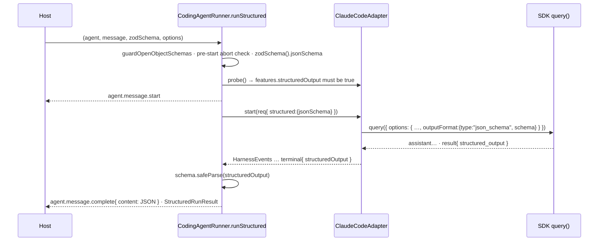

# Implementation strategy — issue #547: `runStructured` for the Claude Code runners

**Size M · one PR from `feat/cc-runner-run-structured` (based on `origin/main` 7505cb5) · packages: runtime · Gate 1 = `gate:auto` (delegated run)**

## Goal

`ClaudeCodeRunner` and `ClaudeCodeAPIRunner` gain a `runStructured<T>(agent, message, schema, options)` that returns a schema-valid `StructuredRunResult<T>`, with **parity** to `AgentRunner.runStructured` on result shape, events, errors and cancellation — implemented on the shared `CodingAgentRunner` base and driven by the Agent SDK's **native** `outputFormat: { type: "json_schema" }` (no prompt contract, no repair loop).

## Current state (verified at `origin/main` 7505cb5, SDK `0.3.226` installed)

- `CodingAgentRunner` implements `run()` (`packages/agent-runtime/src/runner/harness/coding-agent-runner.ts:146`) and `stream()` (`:182`); its `_startRun` comment at `:407-408` says `runStructured()` is "not implemented by this base". `RunnerProtocol.runStructured?` is optional (`runner/types.ts:325-330`), so a consumer on a Claude Code runner sees `runner.runStructured === undefined`. `createRunner()`'s step 5 builds a `ClaudeCodeAPIRunner` (`runner/create-runner.ts:332-342`) — the only automatic path to Claude Code — so any host that falls through to it has no structured path at all.
- `ClaudeCodeRunner extends CodingAgentRunner<AgentLikeForBridge>` (`runner/claude-code-runner.ts:157`); `ClaudeCodeAPIRunner extends ClaudeCodeRunner` (`runner/claude-code-api-runner.ts:44`) and only pins constructor presets — one implementation on the base covers both.
- SDK option / result surface (installed `.d.ts`, `node_modules/.bun/@anthropic-ai+claude-agent-sdk@0.3.226+…/node_modules/@anthropic-ai/claude-agent-sdk/sdk.d.ts`): `Options.outputFormat?: OutputFormat` (`:1739-1750`); `OutputFormat = JsonSchemaOutputFormat` (`:2142`); `JsonSchemaOutputFormat = { type: 'json_schema'; schema: Record<string, unknown> }` (`:930-933`); `SDKResultSuccess.structured_output?: unknown` (`:4503`); `SDKResultError.subtype` includes `'error_max_structured_output_retries'` (`:4442`); `TerminalReason` includes `'structured_output_retry_exhausted'` (`:7213`). Mechanism doc at `:1858-1863`: the turn ends on an end-turn tool carrier followed by a `structured_output` attachment.
- Version bisect (`npm pack` of published tarballs): `outputFormat` / `structured_output` **absent** in 0.3.0, 0.3.50, 0.3.100, 0.3.110, 0.3.120, 0.3.130, 0.3.140; **present** in 0.3.150, 0.3.215, 0.3.226. `packages/agent-runtime/package.json:66` declares `dependencies["@anthropic-ai/claude-agent-sdk"] = "^0.3.0"` (admits featureless versions); `:73` devDependency `^0.3.215`; lockfile + `__fixtures__/claude-agent-sdk-contract.json` pin `0.3.226`.
- `AgentRunner.runStructured` (`runner/agent-runner.ts:1497-1913`) — the parity reference:
  - `guardOpenObjectSchemas(schema, options?.allowOpenObjectSchemas)` first (`:1508`), before any LLM call.
  - Pre-start abort → `throw new RunCancelledError(...)` with **no events** (`:1518-1522`).
  - `runId = options?.runId ?? generateId()`, `traceId = options?.traceId ?? runId` (`:1531-1532`); `agent.message.start` is the root (`:1560-1575`).
  - Mid-run abort → emits `agent.message.complete {content:"", finishReason:"cancelled", tokens accrued}` (`emitCancelledTerminal`, `:1596-1612`) then throws `RunCancelledError` (never a raw AbortError).
  - Validation: `schema.safeParse(rawObject)`; on failure emits `agent.error {recoverable:false}` and throws `Error("runStructured: model output failed schema validation — …")` (`:1856-1873`).
  - Success: `agent.message.complete` with `content: JSON.stringify(parsed.data)` (`:1875-1888`); returns `{ response: JSON.stringify(parsed.data), inputTokens, outputTokens, toolCallsCount, iterations, finishReason, object: parsed.data, usageDetails?, gateway? }` (`:1902-1912`).
- `RunCancelledError` is defined in `agent-runner.ts:132-137` and is **not** re-exported from `runner/index.ts` / `src/index.ts` (verified by grep) — consumers today can only match `err.name`.
- Harness seam: `HarnessRunRequest` (`harness/types.ts:287-311`) carries `agent/message/options/runId/traceId/parentSpanId/correlationId/streaming/evaluateIntent`; `HarnessProbeResult.features` (`:181-187`) has five booleans; the `terminal` `HarnessEvent` variant (`:141-147`) carries `numTurns/usage/costUsd?/finishReason` (+ `meta.finalText`). `HarnessEventTranslator.onTerminal` (`harness/harness-event-translator.ts:314-322`) accrues those into `HarnessRunAccounting` (`:52-60`), read by `finalize()` (`:109-126`).
- CC adapter: `ClaudeCodeAdapter.start()` (`harness/claude-code/claude-code-adapter.ts:130-143`) calls `buildOptions(agent, options, context)` then `query({ prompt, options })`; `BuildSDKOptions` context (`:39-49`) is `{ runId, traceId, parentSpanId?, correlationId?, includePartialMessages? }`. `CCHarnessTranslator.onResult` (`cc-harness-translator.ts:251-269`) builds the terminal event from `SDKResultMessage`; `mapFinishReason` (`:45-58`) maps the four known subtypes, else `"unknown"`.
- `ClaudeCodeRunner._buildOptions` (`claude-code-runner.ts:229-296`) assembles `SDKOptions` from `this._defaults` + per-run fields.
- `zodSchema()` from `ai` (re-exported from `@ai-sdk/provider-utils@5`, `dist/index.d.ts:1013-1021`) accepts zod 3 and zod 4 schemas and returns `Schema<T>` with `.jsonSchema: JSONSchema7 | PromiseLike<JSONSchema7>` (`:983`). This is the same conversion `Output.object({ schema })` performs for `AgentRunner`, so both runners send the same JSON Schema shape.
- Existing test seams: `harness/__tests__/coding-agent-runner-abort.test.ts` drives the base against a `FakeAdapter`/`FakeSession` (no subprocess); `harness/__tests__/cc-translation.test.ts` builds hand-rolled `SDKResultMessage` fixtures; `__tests__/claude-code-api-runner.test.ts` exposes `_buildOptions` via a probe subclass; `__tests__/sdk-contract.test.ts` pins SDK types with `expectTypeOf`. Probe `features` fixtures live in 3 test files + the adapter (`grep -c durableRules`).
- Live integration test `src/__tests__/claude-code-runner.test.ts` is `describe.skipIf(CI==="true" || SKIP_SDK_TESTS==="true")`; in this container it fails with `--dangerously-skip-permissions cannot be used with root/sudo privileges` (environmental, passes in CI's non-root runner — see memory `local-check-env-gotchas`).

## Approach

Design (a): native schema output through the SDK. The base owns the protocol method; the harness-specific half is two additive fields on the seam (`HarnessRunRequest.structured` in, `terminal.structuredOutput` out) plus a probe feature flag so a harness that cannot do it fails loud before any event.



### 1. `runner/errors.ts` (create) — shared `RunCancelledError`

Move the class body verbatim from `agent-runner.ts:119-137` into `runner/errors.ts`; `agent-runner.ts` keeps its public path via `export { RunCancelledError } from "./errors.js";` (also used internally). Add `export { RunCancelledError } from "./errors.js";` to `runner/index.ts` (additive — today it is unexported). `coding-agent-runner.ts` imports from `./../errors.js` — same layer (7), no cycle (`agent-runner.ts` never imports the harness base).

### 2. `harness/types.ts` (modify) — three additive seam fields

```ts
// HarnessRunRequest — present ONLY on the runStructured path
readonly structured?: { readonly jsonSchema: Record<string, unknown> };

// HarnessProbeResult.features — optional so out-of-repo adapters stay valid; absent ⇒ unsupported
readonly structuredOutput?: boolean;

// terminal HarnessEvent variant — the harness's typed result payload (undefined when none)
| { kind: "terminal"; numTurns: number; usage: TokenUsage; costUsd?: number; finishReason: FinishReason; structuredOutput?: unknown }
```

### 3. `harness/harness-event-translator.ts` (modify)

`HarnessRunAccounting.structuredOutput?: unknown`; `onTerminal` stores `event.structuredOutput`; `finalize()` spreads it only when `!== undefined` (absent ≠ present-but-null: `structured_output` is `unknown`, and `null` could be a legitimate value for a nullable schema — keep the raw value, gate presence on `undefined`).

### 4. `harness/claude-code/cc-harness-translator.ts` (modify)

- `onResult`: when `msg.subtype === "success"` and `msg.structured_output !== undefined`, set `structuredOutput: msg.structured_output` on the terminal event.
- `mapFinishReason`: add `case "error_max_structured_output_retries": return "max-structured-output-retries";` (a distinct honest reason — not `"error"`, not `"unknown"`).

### 5. `harness/claude-code/claude-code-adapter.ts` (modify)

- `BuildSDKOptions` context gains `outputSchema?: Record<string, unknown>`.
- `start()` passes `outputSchema: req.structured?.jsonSchema`.
- `probe()` features add `structuredOutput: true` (the SDK floor now guarantees it — §9).

### 6. `claude-code-runner.ts` `_buildOptions` (modify)

After the `includePartialMessages` block: `if (context.outputSchema) sdkOpts.outputFormat = { type: "json_schema", schema: context.outputSchema };` — per-run wins over any `_defaults.outputFormat`. Update the file header + class doc to say structured output is supported and how.

### 7. `harness/coding-agent-runner.ts` (modify) — the method

`_startRun(agent, message, options, streaming, structured?: { jsonSchema })`: after `adapter.probe(...)` and `assertGateRequirements`, **before** `agent.message.start` is published:

```ts
if (structured && probe.features.structuredOutput !== true) {
  throw new HarnessStartError("schema-incompatible",
    `${adapter.name}: runStructured is unavailable — the harness probe does not report features.structuredOutput`);
}
```
and put `...(structured ? { structured } : {})` on the `HarnessRunRequest`. Update the `:407-408` comment (runStructured now exists; it checks abort BEFORE `_startRun` so a pre-start cancel emits nothing — parity with `AgentRunner`).

```ts
async runStructured<T>(agent: TAgent, message: string, schema: ZodType<T>, options?: RunOptions): Promise<StructuredRunResult<T>> {
  guardOpenObjectSchemas(schema, options?.allowOpenObjectSchemas);                 // parity :1508
  if (options?.abortSignal?.aborted) throw new RunCancelledError("runStructured: aborted before the run started (abortSignal already fired)"); // no events
  const jsonSchema = (await zodSchema(schema).jsonSchema) as Record<string, unknown>;
  const prep = await this._startRun(agent, message, options, /* streaming */ false, { jsonSchema });
  const { bus, startEvent, model, traceId, runId, parentSpanId } = prep;
  if (prep.cancelled) {            // signal fired between the check above and _startRun's own check
    await bus.publish(this._completeEvent(startEvent, EMPTY_CANCELLED_ACC, model));
    throw new RunCancelledError("runStructured: aborted before the harness started (no structured output available)");
  }
  const { session, translator } = prep;
  const cancelledRef = { value: false };
  try {
    for await (const hEvent of this._drainSession(session, options, cancelledRef))
      for (const apEvent of translator.translate(hEvent)) await bus.publish(apEvent);
  } catch (err) { await this._emitError(bus, err, traceId, runId, parentSpanId); throw err; }
  finally { await session.close(); }
  if (cancelledRef.value) {        // parity with AgentRunner's emitCancelledTerminal (:1596) then throw
    await bus.publish(this._completeEvent(startEvent, { ...translator.finalize(), finishReason: "cancelled" }, model));
    throw new RunCancelledError("runStructured: aborted while the harness was running (no structured output available)");
  }
  const acc = translator.finalize();
  if (acc.structuredOutput === undefined) {
    const err = new Error(`runStructured: the harness returned no structured output (finishReason="${acc.finishReason}")`);
    await this._emitError(bus, err, traceId, runId, parentSpanId); throw err;
  }
  const parsed = schema.safeParse(acc.structuredOutput);
  if (!parsed.success) {
    const err = new Error(`runStructured: model output failed schema validation — ${parsed.error.message}`);  // parity text :1859
    await this._emitError(bus, err, traceId, runId, parentSpanId); throw err;
  }
  const content = JSON.stringify(parsed.data);
  const finalAcc = { ...acc, content };
  await bus.publish(this._completeEvent(startEvent, finalAcc, model));
  return { ...this._result(finalAcc), object: parsed.data };
}
```

Notes: `_emitError` already emits `agent.error {recoverable:false}` (`:490-509`) — reuse it, do not hand-roll. `_result` / `_completeEvent` are reused so `costUsd`, `iterations` (from `num_turns`) and tokens flow exactly as `run()`. `message.complete` on the harness path already carries `costUsd` — that stays (a superset of `AgentRunner`'s event, not a divergence). The `EMPTY_CANCELLED_ACC` literal is the same zeroed accounting `_emitCancelledRun` uses (`:311-319`) — extract it to a module const so both sites share it.

### 8. `runner/types.ts` (modify) — doc only

`RunOptions.abortSignal` doc (`:209-247`): the `CodingAgentRunner` paragraph gains one sentence: `runStructured()` mirrors `AgentRunner` — a pre-start abort throws `RunCancelledError` with no events; a mid-run abort tears the session down, emits `agent.message.complete {finishReason:"cancelled"}` with whatever accrued, then throws `RunCancelledError`. `RunnerProtocol.runStructured?` doc: add "Implemented by `AgentRunner`, `MockRunner`, and the `CodingAgentRunner` family (`ClaudeCodeRunner` / `ClaudeCodeAPIRunner`, #547)".

### 9. `packages/agent-runtime/package.json` (modify) — floor bump

`dependencies["@anthropic-ai/claude-agent-sdk"]`: `^0.3.0` → `^0.3.215` (matches the devDependency; the bisect puts the feature at ≤0.3.150 but 0.3.215 is the pair the contract fixture was written against). Run `bun install`, then `git diff bun.lock` must show ONLY the specifier line for this package — revert any other drift (`local-check-env-gotchas` #3). The `sdk-contract.test.ts` fixture (`0.3.226`) is untouched.

### 10. `__tests__/sdk-contract.test.ts` (modify) — type pins

Add `expectTypeOf<NonNullable<Options["outputFormat"]>>().toEqualTypeOf<{ type: "json_schema"; schema: Record<string, unknown> }>()` and `expectTypeOf<SDKResultSuccess>().toHaveProperty("structured_output")`, plus a pin that `SDKResultError["subtype"]` extracts `"error_max_structured_output_retries"`. Drift in the pinned SDK surface now fails typecheck at this file.

### 11. Docs (modify) — `docs/runners.md`

- §3.3 parity table: add a row `runStructured()` — `AgentRunner`: yes (Output.object / 2-tier) · CC runners: **yes (#547)** via the SDK's native `outputFormat: json_schema`; result parity; abort parity; validation failure = `agent.error` + throw. Add to the "Remaining honest gaps" list: (4) `options.messageHistory` is still not consumed on this path (same gap as `run()`, §3.4), and `modelParams` is ignored (as documented on `RunOptions.modelParams`).
- §2.5 item 1: append "Also available on the Claude Code runners since #547 (native SDK `json_schema` output)."
Frontmatter unchanged; no new page, no sidebar change, no code fence that executes (per `docs-management`: relative links only; nothing here needs the link checker beyond the existing build).

### 12. Live smoke (modify `src/__tests__/claude-code-runner.test.ts`)

Add ONE case to the existing `describe.skipIf(shouldSkip)` block: a tool-less agent, `runStructured` with `z.object({ answer: z.number(), reasoning: z.string() })`, asserts `typeof result.object.answer === "number"` and `result.response === JSON.stringify(result.object)`. Never runs in CI (`CI=true` skip is pre-existing); in this container it fails for the same root-privilege reason as its two siblings — record that in the result, do not chase it. No key is ever printed.

## File-level plan

### Create
- `packages/agent-runtime/src/runner/errors.ts`
- `packages/agent-runtime/src/runner/harness/__tests__/coding-agent-runner-structured.test.ts`
- `packages/agent-runtime/src/runner/__tests__/claude-code-runner-structured.test.ts`

### Modify
- `packages/agent-runtime/src/runner/agent-runner.ts` (re-export `RunCancelledError`; delete the local class)
- `packages/agent-runtime/src/runner/index.ts` (export `RunCancelledError`)
- `packages/agent-runtime/src/runner/harness/types.ts`
- `packages/agent-runtime/src/runner/harness/harness-event-translator.ts`
- `packages/agent-runtime/src/runner/harness/coding-agent-runner.ts`
- `packages/agent-runtime/src/runner/harness/claude-code/cc-harness-translator.ts`
- `packages/agent-runtime/src/runner/harness/claude-code/claude-code-adapter.ts`
- `packages/agent-runtime/src/runner/claude-code-runner.ts`
- `packages/agent-runtime/src/runner/types.ts` (docs)
- `packages/agent-runtime/package.json` (+ the one `bun.lock` specifier line)
- `packages/agent-runtime/src/runner/__tests__/sdk-contract.test.ts`
- `packages/agent-runtime/src/runner/harness/__tests__/cc-translation.test.ts`
- `packages/agent-runtime/src/__tests__/claude-code-runner.test.ts` (live, skip-gated)
- `docs/runners.md`

## Interfaces

```typescript
// harness/types.ts
export interface HarnessRunRequest<TAgent extends AgentLike = AgentLike> {
  /* …existing… */
  /** Present only on the runStructured path: the JSON Schema the harness must constrain its final output to. */
  readonly structured?: { readonly jsonSchema: Record<string, unknown> };
}
// HarnessProbeResult.features gains: readonly structuredOutput?: boolean;
// terminal HarnessEvent gains:       structuredOutput?: unknown;

// harness/harness-event-translator.ts
export interface HarnessRunAccounting { /* …existing… */ readonly structuredOutput?: unknown; }

// harness/claude-code/claude-code-adapter.ts
export type BuildSDKOptions = (agent, options, context: { runId; traceId; parentSpanId?; correlationId?; includePartialMessages?; outputSchema?: Record<string, unknown> }) => SDKOptions;

// harness/coding-agent-runner.ts
async runStructured<T>(agent: TAgent, message: string, schema: ZodType<T>, options?: RunOptions): Promise<StructuredRunResult<T>>;

// runner/errors.ts (moved; re-exported from agent-runner.ts and runner/index.ts)
export class RunCancelledError extends Error { constructor(message?: string) }
```

## Tests

All CI-path tests are fixture/contract tests — no subprocess, no network, no key.

**`harness/__tests__/coding-agent-runner-structured.test.ts`** — base against a `FakeAdapter`/`FakeSession` (copy the abort test's fakes; add `features.structuredOutput: true` to its probe and a `terminal` fixture carrying `structuredOutput`):
1. happy path: returns `object` (parsed), `response === JSON.stringify(object)`, `finishReason:"stop"`, `iterations` from `numTurns`, `costUsd`, tokens; events are exactly `agent.message.start` … `agent.message.complete` with `content === response`; no `agent.error`.
2. the `HarnessRunRequest` handed to `adapter.start` carries `structured.jsonSchema` with `type:"object"` and the declared `properties` (proves the zod→JSON-Schema conversion reaches the adapter).
3. `runId`/`traceId` from options are honored on `message.start` (parity #437).
4. schema-invalid `structuredOutput` → rejects with `/failed schema validation/`; exactly one `agent.error {recoverable:false}`; no `message.complete`.
5. success terminal with no `structuredOutput` → rejects with `/returned no structured output/`; one `agent.error`.
6. `finishReason:"max-structured-output-retries"` terminal (no payload) → rejects; message includes the finishReason.
7. pre-fired `abortSignal` → rejects with `RunCancelledError` (`instanceof` + `name`), **zero** events published, `adapter.start` never called.
8. mid-run abort (after the fake reaches its hang) → `session.close()` called, `message.complete {finishReason:"cancelled"}` published with the accrued content/tokens, rejects with `RunCancelledError`.
9. adapter whose probe lacks `features.structuredOutput` → rejects with `HarnessStartError` code `"schema-incompatible"` **before** any event; `adapter.start` never called.
10. `z.record(z.string())` schema → rejects with `OpenObjectSchemaError` before probe; with `allowOpenObjectSchemas:true` proceeds (spy on `console.warn`, restore).
11. per-call `options.eventBus` receives the events, the constructor bus does not (#496 parity).

**`harness/__tests__/cc-translation.test.ts`** (extend): result with `structured_output: {a:1}` → terminal `structuredOutput` deep-equals it; success without the field → `structuredOutput` is `undefined` (key absent); `mapFinishReason("error_max_structured_output_retries") === "max-structured-output-retries"` in the existing table test.

**`__tests__/claude-code-runner-structured.test.ts`**: `_buildOptions` with `context.outputSchema` → `outputFormat` deep-equals `{ type:"json_schema", schema }`; without → `"outputFormat" in opts === false`; `_defaults.outputFormat` is overridden per run. `ClaudeCodeAdapter.probe()` reports `features.structuredOutput === true`. `ClaudeCodeAdapter.start()` with `vi.mock("@anthropic-ai/claude-agent-sdk", …)` (query → an empty async iterable with `interrupt`/`return` no-ops): the `buildOptions` spy receives `outputSchema` when `req.structured` is set and `undefined` when not; the mocked `query` receives `options.outputFormat`.

**`__tests__/sdk-contract.test.ts`** (extend): the three type pins from §10.

**Mutation checks** (run each, confirm the named test reddens, revert):
| Guard flipped to broken form | Test that must fail |
|---|---|
| `safeParse` failure no longer throws (return raw) | structured #4 |
| `structuredOutput === undefined` check removed | structured #5 |
| pre-start abort check removed | structured #7 (events count / start called) |
| `cancelledRef` branch removed (fall through to validation) | structured #8 |
| `features.structuredOutput` check removed | structured #9 |
| `guardOpenObjectSchemas` call removed | structured #10 |
| `outputFormat` not set in `_buildOptions` | cc-runner-structured `outputFormat` test |
| `structured_output` not copied in `onResult` | cc-translation structured test |
| `mapFinishReason` new case removed | cc-translation finishReason table |

## Acceptance (from the issue, restated)

- `new ClaudeCodeAPIRunner().runStructured` and `new ClaudeCodeRunner().runStructured` are functions; `createRunner()`'s CLI-probe runner therefore satisfies `runStructured` callers.
- Result/event/error/cancel parity with `AgentRunner.runStructured` as itemised in §7; deviations are only the harness's documented superset (`costUsd`) and the two pre-existing harness gaps (`messageHistory`, `modelParams`), both stated in `docs/runners.md`.
- SDK floor `^0.3.215`; lockfile drift limited to that specifier.
- `bun run build && bun run typecheck && bun run lint && bun run test` green (modulo the two root-only live cases in this container, which pass in CI).

## Out of scope

- #10 (per-call model override), #274 (MockRunner structured tool dispatch), #399 (isolated mode + `ANTHROPIC_API_KEY`) — untouched, referenced only.
- `messageHistory` / `modelParams` on harness runners; `systemPrompt` on the harness `message.start`; `agent.tool.*` for the SDK's internal end-turn carrier tool.
- `createRunner()` probe changes; any software-patterns work; PR #40.

## Open questions

- **Anthropic's structured-output grammar vs open objects.** The open-object guard is kept for parity/portability; if a CC-only consumer needs `z.record`, `allowOpenObjectSchemas: true` is the documented escape hatch (unverified live whether the CC grammar accepts `additionalProperties: true`).
- **`$schema` key.** `zodSchema()` emits `$schema: "http://json-schema.org/draft-07/schema#"`; the SDK types accept any `Record<string, unknown>`. Whether the CLI's validator ignores or rejects it can only be settled by the live smoke (blocked here by root). If it rejects, strip `$schema` in §7 before handing the schema to the adapter — a one-line change, flagged for Dug.

---

<!--
Phase execution log — written by phase agents as gates fire.
-->

## Spec Review
<!-- written by: reviewer · gate 1.5 · /sdlc:critique -->
_Awaiting spec critic._

## Design Addendum
<!-- written by: specifier · in response to REVISE verdict on Spec Review -->
_No addendum required._

## Implementation notes
<!-- written by: implementer · gate 2 · /sdlc:develop -->
_Awaiting implementation._

## Diff Review — Adherence
<!-- written by: reviewer · gate 2.5 · /sdlc:review (lens=adherence) -->
_Awaiting adherence review._

## Diff Review — Quality
<!-- written by: reviewer · gate 2.5 · /sdlc:review (lens=quality) -->
_Awaiting quality review._

## Live Validate
<!-- written by: validator · gate 3 -->
_Awaiting validation._
