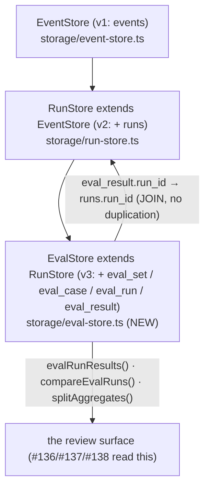

# Spec — EvalStore: eval persistence on the shared SQLite file (#132, E1)

## Goal

Add the **eval annotation layer** on top of the shipped run substrate: a concrete
**`class EvalStore extends RunStore`** (`storage/run-store.ts:124` — which itself
`extends EventStore`) holding four new tables on the **same SQLite file** —
`eval_set` / `eval_case` (the optional case-bank mirror), `eval_run` (one row per
**suite invocation**: set/target/variant/split/model/git_sha/status), and `eval_result`
(one row per case outcome, **annotating** a RunStore run by `run_id`) — plus the query
surface for the two views the schema is keyed for (doc §4): **A/B compare** (same set,
two variants) and **per-split aggregates** (the train-vs-test overfit read).

Load-bearing semantics (doc Update note 2026-07-04, §16.1 RESOLVED — non-negotiable):

- **Each eval case's execution IS a RunStore run.** Tokens, trace_id, final answer,
  finish_reason, elapsed, status, error all live on the inherited `runs` row
  (`run-store.ts:139-150`) and are **JOINed in — never duplicated**. `eval_result`
  stores ONLY `scores_json` / `pass` / linkage (`eval_run_id`, `case_id`, `run_id`).
- **`variant`/`split` ride two places by design**: suite-level as columns on `eval_run`
  (§4 schema), and per-run stamped into the run's `metadata` JSON slot
  (`RunMeta.metadata`, `run-store.ts:49` — the slot #117 reserved for exactly "a future
  eval overlay's join keys, without a schema change").
- **Concrete class, NO `InMemoryEvalStore`.** The doc's §12 "interface + impls"
  phrasing is superseded by the Update note: shipped `RunStore` is a single concrete
  SQLite-backed class and its tests use `:memory:`
  (`storage/__tests__/run-store.test.ts:47`). `EvalStore` mirrors that exactly.
- **The persistence seam is `EvalSpec.onResult`** (`eval/run-eval.ts:46`) — the engine
  is NOT modified. This spec shows the wiring a caller (e.g. #135's `ap eval`) performs;
  the only engine edit in the whole stack belongs to #133 (`eventBus?`).

Additive only. No server routes (#136), no CLI (#135), no loaders/split-guard (#134),
no version bump (release mechanics are cut at stack level).

## Approach

### Verified against the branch tip (2026-07-05, `dug/132-eval-store` @ `1e1fbec` = origin/main)

Every anchor from the issue/plan re-read at the tip. **Zero drift** — all six exact:

1. `storage/run-store.ts:124` — `export class RunStore extends EventStore`. ✓
2. `storage/run-store.ts:211` `startRun(meta: RunMeta = {}): string` / `:227`
   `finishRun(runId, outcome: RunOutcome): void`, with first-terminal-wins enforced by
   `WHERE run_id = ? AND status = 'running'` (`:149`). The `runs` row carries
   `final_answer`, `tool_calls`, `iterations`, tokens, `finish_reason`, `elapsed_ms`,
   `status`, `error`, `step_metrics`, `metadata` (SCHEMA_V2, `event-store.ts:99-125`). ✓
3. `storage/event-store.ts:290` — `private _migrate()`: the `PRAGMA user_version`
   ladder (`if (version < 1) … if (version < 2) …`) with a **strict
   `version !== TARGET_SCHEMA_VERSION` throw** (`:304-308`). `TARGET_SCHEMA_VERSION = 2`
   at `:127`. ✓ — this strictness is load-bearing for the migration plan below.
4. `stores/index.ts:26` — `export { RunStore } from "../storage/run-store.js"` +
   type line at `:27`; the barrel's header (`:1-7`) states the #118 naming law. ✓
5. `eval/run-eval.ts:46` — `readonly onResult?: (r: EvalResult<…>) => void | Promise<void>`,
   fired per case at `:227-229` **after scoring, before fold** — so a persistence
   failure inside `onResult` propagates (runEval awaits it). ✓
6. `storage/__tests__/run-store.test.ts:47` — `new RunStore({ path: ":memory:", Database })`. ✓

Findings beyond the anchors (all inform the plan):

- **The migration ladder must stay in `event-store.ts`, not an `EvalStore` override.**
  `_migrate()` is `private`, constructor-invoked (`event-store.ts:151`), and throws on
  any version ≠ its own target. If `EvalStore` bumped the version itself, a plain
  `EventStore`/`RunStore` opening the same file would throw the mismatch error — the
  classes would stop being interchangeable on one file. #117 solved this exact problem
  by landing the `runs` schema **as v2 inside EventStore's ladder** (SCHEMA_V2 comment,
  `event-store.ts:88-98`), and `run-store.ts:398-399` documents the rule: *"event-store.ts's
  file-level plan is migration-ladder-only."* E1 therefore touches `event-store.ts` in
  exactly one way: **SCHEMA_V3 + one ladder step + `TARGET_SCHEMA_VERSION 2 → 3`**.
- **The onResult wiring precedent already exists as a shipped test**:
  `run-store.test.ts:344-382` ("secondary producer — runEval onResult seam (zero
  coupling to eval/)") runs `runEval` with a `FunctionStep` + `MockRunner` and persists
  per-case runs via `startRun`/`finishRun`. The E1 integration test extends this exact
  pattern with `recordEvalResult`.
- **Zero coupling to `eval/` is a kept invariant.** `run-store.ts` imports nothing from
  `eval/` (`:16` — "zero coupling either way"); its test names it explicitly. `EvalStore`
  keeps it: score input is **structurally** typed (a local `EvalScoreLike` shape that
  `eval/types.ts:47` `Score` satisfies) — no import from `eval/`.
- **`storage/load.ts` ships `loadEventStore`/`loadRunStore`** — the optional-peer-dep
  soft-degradation seam the CLI uses. #117 shipped `loadRunStore` alongside `RunStore`;
  E1 mirrors with `loadEvalStore` (same `LoadEventStoreOptions` in, `{ store?, unavailable,
  reason }` out) so #135 has its seam ready.
- **`PRAGMA foreign_keys = ON` is live** (`event-store.ts:149`). Consequence: declaring
  a hard `FOREIGN KEY (run_id) REFERENCES runs(run_id)` would make insert *ordering*
  load-bearing (run row must exist first) and would break annotate-later flows (#133's
  bus-driven runs land asynchronously via `RunStoreExporter`). Decision: `run_id` is a
  plain indexed TEXT column — the join is by convention, matching how `runs.trace_id`
  references `events` without an FK.

### Layering (one file, three stores)



### Schema — v3 DDL (lands in `event-store.ts`'s ladder)

Doc §4 verbatim in structure, hardened to house style (NOT NULLs on identity/lifecycle
columns; `IF NOT EXISTS`; indexes keyed to the two query views — same treatment SCHEMA_V2
got):

```sql
-- v3 (#132 EvalStore): the eval annotation layer. Purely additive — a v2
-- runs-only DB migrates in place; EventStore/RunStore/EvalStore stay
-- interchangeable on the same file. Downgrade caveat (accepted, as v2's):
-- a v3 DB opened by a pre-#132 runtime throws the version-mismatch error.

-- a named suite of cases (optional; cases may stay file-loaded, §16.4)
CREATE TABLE IF NOT EXISTS eval_set (
  id          TEXT PRIMARY KEY,
  name        TEXT,
  description TEXT,
  created_ts  TEXT NOT NULL
);

-- the case-bank mirror (optional persistence — enables UI browse/authoring)
CREATE TABLE IF NOT EXISTS eval_case (
  set_id        TEXT NOT NULL,
  case_id       TEXT NOT NULL,
  input_json    TEXT,
  expected_json TEXT,
  tags_json     TEXT,
  split         TEXT,              -- 'train' | 'dev' | 'test' (§7; enforced at the API, not DDL)
  PRIMARY KEY (set_id, case_id)
);

-- SUITE-level: one invocation of a (target, variant) over a set/split.
-- NOT per-case — each case's execution is a RunStore `runs` row (eval_result.run_id).
CREATE TABLE IF NOT EXISTS eval_run (
  id        TEXT PRIMARY KEY,
  ts_start  TEXT NOT NULL,
  ts_end    TEXT,
  set_id    TEXT,
  target_id TEXT,
  variant   TEXT,                  -- the A/B label (§6); free string, provenance beside it
  split     TEXT,                  -- run-level split filter label (NULL = all splits)
  model     TEXT,
  git_sha   TEXT,
  status    TEXT NOT NULL          -- 'running' | 'ok' | 'error'
);

-- per-case outcome — ANNOTATES a RunStore run. run_id → runs.run_id (same file).
-- Tokens/trace_id/final answer/finish_reason/status/error live on the runs row,
-- JOINed in — NOT duplicated here. No hard FK: insert order must not be
-- load-bearing (foreign_keys=ON is live; bus-driven runs land asynchronously).
CREATE TABLE IF NOT EXISTS eval_result (
  eval_run_id TEXT NOT NULL,
  case_id     TEXT NOT NULL,
  run_id      TEXT,                -- → runs.run_id
  scores_json TEXT,                -- the engine's heterogeneous Score[] (§4)
  pass        INTEGER,             -- 1 | 0 | NULL (NULL = no gating scorer ran)
  PRIMARY KEY (eval_run_id, case_id)
);

CREATE INDEX IF NOT EXISTS idx_eval_run_set    ON eval_run(set_id, variant);
CREATE INDEX IF NOT EXISTS idx_eval_run_ts     ON eval_run(ts_start);
CREATE INDEX IF NOT EXISTS idx_eval_result_run ON eval_result(run_id) WHERE run_id IS NOT NULL;
```

Ladder edit in `_migrate()` (`event-store.ts:290`), following the v2 step exactly:
`if (version < 3) { this._db.exec(SCHEMA_V3); version = 3; }` +
`const TARGET_SCHEMA_VERSION = 3` (`:127`). Nothing else in `event-store.ts` changes.

### The `EvalStore` class — `storage/eval-store.ts` (NEW)

Concrete class, same construction contract as its parents: `constructor(opts:
EventStoreOptions)` → `super(opts)` → prepare its own statements against the
`protected _db` (`event-store.ts:137`). Prepared statements in the constructor,
camelCase read types, raw-row → public-row mapping helpers at file bottom — all
mirroring `run-store.ts` structure. Local `generateId()` duplicated per the
`run-store.ts:26-32` precedent (deliberately not shared).

Method surface (signatures in § Interfaces):

- **Case bank (upserts — idempotent by design, `INSERT … ON CONFLICT … DO UPDATE`):**
  `upsertEvalSet` / `upsertEvalCase` / `listEvalSets` (with per-split case counts — the
  shape #136's `GET /eval/sets` serves) / `listEvalCases` (optional split filter).
- **Suite lifecycle (mirrors `startRun`/`finishRun` shape):** `startEvalRun` (status
  `'running'`, returns generated-or-passed id) / `finishEvalRun` (stamps `ts_end` +
  terminal status; first-terminal-wins via `WHERE id = ? AND status = 'running'`, the
  `run-store.ts:149-153` idiom).
- **Per-case annotation:** `recordEvalResult` — `INSERT OR REPLACE` keyed on
  `(eval_run_id, case_id)` so re-recording a case is idempotent, never duplicated.
- **Read/query surface (the two views that matter):**
  - `getEvalRun` / `listEvalRuns` (filter by setId/targetId/variant/split, newest first,
    limit — the `listRuns` idiom with `@named` NULL-elided params, `run-store.ts:162-185`).
  - `evalRunResults(evalRunId)` — **the join view**: `eval_result LEFT JOIN runs ON
    eval_result.run_id = runs.run_id`, returning per case the annotation fields
    (`scores`, `pass`) plus the run-owned fields (`traceId`, `status`, `finalAnswer`,
    `inputTokens`, `outputTokens`, `finishReason`, `elapsedMs`, `error`) — proving by
    construction that run data is joined, not copied. LEFT JOIN: a result whose run row
    is missing still renders (run fields null).
  - `compareEvalRuns(aId, bId)` — **A/B compare**: fetch both runs' results (SQL), align
    per `case_id` in TS (SQLite lacks FULL OUTER JOIN; a two-map merge is simpler and
    keeps the SQL boring). Cases present in only one run degrade to a null side — the
    exact shape #138's "shown as not-run, not errors" acceptance needs. Returns aligned
    rows + a delta summary (per-side pass counts, both-passed/only-A/only-B/regressed).
  - `splitAggregates(opts)` — **per-split rollup**: `eval_result JOIN eval_run` +
    `LEFT JOIN eval_case` (on the run's `set_id` + the result's `case_id`), grouped by
    `COALESCE(eval_case.split, eval_run.split)` — case-level split (when the bank is
    mirrored) wins; run-level label is the fallback for file-first banks. Returns
    per split: results / passed / failed / passRate. Filterable by setId/targetId/
    variant — the train-vs-test overfit gap (#138) is two rows of this output.
- **Helper:** `derivePass(scores)` — exported pure function: `false` if any score with
  `passed` defined failed; `true` if at least one defined and all passed; `null` when no
  scorer gated. Structurally typed (`EvalScoreLike`) — zero `eval/` import.

### The persistence seam — how a caller wires `onResult` (engine untouched)

Extends the shipped precedent at `run-store.test.ts:344-382`. A caller (e.g. #135's
`ap eval`, or the E1 integration test) brackets `runEval` with the suite row and, per
case, lands the run row + the annotation:

```ts
const evalRunId = store.startEvalRun({ setId, targetId, variant, split, model, gitSha });

const report = await runEval(
  {
    target,
    cases,
    scorers,
    onResult: (r) => {
      // 1. the case's execution IS a RunStore run — variant/split/join keys
      //    ride the metadata slot (RunMeta.metadata, run-store.ts:49)
      const runId = store.startRun({
        agentName: targetId,
        model,
        metadata: { evalRunId, caseId: r.case.id, variant, split },
      });
      store.finishRun(runId, {
        finalAnswer: JSON.stringify(r.output ?? null),
        toolCalls: 0,            // unknown at this seam until #133's bus capture
        iterations: 0,
        inputTokens: r.inputTokens,
        outputTokens: r.outputTokens,
        finishReason: r.succeeded ? "stop" : "error",
        elapsedMs: 0,
        status: r.succeeded ? "ok" : "error",
        error: r.error,
      });
      // 2. the annotation — scores + pass + linkage ONLY
      store.recordEvalResult({
        evalRunId,
        caseId: r.case.id,
        runId,
        scores: r.scores,
        pass: derivePass(r.scores),
      });
    },
  },
  { runner },
);

store.finishEvalRun(evalRunId, { status: "ok" });
```

Once #133 lands, the run row can instead come from `RunStoreExporter` on the eval bus
(with real tool_calls/iterations/trace linkage) and `onResult` shrinks to
`recordEvalResult` against the bus's runId — the schema is already keyed for it; nothing
here changes.

### Migration plan

| Concern | Plan |
|---|---|
| Version bump | `TARGET_SCHEMA_VERSION` `2 → 3` in `event-store.ts:127` — the base class owns the ladder (see finding 1); `EvalStore` adds NO migration code of its own. |
| v2 → v3 in place | Opening a v2 (events+runs) file with **any** of the three classes creates the four eval tables and stamps `user_version = 3`; existing rows untouched. Covered by the migration test below. |
| Fresh DB | Ladder walks v1 → v2 → v3 on first open, as today. |
| Downgrade | Same accepted caveat as v2 (`event-store.ts:94-97`): a pre-#132 runtime opening a v3 file throws the version-mismatch error. Dev telemetry, single-package lockstep — accept + document in the SCHEMA_V3 comment. |

### Exports (#118 naming law)

The `stores/` barrel header (`stores/index.ts:1-7`) states the law; shipped `RunStore`
(`:26`) is the concrete-class precedent `EvalStore` sits beside:

- `stores/index.ts` — `export { EvalStore, derivePass }` + the row/meta types, directly
  below the `RunStore` lines.
- `storage/index.ts` — same value + type exports, plus `loadEvalStore` /
  `LoadEvalStoreResult` beside `loadRunStore`.
- `storage/load.ts` — `loadEvalStore(opts: LoadEventStoreOptions):
  Promise<LoadEvalStoreResult>`, byte-for-byte the `loadRunStore` shape (`load.ts:89`).
- Package barrel `src/index.ts` already `export *`s both (`:16-17`) — no edit.

## File-level plan

| File | Change |
|---|---|
| `packages/agent-runtime/src/storage/eval-store.ts` | **CREATE** — `class EvalStore extends RunStore`, types, `derivePass`, raw-row mappers |
| `packages/agent-runtime/src/storage/__tests__/eval-store.test.ts` | **CREATE** — the suite below (`:memory:` + one on-disk migration test) |
| `packages/agent-runtime/src/storage/event-store.ts` | **MODIFY** (ladder-only) — `SCHEMA_V3` const, `if (version < 3)` step in `_migrate()` (`:290`), `TARGET_SCHEMA_VERSION = 3` (`:127`) |
| `packages/agent-runtime/src/storage/load.ts` | **MODIFY** — add `loadEvalStore` + `LoadEvalStoreResult` (mirror `loadRunStore`, `:89`) |
| `packages/agent-runtime/src/storage/index.ts` | **MODIFY** — export `EvalStore`, `derivePass`, types, `loadEvalStore` |
| `packages/agent-runtime/src/stores/index.ts` | **MODIFY** — barrel export beside `RunStore` (`:26`) |

Not touched: `eval/run-eval.ts`, `eval/types.ts`, anything in `agent-server` /
`agent-cli` / `agent-dashboard`, `exporters/run-store.ts`, `package.json` version.

## Interfaces

```ts
// storage/eval-store.ts — all NEW. Zero imports from eval/ (structural typing).

export type EvalSplit = "train" | "dev" | "test";

/** Structurally compatible with eval/types.ts `Score` — deliberately NOT imported. */
export interface EvalScoreLike {
  readonly name: string;
  readonly value: number | null;
  readonly passed?: boolean;
  readonly detail?: Record<string, unknown>;
  readonly error?: string;
}

export interface EvalSetMeta {
  readonly id: string;
  readonly name?: string;
  readonly description?: string;
  readonly createdTs?: Date;              // omit → now
}
export interface EvalSetSummary {
  readonly id: string;
  readonly name: string | null;
  readonly description: string | null;
  readonly createdTs: string;
  readonly caseCount: number;
  readonly splitCounts: Readonly<Record<string, number>>;  // per-split, "" bucket = untagged
}

export interface StoredEvalCase {
  readonly caseId: string;
  readonly input?: unknown;               // JSON-serialized into input_json
  readonly expected?: unknown;
  readonly tags?: readonly string[];
  readonly split?: EvalSplit;
}
export interface EvalCaseRow {
  readonly setId: string;
  readonly caseId: string;
  readonly input: unknown;
  readonly expected: unknown;
  readonly tags: readonly string[] | null;
  readonly split: EvalSplit | null;
}

export interface EvalRunMeta {
  readonly id?: string;                   // omit → generated (startRun idiom, run-store.ts:211)
  readonly tsStart?: Date;
  readonly setId?: string;
  readonly targetId?: string;
  readonly variant?: string;
  readonly split?: EvalSplit;
  readonly model?: string;
  readonly gitSha?: string;
}
export interface EvalRunRow {
  readonly id: string;
  readonly tsStart: string;
  readonly tsEnd: string | null;
  readonly setId: string | null;
  readonly targetId: string | null;
  readonly variant: string | null;
  readonly split: EvalSplit | null;
  readonly model: string | null;
  readonly gitSha: string | null;
  readonly status: "running" | "ok" | "error";
}

export interface EvalResultRecord {
  readonly evalRunId: string;
  readonly caseId: string;
  readonly runId?: string;                // → runs.run_id; optional (annotate-later)
  readonly scores?: readonly EvalScoreLike[];
  readonly pass?: boolean | null;
}
/** eval_result LEFT JOIN runs — annotation fields + run-owned fields, never copied. */
export interface JoinedEvalResultRow {
  readonly evalRunId: string;
  readonly caseId: string;
  readonly runId: string | null;
  readonly scores: readonly EvalScoreLike[] | null;
  readonly pass: boolean | null;
  // ↓ from the runs row (null when run_id is null / row missing)
  readonly traceId: string | null;
  readonly runStatus: "running" | "ok" | "error" | null;
  readonly finalAnswer: string | null;
  readonly inputTokens: number | null;
  readonly outputTokens: number | null;
  readonly finishReason: string | null;
  readonly elapsedMs: number | null;
  readonly runError: string | null;
}

export interface EvalComparisonRow {
  readonly caseId: string;
  readonly a: { readonly pass: boolean | null; readonly scores: readonly EvalScoreLike[] | null } | null;
  readonly b: { readonly pass: boolean | null; readonly scores: readonly EvalScoreLike[] | null } | null;
}
export interface EvalComparison {
  readonly a: EvalRunRow;
  readonly b: EvalRunRow;
  readonly rows: readonly EvalComparisonRow[];  // union of case ids; one-sided rows keep the other side null
  readonly summary: {
    readonly bothPassed: number;
    readonly bothFailed: number;
    readonly onlyAPassed: number;               // regressions when A = old, B = new
    readonly onlyBPassed: number;
    readonly aOnly: number;                     // cases missing from B (not-run, not errors)
    readonly bOnly: number;
  };
}

export interface SplitAggregate {
  readonly split: EvalSplit | null;             // null = untagged bucket
  readonly results: number;
  readonly passed: number;
  readonly failed: number;
  readonly passRate: number | null;             // null when no result carried a pass verdict
}

export class EvalStore extends RunStore {
  constructor(opts: EventStoreOptions);         // super(opts); prepare eval statements on this._db

  // case bank (idempotent upserts)
  upsertEvalSet(meta: EvalSetMeta): void;
  upsertEvalCase(setId: string, c: StoredEvalCase): void;
  listEvalSets(): EvalSetSummary[];
  listEvalCases(setId: string, opts?: { split?: EvalSplit }): EvalCaseRow[];

  // suite lifecycle (startRun/finishRun idiom; first-terminal-wins)
  startEvalRun(meta?: EvalRunMeta): string;
  finishEvalRun(id: string, outcome: { status: "ok" | "error" }): void;

  // per-case annotation (INSERT OR REPLACE on (eval_run_id, case_id))
  recordEvalResult(r: EvalResultRecord): void;

  // reads — the two views that matter + plumbing
  getEvalRun(id: string): EvalRunRow | null;
  listEvalRuns(opts?: {
    setId?: string; targetId?: string; variant?: string; split?: EvalSplit; limit?: number;
  }): EvalRunRow[];
  evalRunResults(evalRunId: string): JoinedEvalResultRow[];
  compareEvalRuns(aId: string, bId: string): EvalComparison;      // throws if either id unknown
  splitAggregates(opts: { setId?: string; targetId?: string; variant?: string }): SplitAggregate[];
}

/** all gating scorers passed → true; any failed → false; none gated → null. */
export function derivePass(scores: readonly EvalScoreLike[]): boolean | null;

// storage/load.ts — MODIFY (mirror loadRunStore, load.ts:89)
export interface LoadEvalStoreResult { store?: EvalStore; unavailable: boolean; reason: string; }
export function loadEvalStore(opts: LoadEventStoreOptions): Promise<LoadEvalStoreResult>;
```

## Tests

`packages/agent-runtime/src/storage/__tests__/eval-store.test.ts` — `:memory:`
throughout (`run-store.test.ts:47` idiom) except the on-disk migration test
(`run-store.test.ts:55-109` idiom). `MockRunner` + `FunctionStep` for the integration
test, exactly as `run-store.test.ts:344-382`.

1. **v2 → v3 in-place migration (on-disk).** Hand-build a v2 DB with a raw `Database`
   (events + runs tables + a row each, `user_version = 2` — the runs-only DB of the
   acceptance criteria). Reopen via `EvalStore`: four eval tables exist, prior rows
   intact, `user_version = 3`. Then plain `EventStore` AND `RunStore` both open the v3
   file (shared `TARGET_SCHEMA_VERSION` — interchangeability preserved).
2. **One file serves all three layers.** On one `:memory:` `EvalStore`: `append()` an
   event (inherited from EventStore), `startRun`/`finishRun` (inherited from RunStore),
   `startEvalRun`/`recordEvalResult` — all land; `count()`, `getRun()`, `getEvalRun()`
   all read back.
3. **Case bank round-trip + idempotency.** `upsertEvalSet`/`upsertEvalCase` (with split,
   tags, JSON input/expected) → `listEvalSets` returns per-split counts; `listEvalCases`
   split filter works; re-upserting the same keys updates in place (row counts stable).
4. **Suite lifecycle.** `startEvalRun` round-trips all `EvalRunMeta` fields; second
   `finishEvalRun` is a no-op (first-terminal-wins); `listEvalRuns` filters by
   setId/targetId/variant/split, newest first.
5. **onResult wiring (integration, the acceptance path).** `runEval` over a
   `FunctionStep` with the § seam wiring verbatim → per case: one `runs` row (metadata
   carries `evalRunId`/`caseId`/`variant`/`split` — read back via `getRun().metadata`)
   and one `eval_result` row; `evalRunResults` returns the joined rows with tokens/
   finalAnswer/status populated **from the runs side**.
6. **Join proves no duplication (the load-bearing test).**
   a. `PRAGMA table_info(eval_result)` returns exactly
      `eval_run_id, case_id, run_id, scores_json, pass` — the annotation table
      structurally CANNOT hold run data.
   b. Mutate the `runs` row directly (raw SQL `UPDATE runs SET final_answer = …`),
      re-query `evalRunResults` → the change is reflected — the join reads through,
      nothing was copied.
7. **`recordEvalResult` idempotency.** Same `(evalRunId, caseId)` twice → one row,
   second write wins (INSERT OR REPLACE), no duplicate.
8. **A/B compare.** Two eval_runs, same set, variants "a"/"b", overlapping + one-sided
   case sets → aligned rows; one-sided cases carry `null` for the missing side (not
   errors); summary counts (bothPassed/onlyAPassed/aOnly/…) correct.
9. **Split aggregates.** Mirrored cases across train/dev/test with mixed pass →
   per-split passRate correct; a result for a case NOT in the mirror falls back to
   `eval_run.split` (COALESCE branch); results with `pass = NULL` excluded from
   passRate but counted in `results`.
10. **`derivePass`.** All-gated-pass → true; one-fail → false; no `passed` fields →
    null; errored score (`value: null`, no `passed`) alone → null.
11. **`loadEvalStore`.** Happy path returns a live `EvalStore` (better-sqlite3 is a
    devDependency here, so it resolves); result shape matches `loadRunStore`'s.

Run: `bun run --filter=@agentic-patterns/runtime test` (+ `typecheck`, `lint`).
Existing `event-store.test.ts` / `run-store.test.ts` must stay green — the only shared
edit is the ladder, and test 1 guards it.

## Acceptance criteria → tests

| Issue acceptance criterion | Test(s) |
|---|---|
| One SQLite file serves events + runs + eval tables; a v2 runs-only DB migrates in place | 1, 2 |
| Persisting via onResult → startRun/finishRun + eval_result lands the run_id join | 5 |
| eval_result stores ONLY scores_json/pass/linkage — join test proves no duplication | 6a (structural), 6b (read-through) |
| A/B and per-split aggregate queries covered by `:memory:` tests | 8, 9 |

## Non-goals (scope fences)

- **No engine edits.** `eval/run-eval.ts`, `eval/types.ts`, `eval/scorer.ts`,
  `eval/target.ts` untouched. The stack's only engine edit (`eventBus?`) is #133's.
- **No `InMemoryEvalStore`.** Superseded interface+impls phrasing (doc §12) — concrete
  class per the Update note + shipped `RunStore` precedent; tests use `:memory:`.
- **No server or CLI wiring.** Routes are #136, `ap eval` is #135, dashboard is #137.
  `loadEvalStore` is shipped here only as the seam, unused until #135.
- **No case-bank loaders, split guard, or `EvalCase.split` field** — #134. `eval_case`
  here is only the optional DB mirror (§16.4: file-first authoring stays canonical).
- **No `RunStoreExporter` coupling.** Bus-driven eval capture is #133; this store works
  with it for free (annotate the bus's runId) but references nothing from `exporters/`.
- **No hard FK on `eval_result.run_id`** (documented decision — see findings).
- **No package version bump** — release mechanics are cut at stack level, not per issue.

## Open questions

None blocking. One recorded decision inherited from the doc (§16 open Q2): `variant`
stays a free-string label with `model`/`git_sha` stored alongside for provenance —
this schema implements exactly that proposal; revisit only if #138's compare view
needs more.
