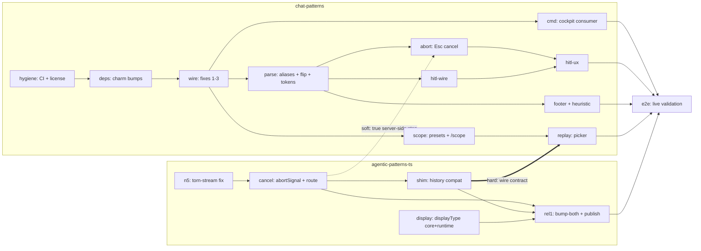

# Harness Cockpit — rollout plan

**Arc:** revive the Go `chat-patterns` TUI (pinned base `187411b`) as the terminal cockpit
for the agentic-patterns TS server (main @ `10d5c0b` lineage), speaking the live HTTP/SSE
contract end-to-end.

- **Strategy of record (locked):** `.ai-docs/research/cli-chat-parity/gap-analysis.md` rev 2 — Strategy A, rounds pre → R1 → R2 → R3. Not relitigated here.
- **Issue plan:** `.ai-docs/plans/harness-cockpit.yaml` — 17 PR-sized issues, canonical `/sdlc:plan` schema (harness-runners exemplar) + explicit `repo`/`round` fields for the cross-repo split.
- **Evidence base:** the six scout dossiers in `.ai-docs/stacks/harness-cockpit/scout/` — every change site in the YAML is a scout-verified `file:line` anchor.
- **Naming disambiguation:** this arc is "harness cockpit". The older "cockpit-port" doc (#300) refers to a shipped dashboard effort — unrelated; #300's cleanup must not touch this directory.

---

## 1. Build order and parallelism

Two tracks that parallelize almost completely — the TS server track and the Go cockpit
track only touch at three seams (abort→cancel soft, replay→shim hard, e2e→everything).

**What runs in parallel:**

- **Day one:** `n5` (TS) and `hygiene`/`deps` (Go) start simultaneously — different repos, zero contact.
- **TS internally:** `display` is file-disjoint from the `conversations.ts` chain (`n5 → cancel → shim` is strictly serialized — same file) and can land at any point.
- **Go internally:** after `wire`, the `parse` / `cmd` / `scope` branches fan out. Development can overlap further (e.g. `hitl-wire` built while `abort` is in review), but **merges are serial in dependency order** — `internal/types/types.go`, `internal/chat/model.go`, `internal/app/model.go`, and `internal/sse/parse.go` are shared across nearly every Go slice. Rebase-before-merge is mandatory; the serial-merge throttle was proven on the eval-surface arc.
- **Cross-repo:** `replay` can be *built* against the shim dossier's golden fixtures before `shim` merges (the fixtures are byte-synced with the shim's own tests — that is the contract lock); it can only be *demoed* after. Same pattern for R2: all of `hitl-wire`/`hitl-ux` is unit-testable offline; the e2e demo needs R1 landed plus an LLM key.

**Round boundaries** map to waves in the YAML: wave1 = pre-work + Go hygiene, wave2 = R1
core, wave3 = R1 tail + R2 wire + R3 TS, wave4 = R2 UX, wave5 = R3 Go, wave6 = release +
e2e.

## 2. Gates — where the human checks in

| Gate | After | What you verify |
|---|---|---|
| **A** | wave1 (`n5`, `cancel`, `hygiene`, `deps`) | N5 four-frame repro (`broken-model` fixture) under **node AND bun**, with the #234 disposition stated in the PR (fixed, or still open as the transport half). Cancel demo: curl `POST …/cancel` → 202, stream winds down with `message.cancel … done`; React Stop now actually stops the runner. Go CI (`check`) green on its own PR. |
| **B** | wave2 (`wire`, `parse`, `cmd`) | **First light:** `just cockpit` against a live `ap playground` — agent list renders (description text, role-object decode), one full turn streams. `contracttest` live suite passes including the new ≥1-event-before-done assertion. |
| **C** | wave4 (`hitl-ux`) | **HITL e2e** with a real key (`AP_APPROVAL_TOOLS=bash AP_APPROVAL_TIMEOUT_MS=30000 ap playground`): approve run, deny run (calm `⊘ blocked` rendering), timeout run (auto-deny dismissal); dashboard admin-stream cross-check shows matching correlation ids; enter-skip during a parked gate does not deadlock. |
| **D** | wave6 (`rel1`, `e2e`) | Full `docs/e2e-cockpit.md` walkthrough against the **released** TS versions; publish confirmed (`rm bun.lock && bun install` in the bump commit); deferred-items list re-affirmed — nothing crept past R3. |

Waves 3 and 5 have no human gate: they are covered by the CI gates plus the C/D demos
that immediately follow them.

## 3. Risks and mitigations

| # | Risk | Mitigation |
|---|---|---|
| 1 | **#234 confound** — N5 and the bun/hono stall share the identical 14-byte signature; fixing one can masquerade as fixing both. | `n5` acceptance requires manual verification under node **and** bun; disposition stated explicitly ("N5 fixed; #234 is the transport half, tracked separately" unless the bun repro passes). Re-confirmed at arc close in `e2e`. |
| 2 | **`conversations.ts` collisions** — pre-work, cancel route, shim, #296, and #328 all edit one file. | Strict serial chain `n5 → cancel → shim` inside this arc; each PR states its ordering vs whatever of #296/#328 has landed at open time (same protocol harness-runners B3 already declares). |
| 3 | **harness-runners is live, not future** — #317–#332 are open; B3 (#328) will widen the exact input transport R2 codes against. | R2 builds on today's contract (waiting couples us to a Codex spike we have nothing to do with — OD-6); the forward-compat seam is declared in `hitl-wire` (requestId alias, availableDecisions-driven rendering, payload passthrough). When #328 lands, the cockpit needs only new decision-kind strings. See §4. |
| 4 | **Go repo drift** — the sandbox clone was fast-forwarded mid-scout by something else; no CI, no branch protection historically. | Base pinned at `187411b`; work from a fresh clone; `hygiene` lands CI (`check` job = `just quality`) as the **first** PR so every subsequent fix merges through a gate; PR-to-main discipline adopted from that PR onward. |
| 5 | **HITL trap 1: deny never arrives as `tool.rejected`** on the POST stream — it arrives as `error {error_type:"ToolCallBlocked"}` (bus-only rejection, verified in `approval-round-trip.test.ts`). | Encoded in `hitl-wire`/`hitl-ux` specs: the deny-rendering path keys on `ToolCallBlocked`; the `tool.rejected` alias still ships (admin firehose / future servers). |
| 6 | **HITL trap 2: enter-to-skip drain deadlock** — `skipStreaming`'s blocking drain parks forever if it swallows the `input.request` of a gate that will never emit again. | `hitl-ux` carries the D5 guard (break on ChunkInputRequest, restore streaming, re-arm the reader) with a dedicated test whose failing mode is a test timeout. |
| 7 | **charm v2 patch bumps** occasionally adjust key/mouse event behavior. | `deps` is a dedicated PR (OD-4) with a manual smoke of the mouse-wheel/click-to-expand surfaces before any behavioral fix stacks on top. |
| 8 | **`message.complete` demotion** — a hypothetical legacy backend that emits it but holds the connection open would hang. | Accepted (locked): channel close synthesizes Done at two layers (`client.go:244-245`, `model.go:1031-1033`); the only known legacy target closes the body per turn. |
| 9 | **Live-verification ceiling** — tool/HITL/token paths need an LLM key; keyless CI can't see them. | Everything is unit-tested offline against dossier-verified wire fixtures; the keyed legs are concentrated in Gates C and D with explicit checklists, not scattered. |
| 10 | **Abort semantics split-brain** — Go Esc-abort lands client-side even without the server cancel work, silently reverting to "burns tokens to completion". | `abort` depends on `cancel` (soft edge, stated in the issue); its live acceptance explicitly verifies the server run row closes cancelled. Cancel-route-first when the server offers it; ctx-cancel fallback for older servers. |
| 11 | **Scope validation opacity** — today the Go client discards non-201 bodies (why N2 was undiagnosable). | `scope` mandates decoding the error body; the 400 issues list is rendered in-phase and *is* the MVP form. |

## 4. Forward-compat vs the harness-runners design (#317–#332)

The constraints scout mapped the five contract changes (C1–C5); the cockpit's stance,
locked per round:

- **R1/R3: no dependency on harness-runners.** The lenient-decode discipline in `parse` is the whole obligation: unknown event **names** pass through as `ChunkUnknown` (never nil) — that is what makes `agent.gate.decision`, `harness-native`, and future kinds non-breaking; unknown **fields** are ignored by Go's default decode and pinned by explicit tests (extra `costUsd` + `meta` keys must not error). The base envelope carries an optional `Meta map[string]any` from day one so `meta.synthetic` badging (F2/#319) is a render-only change later. `tool.rejected` parses an optional `reason` now so `reason:"timeout"` (C4) is a one-line render tweak. `SSEMessageCompleteData` grows `CostUsd *float64` alongside tokens so B1/#323's cost field renders the day it ships.
- **R2: build on today's transport; disposition stated vs #328.** `hitl-wire` implements approve/deny against the current `{correlationId, toolName, arguments, prompt}` / `{correlation_id, decision}` pair, with the declared seam: `RequestID` alias wins when present; decision buttons render from `availableDecisions` when present (else approve/deny); `payload` passes through raw. Always POST to the stream's own `:id` — B3 turns the global-key shortcut into a 404. Do **not** implement AskContext/proposals/durable decisions ahead of #319/#328 (feature-flagged behind #307, shapes still in Gate-0 review).
- **Abort/approval race:** stream teardown auto-denies pending inputs; the cockpit's abort path renders that race as *cancelled*, not a server error — same rule harness-runners' timeout policy will exercise.
- **display_type:** no contact — harness-runners does not touch the `agent.tool.start/end` formatter cases.

## 5. Licensing note

`chat-patterns` is **BSL 1.1** (Licensor: Doug; Change Date 2030-04-10 → Apache 2.0). The
Additional Use Grant permits production use unless offered to third parties as a
commercial product/hosted service — cockpit use is squarely inside the grant; **no
blocker**. Locked posture (OD-3, executed in `hygiene`): keep BSL 1.1, fix the stale
Licensed-Work name ("agentic-tui" predates the rename), commit a one-paragraph posture
note. Relicensing is a single-signature decision (sole author) deferred until code would
actually cross into an MIT repo (e.g. tui-patterns or vendoring into agentic-patterns-ts)
— which this plan avoids by keeping all Go code in the Go repo.

## 6. Versioning / landing constraints honored

- **agentic-patterns-ts:** protected `main`, every commit via PR, required status `check` (`bun run check`). Version bumps happen **only** in `rel1` — one `just bump-both` (core floats for `display`; runtime/server/cli lockstep carries `n5`/`cancel`/`shim`), with `rm bun.lock && bun install` in the same commit (proven publish gate).
- **chat-patterns:** revival hygiene first — CI `check` workflow mirroring the TS required-status name, PR-to-main from the first PR, base pinned `187411b`, `go 1.25.0` left in go.mod with local 1.26.x verified green.
- **Tracker:** all 17 issues sync to pattern-stack/agentic-patterns-ts under one epic (OD-5); Go issues carry the `go` label and name their chat-patterns branch.

## 7. Explicitly deferred (with re-entry triggers)

| Item | Why deferred | Trigger to revisit |
|---|---|---|
| **Branch UI** (picker `b`, branch badges) | No TS branch concept; shim omits the fields (`omitempty` → nil). Code kept, action swallowed. | Server grows conversation branching. |
| **Schema-driven scope forms** (`instantiation.schema` → widgets) | Phase-3-sized build; preset list + JSON editor + server-issue echo covers every fixture agent. Schema is decoded now so no wire change later. | A real agent whose scope is too rich for raw JSON + issues-as-form. |
| **Scratchpad / trace rails** | Gap-analysis open question #1 answered "textual is the MVP bar"; rails are dashboard territory today. | Cockpit users asking for in-terminal trace nav after Gate D. |
| **tui-patterns consolidation** (Strategy C) | Largest scope, MVP furthest away; two protocols to reconcile; `defaultvocab` drops multi-agent events. | A **second real Go consumer** of the chat contract, or the protocol formalization becoming a funded arc — then chat-patterns' cockpit learnings seed P5, and the BSL→MIT question (§5) activates. |
| **Conversation rehydrate / resume** | Server registry is in-memory; stored ids 404 on send. Replay is read-only with an honest banner (R3-3). | A server-side rehydrate route; lift `ReadOnly` then. |
| **Client-side approval countdown** | Timeout is not on the wire; guessing invites lying (D5). | One-line server addition to the `input.request` mapping + gate plumb-through — file when wanted. |
| **CLI (`ap run`) adoption of `RunOptions.abortSignal`** | The runtime seam ships in `cancel`, dormant for the CLI (D6). | Any CLI abort-UX complaint; the fix is mechanical. |
| **`StoredConversationSummary` token-split extension** | Route-level N+1 is fine at picker scale (A-1); the extension forces bump-both for a server feature. | Measured list latency on real history volumes. |
| **`tool.intent` display_type stamp** | No consumer (Go parses start/end only; React renders intent as placeholder) (B-2). | A consumer appears. |
| **`/debug` slash command** (replacing `CHAT_DEBUG_EVENTS`) | Env var is zero-plumbing for R1 bring-up. | R2/R3 already touch the command registry — fold in opportunistically, don't schedule. |
| **Dashboard `message.cancel` rendering polish** | Dashboard tolerates the new frames (unknown-name passthrough). | Dashboard polish pass (#281 territory). |

## 8. Issue index (17)

| # | Key | Repo | Round | Size | Title |
|---|---|---|---|---|---|
| 1 | `n5` | TS | pre | M | Torn-stream fix: error+done frames on pre-token failure |
| 2 | `cancel` | TS | pre | M | RunOptions.abortSignal + cancel route + disconnect hardening |
| 3 | `hygiene` | Go | R1 | S | CI `check` workflow + license fix + base pin |
| 4 | `deps` | Go | R1 | S | Charm v2 patch bumps + TUI smoke |
| 5 | `wire` | Go | R1 | M | Wire fixes #1–#3 + first httpclient tests |
| 6 | `parse` | Go | R1 | M | Parser aliases, message.complete demotion, no-allowlist flip |
| 7 | `cmd` | Go | R1 | S | `cmd/cockpit` consumer + `_examples` disposition |
| 8 | `abort` | Go | R1 | M | Esc cancels the in-flight turn |
| 9 | `scope` | Go | R1 | L | Scope-on-create + preset picker + `/scope` |
| 10 | `hitl-wire` | Go | R2 | M | input.request parse + InputResponder + RespondInput |
| 11 | `hitl-ux` | Go | R2 | L | HITL prompt state machine + render + shell guards |
| 12 | `shim` | TS | R3 | S | History compat shim (bare list + inline messages) |
| 13 | `display` | TS | R3 | M | displayType core→runtime→SSE (`bump-both` driver) |
| 14 | `footer` | Go | R3 | S | Token footer + display_type heuristic |
| 15 | `replay` | Go | R3 | M | Picker + read-only replay (branch disabled) |
| 16 | `rel1` | TS | R3 | S | Release: bump-both + publish |
| 17 | `e2e` | Go | R3 | M | Final live e2e validation (smoke-harness approach) |
