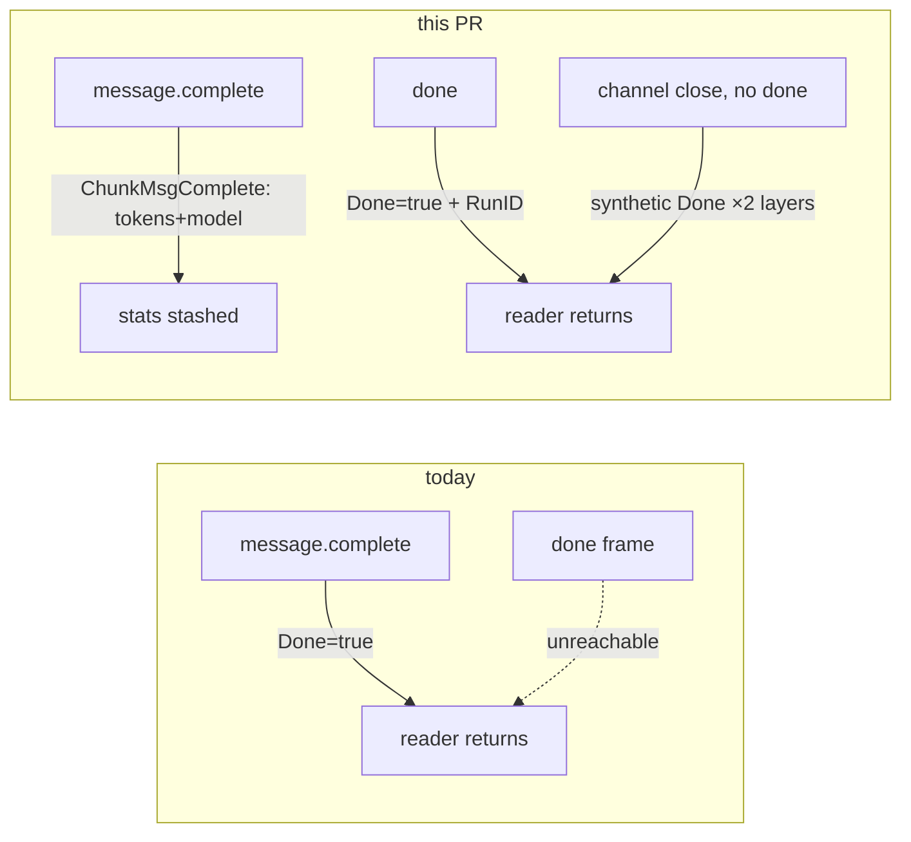

# go: parser round — tool.rejected/iteration aliases, message.complete demotion + tokens/model, done.run_id, no-allowlist flip

> **Cross-repo note:** tracker issue lives in `pattern-stack/agentic-patterns-ts`; the code
> change lands in `github.com/pattern-stack/chat-patterns` on branch **`cockpit/parse`**
> (base: `main` after #344 `cockpit/wire` merges — see Approach § Branch protocol). All
> `file:line` anchors below were re-verified at chat-patterns `main @ 4720311` (identical
> `.go` content to the scouted `187411b` — #342/#343 changed no Go files).

## Goal

Make `ChunkFromSSE` speak the TS server's live event vocabulary and the harness-runners
forward-compat contract in one PR over the two SSE files + chunk vocab: canonical
`tool.rejected` / `iteration.*` aliases; `message.complete` demoted from Done-carrier to
a `ChunkMsgComplete` data-carrier (tokens + model + optional `costUsd`); `done` decodes
`{run_id}` onto the terminal chunk; and the no-allowlist flip — unknown event **names**
pass through as `ChunkUnknown` (never nil), unknown **fields** never error. This is the
declared forward-compat seam for R1/R3 (plan.md §4, binding): after this PR, future
vocabulary (`agent.gate.decision`, `harness-native`, `meta`) reaches the reducer layer
without a parser release.

## Approach

**Locked dispositions honored, not re-derived:** Risk 8 (message.complete demotion) is
ACCEPTED — channel close synthesizes Done at two layers (`internal/httpclient/client.go:244-245`
reader-goroutine close; `internal/chat/model.go:1029-1037` `readStream` on closed channel),
and the only known legacy target closes the body per turn. HITL trap 1 is R2 territory
(#349/#350); the `tool.rejected` alias ships here anyway for the admin firehose.

**1. Aliases (parse.go).** `case "agent.tool.rejected":` (`internal/sse/parse.go:119`)
gains `"tool.rejected"`, and the decode struct gains `GateName string \`json:"gate_name"\``
(server payload is `{tool_name, reason, gate_name}` per `sse-formatter.ts:161-169`).
Non-empty `gate_name` is folded into Content as `reason + " (gate: " + gateName + ")"` —
the existing render path (`internal/chat/model.go:690-696`, `"Tool rejected: " + ToolName +
": " + Content`) then shows it with zero render changes, and C4's future `reason:"timeout"`
is a captured field from day one. `case "agent.iteration.start", "agent.iteration.end":`
(`parse.go:133`) gains canonical `"iteration.start", "iteration.end"` — still mapping to
`ChunkIteration` (which `handleResponse` ignores today; rendering is not this issue's job).

**2. message.complete demotion + done.run_id (parse.go, sse/types.go, types.go).** The
subtlety that forces the demotion: because `message.complete` sets `Done`
(`parse.go:69-72`), the httpclient reader returns at that chunk (`client.go:238-241`) and
the `done` frame is *unreachable* — `run_id` can never be captured without this change.



- `SSEMessageCompleteData` (`internal/sse/types.go:11-16`, currently dead code) gains
  `Model string` (server sends it, `sse-formatter.ts:100`) and `CostUsd *float64
  \`json:"costUsd,omitempty"\`` (harness-runners C4/B1 — renders the day #323 ships).
- `message.complete` case returns `&StreamChunk{Type: ChunkMsgComplete, ModelName,
  InputTokens, OutputTokens}` — **not Done**, Content empty (never re-emit streamed text).
  Malformed payload returns a non-nil **zero-field** `ChunkMsgComplete` (issue acceptance;
  deliberate exception to malformed-drops — the frame's presence is preserved even when
  its stats are not).
- `done` case (`parse.go:136-137`) decodes `{run_id}` (ignore unmarshal error — `{}` and
  malformed both stay Done with `RunID ""`) and returns `{Done: true, RunID: d.RunID}`.
- `StreamChunk` (`internal/types/types.go:52-73`) gains `RunID string`.

**3. No-allowlist flip (parse.go default).** `ParseSSE` already forwards every event
(`parse.go:14`); the drop happens in `ChunkFromSSE`'s `default: return nil`
(`parse.go:150-153`). Flip: return `&StreamChunk{Type: ChunkUnknown, RawEvent: evt.Event,
RawData: evt.Data}`. Only malformed frames drop (matches React's §2.6.3 rule). Verified
safe downstream: the reader forwards non-Done chunks (`client.go:236-241`);
`handleResponse`'s switch has no default arm so `ChunkUnknown` falls through to the
`chunk.Done` check (`model.go:724`); `skipStreaming`'s `default:` arm is guarded by
`chunk.Content != ""` (`model.go:927-930`) and `ChunkUnknown` carries empty Content —
add explicit no-op cases anyway to make intent non-coincidental.

**4. Meta envelope (sse/types.go, types.go).** Base envelope carries `Meta` from day one
(locked): new `SSEBase struct { Meta map[string]any \`json:"meta,omitempty"\` }` embedded
in every payload struct in `sse/types.go`; `StreamChunk` gains `Meta map[string]any`,
populated in each typed decode case — so F2/#319's `meta.synthetic` badging is a
render-only change later.

**5. Debug sink + stash (chat/model.go).** `Model` (`model.go:149-169`) gains
`lastModel string`, `lastInputTokens, lastOutputTokens int`, `lastRunID string`,
`debugEvents bool` (set from `os.Getenv("CHAT_DEBUG_EVENTS") != ""` in `New`,
`model.go:207-215`). `handleResponse` gains `case ChunkMsgComplete:` (stash stats) and
`case ChunkUnknown:` (debug on → `appendToParts(target, PartStatus, "⋯ "+chunk.RawEvent)`,
same dim-status idiom as the llm.end token line at `model.go:718-721`; debug off → no-op).
The `chunk.Done` block (`model.go:724-735`) stashes `lastRunID` when `chunk.RunID != ""`.
`skipStreaming` (`model.go:867-939`) mirrors the `ChunkMsgComplete` stash and stashes
`RunID` at its `chunk.Done` break, so enter-skip loses nothing. **RENDERING is R3's
footer job (#353, key `footer`)** — this PR only captures.

**Branch protocol vs #344 (serial-merge, shared files).** `internal/types/types.go` and
`internal/chat/model.go` are edited by both; #344's new `internal/httpclient/client_test.go`
asserts a chunk sequence in which `message.complete` is terminal — semantics this PR
changes. Protocol: branch `cockpit/parse` **from the head of `cockpit/wire`** (stacked);
after #344 merges, rebase onto `main` before opening/merging the parse PR, and update
#344's chunk-sequence expectations in this PR (`delta, delta, msg_complete, done(RunID)`
replaces `delta, delta, complete(Done)`). Never force-push over the wire branch; parse
merges strictly after wire.

## File-level plan

### Create

None (all tests extend existing files; `internal/httpclient/client_test.go` is created
by #344 — if this PR races ahead of it, create the file with only the stream-termination
guard test and note the collision in the PR body).

### Modify (all in chat-patterns)

- `internal/types/types.go` — ChunkType consts (`:21-36`): + `ChunkMsgComplete`,
  `ChunkUnknown`. `StreamChunk` (`:52-73`): + `RunID`, `RawEvent`, `RawData`, `Meta`.
- `internal/sse/types.go` — + `SSEBase{Meta}` embedded in all payload structs;
  `SSEMessageCompleteData` + `Model`, + `CostUsd *float64`.
- `internal/sse/parse.go` — tool.rejected alias + gate_name (`:119-131`); iteration
  aliases (`:133-134`); message.complete demotion (`:69-72`); done run_id (`:136-137`);
  default-case flip (`:150-153`); `Meta` plumbed in typed cases.
- `internal/sse/parse_test.go` — update `:84` and `:182`; flip `:193`; keep `:201`;
  new tool.rejected + lenient-decode tests (see Tests).
- `internal/chat/model.go` — Model fields (`:149-169`); env read in `New` (`:207-215`);
  `handleResponse` cases + Done-arm stash (`:607`, `:724-735`); `skipStreaming` explicit
  cases + stash (`:867-939`).
- `internal/chat/model_test.go` — new finalize-exactly-once / channel-close / ChunkUnknown
  tests (house idiom: drive `handleResponse` with hand-built chunks, `newTestModel()`).
- `internal/httpclient/client_test.go` — extend (or create, see above) with the
  no-done-frame termination guard.

## Interfaces

```go
// internal/types/types.go
const (
	ChunkMsgComplete ChunkType = "msg_complete" // terminal message stats (tokens/model/cost)
	ChunkUnknown     ChunkType = "unknown"      // passed-through event with no typed mapping
)

type StreamChunk struct {
	// ... existing fields unchanged ...
	// RunID is the server-side run id from the SSE `done` frame (populated
	// on the terminal Done chunk; empty for backends that don't send it).
	RunID string
	// Raw passthrough (populated for ChunkUnknown): SSE wire name + unparsed
	// JSON payload, for debug sinks / future typed handling (input.request, …).
	RawEvent string
	RawData  string
	// Meta is the harness-runners base-envelope meta record (C1/F2), when present.
	Meta map[string]any
}

// internal/sse/types.go
// SSEBase carries fields present on every server event envelope (harness-runners C1).
type SSEBase struct {
	Meta map[string]any `json:"meta,omitempty"`
}

type SSEMessageCompleteData struct {
	SSEBase
	Content      string   `json:"content"`
	InputTokens  int      `json:"input_tokens"`
	OutputTokens int      `json:"output_tokens"`
	Model        string   `json:"model"`
	CostUsd      *float64 `json:"costUsd,omitempty"` // harness-runners B1/#323
}

// internal/chat/model.go — Model additions (unexported; same-package tests read directly)
//   lastModel string; lastInputTokens, lastOutputTokens int; lastRunID string
//   debugEvents bool // os.Getenv("CHAT_DEBUG_EVENTS") != ""
```

## Tests

CI gate: `just quality` (`go build && go vet && go test ./...`) green — workflow landed
by #342, job id `check`.

| Change | Test (file : action) |
|---|---|
| message.complete demotion | `parse_test.go:84` `TestChunkFromSSE_MessageComplete_NoDuplication` UPDATE: `Done==false`, `Type==ChunkMsgComplete`, tokens (10/5) + model populated, Content still empty; NEW sub-case: malformed payload → non-nil zero-field `ChunkMsgComplete`. |
| done.run_id | `parse_test.go:182` `TestChunkFromSSE_Done` UPDATE: `{"run_id":"r-1"}` → `Done && RunID=="r-1"`; bare `{}` → `Done && RunID==""`. |
| tool.rejected aliases | NEW `TestChunkFromSSE_ToolRejected` (no existing coverage — both names are new tests): canonical `tool.rejected` with `{"tool_name":"deploy","reason":"denied","gate_name":"approval"}` → `ChunkToolReject`, ToolName set, Content contains reason + `(gate: approval)`; legacy `agent.tool.rejected` without gate_name → Content == reason. |
| iteration aliases | NEW/extend: canonical `iteration.start`/`iteration.end` → `ChunkIteration`, not `ChunkUnknown`. |
| no-allowlist flip | `parse_test.go:193` FLIP `…UnknownEvent_ReturnsNil` → `…_PassesThrough`: `ChunkUnknown`, `RawEvent=="unknown.event.type"`, `RawData` preserved, `!Done`. KEEP `:201` `InvalidJSON_ReturnsNil` — malformed still drops. |
| lenient decode (forward-compat seam, binding) | NEW: `message.complete` payload with `costUsd`, `meta:{synthetic:true}` **plus genuinely-unknown keys** (`settledBy`, a nested future object) → no error, tokens/model/cost/meta captured, unknown keys ignored. NEW: delta payload with extra keys → no error. |
| chat-model finalize | NEW `model_test.go`: delta → msg_complete(tokens/model) → done(run_id) sequence finalizes exactly once (`streaming==false`, parts Complete), `lastModel/lastInputTokens/lastOutputTokens/lastRunID` stashed. |
| channel-close guard | NEW `model_test.go`: `readStream` on a closed channel yields synthetic `Done` (layer 2, `model.go:1029-1037`). NEW/extend `httpclient/client_test.go`: served stream ending after `message.complete` **without** `done` → chunk channel yields `ChunkMsgComplete` then synthetic `Done` (layer 1, `client.go:244-245`). |
| ChunkUnknown rendering | NEW `model_test.go`: `ChunkUnknown` chunk → zero parts with `debugEvents` off; exactly one `PartStatus` (`⋯ event.name`) with it on; stream never terminates on it. |
| skip-streaming parity | NEW/extend: enter-skip over msg_complete + done still stashes stats/run_id. |

Live-verification ceiling (plan Risk 9): tool.rejected and real token/model values need
an LLM key — offline unit tests against dossier-verified wire fixtures are the acceptance
here; the keyed leg is Gate B/C territory.

## Out of scope

- Esc-abort (#347), HITL `input.request` typed handling (#349/#350 — until then
  `input.request` arrives as `ChunkUnknown`, which is correct and visible under
  `CHAT_DEBUG_EVENTS`).
- Token-footer/model **rendering** (#353) — this PR stashes, never renders.
- `/debug` slash command (deferred; env var is the R1 sink — fold into R2/R3 command work
  opportunistically).
- `ChunkIterationStart/End`, `ChunkMsgStart`, delegation vocab (`types.go:29-35`) — stdio
  vocabulary, untouched.
- Any change in agentic-patterns-ts (server emits nothing new here).
- Fixing the pre-existing spinner leak in `handleResponse`'s error arm — that rides #347
  per the dossier.

## Open questions

- **Meta plumbing depth:** spec says embed `SSEBase` in *all* payload structs and populate
  `StreamChunk.Meta` in every typed case (recommended — makes F2 badging truly render-only).
  Acceptable slimmer cut: capture Meta only on `message.complete` + `tool.rejected` now.
  Confirm the full-population reading.
- **gate_name shape:** fold into Content as `reason (gate: X)` (recommended — zero render
  changes via `model.go:690-696`) vs a dedicated `GateName` field on `StreamChunk` with
  rendering deferred to R2. Content-fold loses the raw field; is that acceptable until R2?
- **Branch base:** stack `cockpit/parse` on `cockpit/wire`'s head (recommended; this PR
  updates #344's chunk-sequence test expectations during the post-merge rebase) vs branch
  from `main` and absorb the conflict at rebase time. Confirm stacking.
- **Malformed-`done` posture:** unmarshal error on `done` data still returns `Done` with
  empty RunID (recommended — a torn terminal frame must still terminate). Confirm.

---

<!--
The sections below this divider are the **phase execution log**. They are
written by phase agents (reviewer, specifier, implementer, validator) as the
issue progresses through gates. The static spec sections above are the
current implementation contract; the phase sections below are how we got
here. See `instructions.yaml.phases` for ownership and gate mapping.

When `instructions.yaml.implementer_view` is `clean`, sections below this
divider are stripped before the implementer reads the spec.
-->

## Spec Review
<!-- written by: reviewer · gate 1.5 · /sdlc:critique -->
_Awaiting spec critic._

## Design Addendum
<!-- written by: specifier · in response to REVISE verdict on Spec Review -->
_No addendum required._

## Implementation notes
<!-- written by: implementer · gate 2 · /sdlc:develop -->
_Awaiting implementation._

## Diff Review — Adherence
<!-- written by: reviewer · gate 2.5 · /sdlc:review (lens=adherence) -->
_Awaiting adherence review._

## Diff Review — Quality
<!-- written by: reviewer · gate 2.5 · /sdlc:review (lens=quality) -->
_Awaiting quality review._

## Live Validate
<!-- written by: validator · gate 3 -->
_Awaiting validation._
