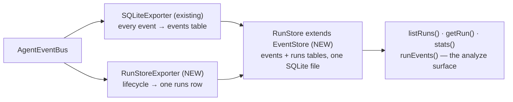

# Spec — RunStore: first-class queryable run records (#117)

## Goal

Add the **one-row-per-run aggregate** on top of the existing per-event substrate: a **`RunStore`**
(extends `EventStore`, `storage/event-store.ts:94`) holding a `runs` table — final answer,
tool_calls, iterations, tokens, finish_reason, elapsed, status, step_metrics, system prompt,
agent config — plus **run-list / run-aggregate queries** and access to each run's ordered event
stream (already captured per-event by `EventStore` + `SQLiteExporter`, keyed by the `run_id`
column at `event-store.ts:74`).

The feed is a **`RunStoreExporter`** (layer 10, sibling of `SQLiteExporter`): it subscribes to the
bus's run lifecycle — run opens at `agent.message.start`, closes at `agent.message.complete` /
non-recoverable `agent.error` — so it captures **all** runs on a bus, not just eval runs. This is
the "general bus-finish hook" seam the locked design prefers; `runEval`'s `onResult`
(`eval/run-eval.ts:46`) stays a **secondary** producer via `RunStore`'s manual
`startRun`/`finishRun` API, with **zero code coupling** to `eval/`.

Semantics per the locked design: **ConversationStore = the dialogue you replay; RunStore = the
execution you analyze.** They stay linked, not merged, via `StoredMessage.runId`
(`conversation/store.ts:38`). RunStore is observational — the agent never reads it back.

This is canvas-workstation's `EvalStore.run` table (verified against
`~/retrieval-agent-2.0/canvas-workstation/src/query-surface/eval/store.ts`) **minus the
`eval_result` overlay** — no grading tables, no scores; grading rides on top later, once an eval
system exists (deferred-with-intent). Additive only — **no version bump** (#118 owns the stack's
0.8.0).

## Approach

Follow the established store/exporter split (`EventStore` ⟷ `SQLiteExporter`): the **store** owns
the SQLite substrate + query API; the **exporter** owns bus subscription + aggregation. One
`RunStore` instance serves both exporters — hand it to `SQLiteExporter` (it IS-A `EventStore`)
for the per-event rows and to `RunStoreExporter` for the aggregate row; `runEvents(runId)` joins
them.



### Verified against the branch tip (2026-07-03, `dug/116-124-runner-scratchpad-propagation` @ 59d0b15)

Every file:line was re-verified at the stack-branch tip (NOT main — this issue stacks on
#116+#124). Drift and findings vs the locked doc:

1. **`eval/run-eval.ts:45` in the doc → actually `:46`.** The `onResult` seam is declared at
   `run-eval.ts:46` and fires per-case at `:227-228` with an `EvalResult`.
2. **`storage/event-store.ts:94` — no drift.** `EventStore` class declaration; `run_id` column
   at `:74`; the migration ladder left a designed v2 slot at `:257`
   (`// future: if (version < 2) …`) which this issue fills.
3. **The doc's "`startRun` → attach event stream → `finishRun`" hook does not exist on our bus
   under those names.** The real run lifecycle on the bus is:
   - **open**: `agent.message.start` (root of the trace; emitted by all three runner paths —
     `run()` `agent-runner.ts:304`, `runStructured()` `:769`, `stream()` `:978`). Every event
     carries `runId` (`events/types.ts:33`).
   - **close (success)**: `agent.message.complete` with final content + run token totals
     (`run()` `:474`, `runStructured()` `:907`, `stream()` `:1230`).
   - **close (failure)**: `agent.error` with `recoverable: false` (`run()` `:387`,
     `runStructured()` `:893`, `stream()` `:1143`/`:1269`), after which the path throws/returns.
   - `agent.conversation.start`/`end` are **streaming-transport lifecycle only** (emitted by
     `stream()` at `:968` + four end sites) — not the universal run seam; do not build on them.
4. **The seam has three holes at the tip** (closed by the "runner seam enablement" below):
   - `run()`'s **max-iterations exit emits NO terminal event** (`agent-runner.ts:626-633`
     returns `finishReason: "max_iterations"` silently); `stream()`'s max-iterations exit emits
     `conversation.end` `reason: "completed"` but no `message.complete` (`:1394`).
   - **No event carries the system prompt.** `run()` renders it at `:330` — AFTER the start
     event at `:304`. canvas-workstation's `RunMeta.systemPrompt` doc comment is the documented
     evidence: "Captured because no event carries it."
   - `stream()`'s `agent.message.start` (`:978`) carries **no `agentConfig` at all** (agentName
     only), unlike `run()` (`:304`) and `runStructured()` (`:769`).
5. **`stores/index.ts` exists on this branch** (created by #118) with explicit named re-exports
   and a `// #117 adds: RunStore` breadcrumb at `:26` — this spec replaces that breadcrumb.
6. **finish_reason is recoverable from the bus only via `agent.llm.end`** (`events/types.ts:147`),
   and it lies on the max-iterations path (last `llm.end` says `"tool_calls"`). Hence the
   optional `finishReason` on `MessageCompleteEvent` below — the terminal event becomes
   authoritative.

### The RunStore — `class RunStore extends EventStore`

"Extends" is literal inheritance (locked design §"#117 — RunStore (extends EventStore)"): same
SQLite file, same injected `better-sqlite3` constructor (`EventStoreOptions.Database`,
`event-store.ts:61`), same WAL pragmas. The subclass adds the `runs` table's prepared statements
and API; the **schema lands in `event-store.ts`'s migration ladder** as v2
(`TARGET_SCHEMA_VERSION` `1 → 2`, filling the designed slot at `:257`):

- v2 = `CREATE TABLE IF NOT EXISTS runs (…)` + indexes — purely additive; a v1 events-only DB
  migrates in place; `EventStore` and `RunStore` stay interchangeable on the same file.
- **Downgrade caveat (accept + document in the DDL comment):** a v2 DB opened by a pre-#117
  runtime's `EventStore` throws the existing version-mismatch error (`event-store.ts:259-263`).
  These DBs are retention-pruned dev telemetry; both classes ship in lockstep in one package.

Column set = canvas-workstation's `run` table with the experiment-specific meta columns
(`mode`/`arm`/`suite`/`question_id`/`deal_id`/`as_of`/`scope`/`git_sha`) generalized into one
`metadata` JSON column (producers stamp their own axes there — that is also where a future eval
overlay's join keys ride without a schema change), and `question` dropped (no bus event carries
the user message; producers who have it stamp `metadata`). Read types are camelCase like
`PersistedEvent` (`event-store.ts:25`), not raw snake_case.

**No `redactSecrets` pass in v1** — deliberate simplification with stated rationale:
canvas-workstation needed it because it persisted the full `agent.toJSON()` snapshot, which
serializes the capability's live toolbox client including `Authorization` headers. We persist
the event's `agentConfig` summary (`{ role, model, tools: string[] }`, stamped at
`agent-runner.ts:309-313`) — no live clients, no secrets. If the full structured snapshot lands
later (Open questions), the redaction pass lands with it.

### The RunStoreExporter — the general bus-finish hook

`RunStoreExporter extends BaseExporter` (`exporters/base.ts:38`), sibling of `SQLiteExporter`
(`exporters/sqlite.ts:17`). Unlike SQLiteExporter's generic `handleEvent` override, it uses the
base `_on<Suffix>` dispatch (`base.ts:58-76`) — it reacts to specific lifecycle types.
`profile = EventProfile.OBSERVABILITY` (`event-profiles.ts:50`): everything needed, no
`message.chunk` deltas.

Per-run state machine, keyed by `runId` (every event carries it — nested sub-agent runs on the
same bus each get their own row for free; `trace_id` ties a multi-agent trace together):

- `_onMessageStart` → `store.startRun({ runId, traceId, tsStart: event.timestamp, agentName,
  model + systemPrompt + agentConfig from the event })` — row opens with `status: 'running'`.
  Open an in-memory accumulator.
- `_onLlmEnd` → fold `inputTokens`/`outputTokens`/`durationMs`/`finishReason` into the
  accumulator's current iteration.
- `_onToolEnd` → increment `toolCalls` (+ per-iteration count).
- `_onIterationEnd` → push one step-metrics entry
  `{ iteration, inputTokens, outputTokens, toolCalls, llmDurationMs, hasMore }` — the generic
  analog of canvas-workstation's workflow-specific `stepMetricsOf` (manual producers pass their
  own richer `stepMetrics` through `finishRun`).
- `_onMessageComplete` → **finalize `status: 'ok'`**: `finalAnswer` = `content`, token totals
  from the event (authoritative — the runner accumulates them), `finishReason` =
  `event.finishReason ?? last llm.end finishReason`, `elapsedMs` = complete timestamp − start
  timestamp (event-clock, deterministic in tests), `stepMetrics` from the accumulator.
- `_onError` with `recoverable: false` → **finalize `status: 'error'`**, `error` = message.
  (Recoverable errors fold into the accumulator, they don't finalize.)
- **First terminal event wins** — a later terminal for the same `runId` is ignored (guards the
  error-then-throw paths). Accumulator entries are deleted on finalize; a `maxOpenRuns` cap
  (default 1000, evict-oldest) bounds orphan growth in long-lived processes.
- Best-effort like SQLiteExporter: every handler body is try/caught into an `onError` callback
  (default stderr) — a misbehaving store must never break the bus.

Rows left `'running'` (process died mid-run, orphan eviction) are swept by
`RunStore.sweepRunning()` — same recovery shape as canvas-workstation's cockpit-startup sweep.

### Runner seam enablement — the one place layer 7 changes (minimal, additive)

Without these, the bus-finish seam cannot capture status/finish_reason for all runs and the
system prompt is on no event (finding #4). All changes are **optional fields + one emission
site per path** — additive, non-breaking, no version bump:

1. `events/types.ts` — `MessageStartEvent` gains `systemPrompt?: string` (`:43-47`);
   `MessageCompleteEvent` gains `finishReason?: string` (`:55-61`).
2. `run()` — hoist `const system = agent.renderInitialPrompt()` (`:330`) above the start event
   (`:304`) and stamp `systemPrompt: system`; stamp `finishReason` on the `:474` complete; **emit
   a terminal `agent.message.complete`** (`content: ""`, run totals, `finishReason:
   "max_iterations"`) on the max-iterations exit before `:626`'s return.
3. `runStructured()` — stamp `systemPrompt` at `:769` (`system` already in scope at `:766`);
   stamp `finishReason` at `:907` (variable in scope).
4. `stream()` — stamp `systemPrompt` + `agentConfig` at `:978` (parity with the other two
   paths; `system` in scope at `:955`); stamp `finishReason` at `:1230`; emit + yield a terminal
   `agent.message.complete` (`finishReason: "max_iterations"`) on the max-iterations exit before
   the `conversation.end` at `:1394`. **Note:** this changes `stream()`'s yielded sequence on
   the max-iterations path only — existing sequence-asserting tests are updated (see Tests).

`renderInitialPrompt()` is a pure render (no side effects) — the `run()` hoist is safe.

### The secondary producer — `runEval` (no code coupling)

`eval/` changes: **none**. `RunStore.startRun`/`finishRun` are public precisely so a harness that
holds run metadata can persist without a bus. The documented usage (proven by one test, see
Tests) is:

```typescript
onResult: (r) => {
  const runId = store.startRun({ metadata: { caseId: r.case.id } });
  store.finishRun(runId, {
    finalAnswer: JSON.stringify(r.output), toolCalls: 0, iterations: 0,
    inputTokens: r.inputTokens, outputTokens: r.outputTokens,
    finishReason: r.succeeded ? "stop" : "error", elapsedMs: 0,
    status: r.succeeded ? "ok" : "error", error: r.error,
  });
}
```

When the eval target's runner has a bus with `RunStoreExporter` attached, the bus path captures
the underlying agent runs automatically — `onResult` is for case-level annotation, not the
primary feed.

## File-level plan

### Create

- `packages/agent-runtime/src/storage/run-store.ts` — `RunStore extends EventStore` + row/query
  types (full contents shape in **Interfaces**).
- `packages/agent-runtime/src/exporters/run-store.ts` — `RunStoreExporter extends BaseExporter`.
- `packages/agent-runtime/src/storage/__tests__/run-store.test.ts` — store unit tests.
- `packages/agent-runtime/src/exporters/__tests__/run-store.test.ts` — exporter-over-bus tests.

### Modify

- `packages/agent-runtime/src/storage/event-store.ts` — migration ladder only: `SCHEMA_V2`
  (runs DDL), `TARGET_SCHEMA_VERSION = 2`, `if (version < 2)` step in `_migrate()` (`:248-265`).
  No behavior change to any existing method.
- `packages/agent-runtime/src/events/types.ts` — two optional fields (`MessageStartEvent.
  systemPrompt`, `MessageCompleteEvent.finishReason`).
- `packages/agent-runtime/src/runner/agent-runner.ts` — seam enablement per Approach:
  `run()` (`:304`/`:330`/`:474`/`:626`), `runStructured()` (`:769`/`:907`), `stream()`
  (`:978`/`:1230`/`:1394`).
- `packages/agent-runtime/src/storage/load.ts` — add `loadRunStore()` mirroring
  `loadEventStore()` (same optional-dep dance, constructs `RunStore`).
- `packages/agent-runtime/src/storage/index.ts` — add `RunStore` + types + `loadRunStore`.
- `packages/agent-runtime/src/stores/index.ts` — replace the `:26` breadcrumb with the RunStore
  exports, matching the barrel's explicit-named-export style (see **Interfaces**).
- `packages/agent-runtime/src/exporters/index.ts` — add `RunStoreExporter` export.
- Existing runner tests whose event-sequence assertions the seam enablement touches:
  `runner/__tests__/agent-runner.test.ts`, `agent-runner-stream.test.ts`,
  `mock-runner.test.ts` (only where max-iterations sequences / `message.start` payloads are
  asserted — no logic changes beyond the new/enriched events).

### Do NOT touch

- `packages/agent-runtime/src/eval/**` — `onResult` (`run-eval.ts:46`) is consumed from outside;
  zero imports in either direction between `eval/` and `storage/`|`exporters/`.
- **No `eval_result` table, no grading columns, no "EvalStore"** — hard boundary (locked
  design): RunStore's substrate = runs + events + tool surface only; grading rides on top later.
- `packages/agent-runtime/package.json`, `bun.lock` — **no version bump** (#118 owns 0.8.0;
  this issue is additive under it). The main tree also carries unrelated uncommitted WIP
  (`bun.lock`, `agent-cli/package.json`, `.claude/sdlc.yml`, `.ai-docs/handoff.md`) — leave it.
- `packages/agent-runtime/src/conversation/**` — the replay axis; linked via
  `StoredMessage.runId` (`conversation/store.ts:38`), never merged.
- `packages/agent-runtime/src/index.ts` — already star-exports `storage/` (`:16`) and `stores/`
  (`:17`); new symbols surface through the existing lines.
- `exporters/sqlite.ts` — unchanged; composes with the new exporter on the same bus/store.

## Interfaces

```typescript
// ---------------------------------------------------------------------------
// packages/agent-runtime/src/storage/run-store.ts (NEW)
// ---------------------------------------------------------------------------

/** Metadata opening a run row. All optional — the exporter fills from bus events. */
export interface RunMeta {
  /** Omit → generated (manual producers); the exporter passes the bus runId. */
  readonly runId?: string;
  readonly traceId?: string;
  readonly tsStart?: Date;
  readonly agentName?: string;
  readonly model?: string;
  readonly systemPrompt?: string;
  readonly agentConfig?: Record<string, unknown>;
  /** Free-form producer meta (JSON) — eval axes / join keys ride here. */
  readonly metadata?: Record<string, unknown>;
}

/** Outcome stamped at finalize. Field-for-field canvas-workstation's RunOutcome. */
export interface RunOutcome {
  readonly finalAnswer: string;
  readonly toolCalls: number;
  readonly iterations: number;
  readonly inputTokens: number;
  readonly outputTokens: number;
  readonly finishReason: string;
  readonly elapsedMs: number;
  readonly status: "ok" | "error";
  readonly error?: string;
  readonly stepMetrics?: unknown; // JSON-serialized into runs.step_metrics
}

/** Full run row (read side, camelCase like PersistedEvent). */
export interface RunRow {
  readonly runId: string;
  readonly traceId: string | null;
  readonly tsStart: string;
  readonly tsEnd: string | null;
  readonly agentName: string | null;
  readonly model: string | null;
  readonly systemPrompt: string | null;
  readonly agentConfig: Record<string, unknown> | null;
  readonly finalAnswer: string | null;
  readonly toolCalls: number | null;
  readonly iterations: number | null;
  readonly inputTokens: number | null;
  readonly outputTokens: number | null;
  readonly finishReason: string | null;
  readonly elapsedMs: number | null;
  readonly status: "running" | "ok" | "error";
  readonly error: string | null;
  readonly stepMetrics: unknown;
  readonly metadata: Record<string, unknown> | null;
}

/** Run-list projection — cheap columns only (no systemPrompt / finalAnswer blobs). */
export interface RunSummary {
  readonly runId: string;
  readonly traceId: string | null;
  readonly tsStart: string;
  readonly tsEnd: string | null;
  readonly agentName: string | null;
  readonly model: string | null;
  readonly status: "running" | "ok" | "error";
  readonly finishReason: string | null;
  readonly toolCalls: number | null;
  readonly iterations: number | null;
  readonly inputTokens: number | null;
  readonly outputTokens: number | null;
  readonly elapsedMs: number | null;
  readonly answerLength: number;
  readonly hasPrompt: boolean;
}

/** The run-aggregate query result. */
export interface RunStats {
  readonly runs: number;
  readonly ok: number;
  readonly error: number;
  readonly running: number;
  readonly totalInputTokens: number;
  readonly totalOutputTokens: number;
  readonly meanElapsedMs: number | null;
  readonly meanIterations: number | null;
}

export class RunStore extends EventStore {
  constructor(opts: EventStoreOptions); // super() — same file, same injected Database
  /** Open a run row (status 'running'). Returns the runId (generated when omitted). */
  startRun(meta?: RunMeta): string;
  /** Stamp the outcome. First finalize wins; re-finalizing is a no-op. */
  finishRun(runId: string, outcome: RunOutcome): void;
  /** Mark orphaned 'running' rows as errored (process died mid-run). Returns count. */
  sweepRunning(reason?: string): number;
  /** Full row by id or unique prefix. */
  getRun(id: string): RunRow | null;
  /** Newest first. */
  listRuns(opts?: {
    limit?: number;
    status?: "running" | "ok" | "error";
    agentName?: string;
    since?: Date;
  }): RunSummary[];
  /** The run's ordered event stream — inherited events table, WHERE run_id ORDER BY id. */
  runEvents(runId: string): PersistedEvent[];
  /** Aggregate across runs. */
  stats(opts?: { since?: Date; agentName?: string; model?: string }): RunStats;
}

// ---------------------------------------------------------------------------
// packages/agent-runtime/src/storage/event-store.ts — migration ladder only
// ---------------------------------------------------------------------------
const SCHEMA_V2 = `
CREATE TABLE IF NOT EXISTS runs (
  run_id TEXT PRIMARY KEY,
  trace_id TEXT,
  ts_start TEXT NOT NULL,
  ts_end TEXT,
  agent_name TEXT,
  model TEXT,
  system_prompt TEXT,
  agent_config TEXT,
  final_answer TEXT,
  tool_calls INTEGER,
  iterations INTEGER,
  input_tokens INTEGER,
  output_tokens INTEGER,
  finish_reason TEXT,
  elapsed_ms INTEGER,
  status TEXT NOT NULL,
  error TEXT,
  step_metrics TEXT,
  metadata TEXT
);
CREATE INDEX IF NOT EXISTS idx_runs_ts_start ON runs(ts_start);
CREATE INDEX IF NOT EXISTS idx_runs_status ON runs(status);
CREATE INDEX IF NOT EXISTS idx_runs_trace ON runs(trace_id) WHERE trace_id IS NOT NULL;
`;
const TARGET_SCHEMA_VERSION = 2; // was 1; v2 step fills the designed slot at :257

// ---------------------------------------------------------------------------
// packages/agent-runtime/src/exporters/run-store.ts (NEW)
// ---------------------------------------------------------------------------
export class RunStoreExporter extends BaseExporter {
  override profile = EventProfile.OBSERVABILITY;
  constructor(opts: {
    store: RunStore;
    onError?: (err: unknown, event: BaseEvent) => void;
    /** Bound on concurrently-open run accumulators (evict-oldest). Default 1000. */
    maxOpenRuns?: number;
  });
  // _onMessageStart / _onLlmEnd / _onToolEnd / _onIterationEnd /
  // _onMessageComplete / _onError — per the Approach state machine.
}

// ---------------------------------------------------------------------------
// packages/agent-runtime/src/events/types.ts — additive optional fields
// ---------------------------------------------------------------------------
export interface MessageStartEvent extends BaseEvent {
  readonly type: "agent.message.start";
  readonly agentName: string;
  readonly agentConfig?: Record<string, unknown>;
  /** #117: the rendered system prompt (agent.renderInitialPrompt()) — no other event carries it. */
  readonly systemPrompt?: string;
}
export interface MessageCompleteEvent extends BaseEvent {
  readonly type: "agent.message.complete";
  readonly content: string;
  readonly inputTokens: number;
  readonly outputTokens: number;
  readonly model: string;
  /** #117: authoritative run finish reason ("stop" | "max_iterations" | …). */
  readonly finishReason?: string;
}

// ---------------------------------------------------------------------------
// packages/agent-runtime/src/stores/index.ts — replaces the :26 breadcrumb
// ---------------------------------------------------------------------------
export { RunStore } from "../storage/run-store.js";
export type { RunMeta, RunOutcome, RunRow, RunStats, RunSummary } from "../storage/run-store.js";

// ---------------------------------------------------------------------------
// packages/agent-runtime/src/exporters/index.ts — append
// ---------------------------------------------------------------------------
export { RunStoreExporter } from "./run-store.js";
```

## Tests

All store tests use in-memory SQLite with the injected constructor, per the
`storage/__tests__/event-store.test.ts` precedent (`import Database from "better-sqlite3"` —
already a devDependency, `package.json:74`).

**`storage/__tests__/run-store.test.ts`:**

- v1 → v2 migration: build a `user_version = 1` events-only DB by hand, reopen via `RunStore` →
  `runs` table exists, existing event rows intact, `user_version = 2`. Plain `EventStore` also
  opens a v2 file (shared `TARGET_SCHEMA_VERSION`).
- `startRun`/`finishRun` round-trip: all `RunRow` fields incl. JSON round-trip of
  `agentConfig`/`stepMetrics`/`metadata`; generated-vs-supplied `runId`; re-finalize is a no-op
  (first wins).
- `listRuns`: newest-first, `limit`/`status`/`agentName`/`since` filters, projection carries
  `answerLength`/`hasPrompt` and omits blobs.
- `getRun` by full id and by unique prefix; `null` on miss.
- `runEvents`: `append()` (inherited) events for two interleaved runIds → per-run ordered
  streams.
- `stats`: counts by status + token sums + means; filters.
- `sweepRunning` marks stale `'running'` rows errored and returns the count.
- Secondary-producer seam: `runEval` (real import, `MockRunner`-style stub runner per
  `eval/__tests__` precedent) with `onResult` writing rows per the snippet in Approach — proves
  the eval path persists via public API with zero coupling.

**`exporters/__tests__/run-store.test.ts`** (real `EventBus` + `RunStoreExporter` + in-memory
`RunStore`):

- Success sequence (`message.start` → iterations of `llm.end`/`tool.end`/`iteration.end` →
  `message.complete`): row is `'ok'` with correct finalAnswer/tokens/toolCalls/iterations/
  finishReason/stepMetrics; elapsed = event-timestamp delta.
- Error sequence (`message.start` → `agent.error` `recoverable: false`): row `'error'`, error
  message stamped; a subsequent terminal event is ignored.
- Orphan: no terminal → row stays `'running'`; `sweepRunning()` flips it.
- Interleaved runs (two runIds on one bus — the nested sub-agent shape): two independent rows.
- Store throw inside a handler → `onError` fires, bus unaffected (SQLiteExporter's contract).
- Composition: same `RunStore` handed to `SQLiteExporter` + `RunStoreExporter` on one bus →
  `runEvents(runId)` returns the stream the aggregate row summarizes.

**Runner seam tests (`runner/__tests__`):**

- `run()` max-iterations now emits a terminal `agent.message.complete` with
  `finishReason: "max_iterations"` and run totals; `stream()` max-iterations yields it before
  `conversation.end`. Update the existing sequence assertions in `agent-runner.test.ts` /
  `agent-runner-stream.test.ts` / `mock-runner.test.ts` accordingly.
- `message.start` carries `systemPrompt` on all three paths; `stream()`'s also carries
  `agentConfig` now.

**Acceptance gates:** `bun run check` green (build + typecheck + lint + test);
`git status` shows `package.json`/`bun.lock` untouched; `rg -n "eval_result|EvalStore" packages/`
→ 0 hits in src.

## Out of scope

- **`EvalStore` / `eval_result` overlay / grading** — hard boundary. Deferred until an eval
  system exists; the `metadata` column + `runs`/`events` substrate is what it will ride on.
- **`question`/user-message column or event field** — no bus event carries the user input;
  deliberately not added to events in v1 (privacy posture: don't persist raw user input by
  default). Producers who want it stamp `metadata`.
- **Full `agent.toJSON()` agent-config snapshots + `redactSecrets`** — v1 persists the event's
  config summary only (see Approach). The structured-snapshot + redaction pair lands together
  if/when needed.
- **Flipping the `ap playground` CLI / server to RunStore** — `loadRunStore()` makes it a
  one-line follow-up; not this issue.
- **Version bump / changeset** — #118 owns 0.8.0; additive change rides under it.
- **#119 MemoryStore, #120 ArtifactStore, the `Session` aggregate** — deferred-with-intent per
  the locked design.

## Open questions

1. **`metadata` JSON column** — spec default: **include**. It is the generalization of
   canvas-workstation's experiment columns (`mode`/`arm`/`scope`/…) and the future eval
   overlay's join-key landing zone; without it, the first downstream consumer forks the schema.
2. **`stream()` max-iterations yield-sequence change** — spec default: **emit + yield** the
   terminal `message.complete` (consistency across paths beats sequence stability; the path is
   an edge case and consumers already handle `message.complete`). Flag for Gate-1 since it is
   observable by existing stream consumers.
3. **`loadRunStore` in `storage/load.ts`** — spec default: **include** (~15 lines, exact
   `loadEventStore` mirror; #118's Gate-1 excluded loaders from the *stores barrel*, and this
   follows that — `loadRunStore` is exported from `storage/index.js` only).

---

<!--
The sections below this divider are the **phase execution log**. They are
written by phase agents (reviewer, specifier, implementer, validator) as the
issue progresses through gates. The static spec sections above are the
current implementation contract; the phase sections below are how we got
here. See `instructions.yaml.phases` for ownership and gate mapping.

When `instructions.yaml.implementer_view` is `clean`, sections below this
divider are stripped before the implementer reads the spec.
-->

## Spec Review
<!-- written by: reviewer · gate 1.5 · /sdlc:critique -->
_Awaiting Gate-1 review._

## Implementation notes
<!-- written by: implementer · gate 2 · /sdlc:develop -->
_Awaiting implementation._

## Diff Review — Adherence
<!-- written by: reviewer · gate 2.5 · /sdlc:review (lens=adherence) -->
_Awaiting adherence review._

## Diff Review — Quality
<!-- written by: reviewer · gate 2.5 · /sdlc:review (lens=quality) -->
_Awaiting quality review._

## Live Validate
<!-- written by: validator · gate 3 -->
_Awaiting validation._
