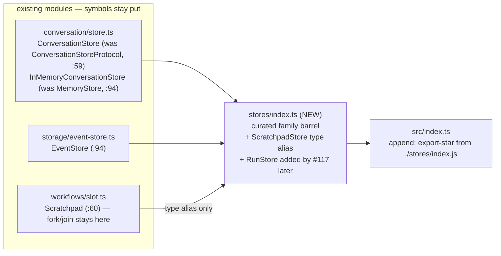

# Spec — Store-family naming standardization (#118)

## Goal

One naming convention for the persistence family: **`<Noun>Store` names the protocol/concept;
`InMemory<Noun>Store` / `Sqlite<Noun>Store` name impls. The bare noun never names an impl.**
Concretely: rename `ConversationStoreProtocol` → `ConversationStore` and `MemoryStore` →
`InMemoryConversationStore` (both in `packages/agent-runtime/src/conversation/store.ts`), and
establish `packages/agent-runtime/src/stores/index.ts` as the curated barrel for the durable
family (`ConversationStore` + impls, `EventStore`, a `ScratchpadStore` type alias; #117's
`RunStore` joins later).

This is a **pure refactor — zero behavior change** — and a **breaking API change** on
`@agentic-patterns/runtime` (renames published symbols; version bump `0.7.0 → 0.8.0`, no
back-compat alias). It frees the `MemoryStore` name for #119 (semantic cross-session recall,
ADK `MemoryService` analog) and unblocks the locked execution order `#118 → #116+#99 → #117`
(`docs/store-family.md` §"Execution plan").

## Approach

In-place renames, ripple the usages, add one new curated barrel, bump the version. No physical
file moves (locked design: "a re-export barrel is enough for v1 — keep the diff reviewable").

The store stays **interface + impl**: `ConversationStore` is the interface every consumer depends
on; `InMemoryConversationStore` / `SqliteConversationStore` / `PostgresConversationStore` are
impls. Backend selection is a **single composition-root conditional**
(`const store = isProd ? new PostgresConversationStore(db) : new InMemoryConversationStore()`) —
which is what the design doc's "injection, not a runtime `if`" phrasing means: *one* `if` at the
wiring point, not `if`s scattered through consumers. (#118 ships only the interface + the in-mem
impl; the Sqlite/Postgres impls are future work.)



### Verified against HEAD (2026-07-03, main @ 1975ec3)

Every file:line below was re-verified against current source; the design doc's `store.ts` line
numbers (`:59`, `:94`) have **not** drifted. The doc's *usage grep list* has drifted in three
ways — call them out so the implementer doesn't chase ghosts:

1. **`packages/agent-server/src/index.ts` — zero hits.** The doc lists it, but at HEAD it only
   exports the server's own structural type `ConversationStoreLike` (`index.ts:8`). No change.
2. **`packages/agent-server/src/config.ts` — comment-only.** The server deliberately uses
   structural typing (`ConversationStoreLike`, `config.ts:65`) rather than importing the runtime
   protocol; the sole hit is the doc comment at `config.ts:63`. One-word comment fix, no code
   change, **no server version bump**.
3. **The doc's list omits 3 test files and 2 READMEs** (enumerated in the File-level plan) —
   `conversation/__tests__/store.test.ts` alone has ~16 `new MemoryStore()` sites plus its
   `describe("MemoryStore", …)` title.

### The stores/ barrel — explicit named re-exports, wired into the top barrel

- New `src/stores/index.ts` uses **explicit named re-exports** (not `export *`) — it is a curated
  family index, and explicitness is the point. Contents in **Interfaces** below.
- Wire it into `src/index.ts` (currently 16 `export *` lines; conversation at `:7`, storage at
  `:16`) by appending `export * from "./stores/index.js";`. The runtime package has a
  **single-entry exports map** (`package.json:24-35`, only `"."`) and tsup builds only
  `src/index.ts` (`tsup.config.ts` `entry: ["src/index.ts"]`) — so top-barrel wiring is the only
  way the barrel exists in the published artifact. No subpath export is added (out of scope).
- **Star-export ambiguity is a non-issue**: `ConversationStore`, `InMemoryConversationStore`, and
  `EventStore` will reach the top barrel via two star exports (their home barrels AND `stores/`),
  but both paths resolve to the *same original declaration* — ES module resolution (and tsc's
  TS2308) only treat *distinct* declarations as ambiguous. `bun run typecheck` + `bun run build`
  (tsup dts) gate this regardless.
- `ScratchpadStore` is a **type alias only** (`export type { Scratchpad as ScratchpadStore }`),
  pointing at `workflows/slot.ts:60`. The fork/join mechanism is Parallel/FanOut execution
  substrate, not a durable injected store — it does **not** move (locked design: "naming alias
  only").

### Versioning — reconciled with actual repo tooling

This repo has **no changesets tooling** (no `.changeset/`, no `@changesets/cli` in any
package.json, no release script). The release convention is manual `chore(release)` version-bump
commits (`4562b66`, `27efe98`, `71aae0f`) with lockfile refreshes as separate commits
(`f0477c1`). The "changeset" deliverable therefore translates to:

- Bump `packages/agent-runtime/package.json` `"version"`: `0.7.0` → `0.8.0` **in this PR**
  (breaking change in 0.x → minor bump, matching the `0.6.x → 0.7.0` closed-composition
  precedent). Release notes go in the PR body (breaking-change migration table below).
  **Settled deliverable** (Gate-1 decision, 2026-07-03 — see Open questions): #118 is the only
  breaking change in the store-family stack, so bumping here means the additive siblings
  (#116/#99, #117) leave `package.json` untouched → zero version-line conflicts, and 0.8.0
  captures the whole stack's release.
- **Do NOT touch `bun.lock`.** It embeds the workspace version (`bun.lock:87`,
  `"version": "0.7.0"`), but CI's `check` job tolerates the mismatch — verified empirically:
  commit `4562b66` (version bumps, no lock refresh) has `check = success`, `publish = failure`.
  The failure is the publish-time lockfile-sanity gate. `rm bun.lock && bun install` is a
  **publish-only release-checklist item** (per `f0477c1` precedent), NOT an impl step — the
  working tree currently carries unrelated uncommitted `bun.lock` WIP that must not be clobbered.

### Migration table (goes in PR body / release notes)

| Old (0.7.0) | New (0.8.0) |
|---|---|
| `import { MemoryStore } from "@agentic-patterns/runtime"` | `import { InMemoryConversationStore } from "@agentic-patterns/runtime"` |
| `import type { ConversationStoreProtocol } from "@agentic-patterns/runtime"` | `import type { ConversationStore } from "@agentic-patterns/runtime"` |
| *(n/a)* | `import type { ScratchpadStore } from "@agentic-patterns/runtime"` (new alias of `Scratchpad`) |

No deprecated `MemoryStore` alias ships — clean break, per the project's breaking-change posture
(atom-standardization precedent).

## File-level plan

### Create

- `packages/agent-runtime/src/stores/index.ts` — curated durable-family barrel (full contents in
  **Interfaces**). Include a header comment naming the convention (`<Noun>Store` = protocol,
  `InMemory<Noun>Store` = impl) and a `// #117 adds: RunStore` breadcrumb.
- `packages/agent-runtime/src/stores/__tests__/index.test.ts` — barrel-surface smoke test (see
  **Tests**).

### Modify

**Runtime — source (the renames):**

- `packages/agent-runtime/src/conversation/store.ts` — the only file where the symbols are
  *declared*:
  - `:2` header comment `ConversationStoreProtocol` → `ConversationStore`
  - `:59` `export interface ConversationStoreProtocol` → `export interface ConversationStore`
  - `:90` section banner `// MemoryStore` → `// InMemoryConversationStore`
  - `:93` doc comment → `/** In-memory implementation of ConversationStore. */`
  - `:94` `export class MemoryStore implements ConversationStoreProtocol` →
    `export class InMemoryConversationStore implements ConversationStore`
- `packages/agent-runtime/src/conversation/index.ts` — `:10` value export `MemoryStore` →
  `InMemoryConversationStore`; `:12` type export `ConversationStoreProtocol` →
  `ConversationStore`
- `packages/agent-runtime/src/conversation/conversation.ts` — type-only usage: `:19` import,
  `:71` `_store` field type, `:83` options type
- `packages/agent-runtime/src/streaming/stdio-adapter.ts` — `:11-12` imports, `:53` field type,
  `:59` opts type, `:64` default `new MemoryStore()` → `new InMemoryConversationStore()`
- `packages/agent-runtime/src/index.ts` — append `export * from "./stores/index.js";` after `:16`

**Runtime — tests (rename ripple only, no logic changes):**

- `packages/agent-runtime/src/conversation/__tests__/store.test.ts` — `:2` import, `:4`
  `describe("MemoryStore", …)` → `describe("InMemoryConversationStore", …)`, ~16 constructor
  sites (`:6,:18,:24,:34,:46,:56,:63,:81,:96,:106,:113,:126,:140,:146,:162,:168`)
- `packages/agent-runtime/src/conversation/__tests__/conversation.test.ts` — `:4` import, `:126`
  test-name string, `:129` constructor, `:136,:138` comments
- `packages/agent-runtime/src/streaming/__tests__/stdio-adapter.test.ts` — `:2` import, `:24`
  helper type annotation, `:56,:88,:119,:140` constructors

**Server (comment-only — no code change, no version bump):**

- `packages/agent-server/src/config.ts` — `:63` doc comment "structural typing for
  ConversationStoreProtocol" → "…for ConversationStore". `ConversationStoreLike` (`:65`) stays.

**Docs:**

- `README.md` — `:346` layer-map row: `ConversationStoreProtocol, MemoryStore` →
  `ConversationStore, InMemoryConversationStore` (mention `src/stores/` barrel in the row if it
  reads naturally)
- `packages/agent-runtime/README.md` — `:301, :341, :344, :357, :361` (prose + code examples)

**Release:**

- `packages/agent-runtime/package.json` — `:3` `"version": "0.7.0"` → `"0.8.0"`

### Do NOT touch

- `bun.lock` — carries unrelated uncommitted WIP; publish-time refresh only (see Approach).
- `packages/agent-cli/package.json`, `.claude/sdlc.yml`, `.ai-docs/handoff.md` — unrelated
  uncommitted WIP in the working tree; leave unstaged.
- `packages/agent-runtime/src/workflows/slot.ts` — `Scratchpad`/`fork()`/`join()` stay put;
  alias lives in `stores/index.ts` only.
- `packages/agent-server/src/index.ts` — zero references to the renamed symbols at HEAD.
- `packages/agent-runtime/package.json` `"exports"` map — no `"./stores"` subpath in v1.

## Interfaces

```typescript
// packages/agent-runtime/src/conversation/store.ts — renames IN PLACE; every method
// signature and body is byte-identical to today. (was: ConversationStoreProtocol, :59)
export interface ConversationStore {
  createConversation(agentName: string, model: string): Promise<StoredConversation>;
  getConversation(conversationId: string): Promise<StoredConversation | null>;
  updateConversation(
    conversationId: string,
    updates: Record<string, unknown>,
  ): Promise<StoredConversation>;
  addMessage(
    conversationId: string,
    kind: "request" | "response",
    parts: Array<{ type: string; content?: string; metadata?: Record<string, unknown> }>,
    options?: { runId?: string; inputTokens?: number; outputTokens?: number },
  ): Promise<StoredMessage>;
  getMessages(conversationId: string, limit?: number): Promise<StoredMessage[]>;
  getMessageParts(messageId: string): Promise<StoredMessagePart[]>;
}

// (was: MemoryStore, :94) — body unchanged
export class InMemoryConversationStore implements ConversationStore { /* unchanged */ }

// ---------------------------------------------------------------------------
// packages/agent-runtime/src/stores/index.ts — NEW. The durable-store family barrel.
// Convention: `<Noun>Store` = the protocol/concept; `InMemory<Noun>Store` etc. = impls.
// ---------------------------------------------------------------------------
export type {
  ConversationStore,
  StoredConversation,
  StoredMessage,
  StoredMessagePart,
} from "../conversation/store.js";
export { InMemoryConversationStore } from "../conversation/store.js";

export { EventStore } from "../storage/event-store.js";
export type { EventStoreOptions, PersistedEvent, SessionSummary } from "../storage/event-store.js";

/**
 * Naming alias ONLY — Scratchpad is run-scoped execution substrate (fork/join is
 * coupled to Parallel/FanOut); it is not a durable injected store and does not move.
 */
export type { Scratchpad as ScratchpadStore } from "../workflows/slot.js";

// #117 adds: RunStore (one-row-per-run aggregate, extends EventStore substrate).

// ---------------------------------------------------------------------------
// packages/agent-runtime/src/index.ts — append after :16
// ---------------------------------------------------------------------------
export * from "./stores/index.js";
```

## Tests

Rename-ripple only — **no existing test logic changes**; every assertion stays byte-identical
apart from the symbol names, the `describe` title in `store.test.ts:4`, and comment/test-name
strings (`conversation.test.ts:126,:136,:138`). No test asserts `constructor.name` or class-name
strings, so renames cannot break snapshots (verified by grep).

One **new** test file, `packages/agent-runtime/src/stores/__tests__/index.test.ts` — a
barrel-surface smoke test guarding the new module against accidental un-export:

- value imports `{ InMemoryConversationStore, EventStore }` from `../index.js`; instantiates
  `InMemoryConversationStore` and round-trips one conversation + message (3-4 lines, reusing the
  shape of `store.test.ts`); asserts `EventStore` is a function/constructor.
- type-only imports `{ ConversationStore, ScratchpadStore }` from `../index.js`; assigns the
  instance to a `ConversationStore`-typed binding (compile-time check that the impl satisfies
  the protocol via the barrel).

**Acceptance gates (all must pass before PR):**

1. `rg -n 'ConversationStoreProtocol' packages/ README.md` → **0 hits**
2. `rg -nw 'MemoryStore' packages/ README.md` → **0 hits** (word-boundary; note
   `InMemoryConversationStore` does not contain the substring `MemoryStore`, so even a plain
   grep must come back clean)
3. `bun run check` green (build + typecheck + lint + test, all packages) — this specifically
   gates the double-star-export of same-binding symbols through `stores/` (tsup dts + tsc)
4. `git status` shows `bun.lock`, `packages/agent-cli/package.json`, `.claude/sdlc.yml`,
   `.ai-docs/handoff.md` still untouched/unstaged

## Out of scope

- **No deprecated `MemoryStore` alias / back-compat shim** — clean break (locked design;
  atom-standardization precedent).
- **No physical file moves** into `stores/` — re-export barrel only (v1, locked design).
- **No `"./stores"` subpath** in the runtime `exports` map (single-entry map today).
- **`rm bun.lock && bun install`** — publish-only release-checklist step, not an impl step.
- **No server version bump** (comment-only change rides along in the diff).
- **#116/#99** (runner policy + scratchpad propagation — `docs/node-context.md`), **#117**
  (`RunStore`), **#119** (semantic `MemoryStore`), **#120** (`ArtifactStore`), the deferred
  `Session` aggregate, and the AgentNode ↔ Node-world consolidation.

## Open questions

- **Version-bump placement** — **RESOLVED (Gate-1, 2026-07-03): bump `0.7.0 → 0.8.0` in #118's
  PR.** #118 is the only breaking change in the stack; the additive siblings (#116/#99, #117) then
  leave `package.json` untouched → zero version-line conflicts across the stack, and 0.8.0 captures
  the whole release. (CI-verified safe: `check` passed on the bump-without-lock precedent
  `4562b66`; `bun.lock` refresh stays a publish-only step.)
- **`loadEventStore`** (`storage/load.ts`) in the stores barrel — **RESOLVED (Gate-1, 2026-07-03):
  excluded for v1.** It's a loader utility, not a store; the barrel is the clean store-family
  surface. It remains exported from `storage/index.js` as today.
- **README layer-map depth**: `README.md:346` names layer 11's exports; should the row also gain
  a `src/stores/` mention, or is a new row overkill for a re-export barrel? Spec default: amend
  the existing row's symbol names only.

---

<!--
The sections below this divider are the **phase execution log**. They are
written by phase agents (reviewer, specifier, implementer, validator) as the
issue progresses through gates. The static spec sections above are the
current implementation contract; the phase sections below are how we got
here. See `instructions.yaml.phases` for ownership and gate mapping.

When `instructions.yaml.implementer_view` is `clean`, sections below this
divider are stripped before the implementer reads the spec.
-->

## Spec Review
<!-- written by: reviewer · gate 1.5 · /sdlc:critique -->
**Gate-1 verdict: APPROVED — approach unchanged.** Reviewer: Doug. Date: 2026-07-03.

Human Gate-1 sign-off. No re-architecture requested — the rename + curated-barrel strategy stands
as specified. One revision required and applied: the Approach Mermaid diagram had an invalid
unquoted `subgraph` title (em-dash) that failed to render on GitHub; fixed to the quoted
`subgraph id["title"]` form and verified to render via `@mermaid-js/mermaid-cli` (valid SVG, exit
0). Two open decisions resolved (version-bump placement; `loadEventStore` exclusion — see Open
questions) and the design-model note captured in Design Addendum below.

## Design Addendum
<!-- written by: specifier · in response to REVISE verdict on Spec Review -->
**Design-model clarification (Gate-1 discussion w/ Doug, 2026-07-03).**

`ConversationStore` stays **interface + impl**. The interface (`ConversationStore`) is the only
thing consumers depend on; the impls (`InMemoryConversationStore` today; `SqliteConversationStore`
/ `PostgresConversationStore` as future work) are chosen at the composition root by a **single
conditional**:

```typescript
const store = isProd ? new PostgresConversationStore(db) : new InMemoryConversationStore();
```

This reconciles the design doc's "injection, not a runtime `if`" phrasing: it means *one* `if` at
the instantiation / wiring point — **not** `if`s scattered through consumers. Every consumer still
depends solely on the `ConversationStore` type and never learns which backend it got. #118 ships
the interface + the in-memory impl only; the durable impls are deferred, and the naming convention
this issue lands is precisely what keeps that future substitution a one-line wiring change.

## Implementation notes
<!-- written by: implementer · gate 2 · /sdlc:develop -->
_Awaiting implementation._

## Diff Review — Adherence
<!-- written by: reviewer · gate 2.5 · /sdlc:review (lens=adherence) -->
_Awaiting adherence review._

## Diff Review — Quality
<!-- written by: reviewer · gate 2.5 · /sdlc:review (lens=quality) -->
_Awaiting quality review._

## Live Validate
<!-- written by: validator · gate 3 -->
_Awaiting validation._
