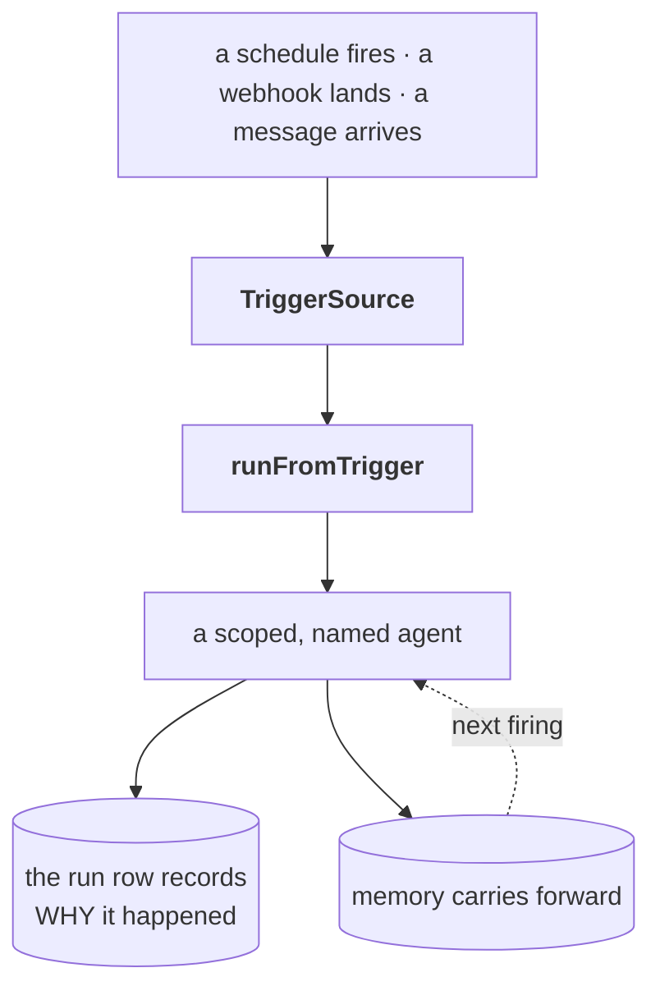

Most agent frameworks assume a person is waiting: a request arrives, an agent answers, the
process ends. **Ambient** agents invert that. They run because something happened — a
schedule fired, a webhook landed, a message arrived — and whoever cares reads the result
later.

That inversion is what this framework is built for.

## The loop



One function starts it, and the run's own row answers "why did this happen" without a join
back to your scheduler:

```ts
import { runFromTrigger } from "@agentic-patterns/runtime";

const { runId, result } = await runFromTrigger(
  { registry, runner },
  {
    agentId: "ops/morning-brief",
    input: "Summarize what changed overnight.",
    trigger: { kind: "schedule", label: "morning-brief", firedAt: new Date().toISOString() },
  },
);
```

The daemon and the scheduler stay yours — `runFromTrigger` is a function, not a process.
See **[Ambient agents](ambient/index.md)** for the full loop and an honest table of what is
shipped versus what is still roadmap.

## How agents are built

Composition is the mechanism underneath. Everything is a frozen, Zod-validated primitive
that composes upward:

```
Agent = Role × Background × Awareness × Mission
Role  = Persona + Judgments + Capabilities + Responsibilities
Capability = Toolbox + Manual + Playbook
```

Atoms → protocols → molecules → rendering → organisms in `@agentic-patterns/core`, then
events → gates → runner → transport → runtime → workflows → conversation → exporters →
presets in `@agentic-patterns/runtime`. Core never imports runtime.

## Install

```sh
bun add @agentic-patterns/core @agentic-patterns/runtime
```

The three common AI SDK providers ship as real dependencies, so setting a provider key is
the only step — no separate install, and no silent degradation when a package is missing
([ADR 0010](adr/0010-bundled-provider-packages.md)).

The server (`@agentic-patterns/server`) and CLI (`@agentic-patterns/cli`) version in
lockstep with the runtime; core floats independently.

## Where to start

- **[Getting started](getting-started.md)** — zero to a running agent, with or without an
  API key.
- **[Ambient agents](ambient/index.md)** — triggers, threading, and the model routing an
  unattended fleet needs.
- **[Memory](memory/guide.md)** — cross-session memory: the store, the recall surface, and
  how agents evolve.
- **Guides** — authoring toolboxes and plays; the runner & provider strategy.
- **Reference** — the SSE event catalog (generated from the runtime manifest) and
  playground event persistence.
- **Architecture Decisions** — the ADR trail, from the constellation dashboard through
  compositional memory to bundled providers.
- **Design notes** — dated design and planning documents, kept honest and clearly separated
  from shipped API.

Live API surfaces ship with the server itself: Scalar API docs at `/docs` and an `llms.txt`
at `/llms.txt` on any running instance.
